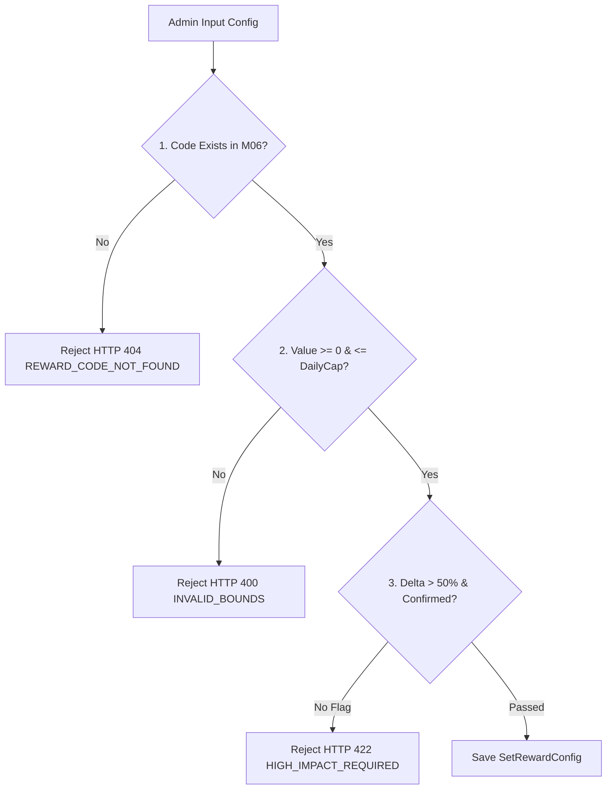

# Xây dựng kiểm tra hợp lệ cấu hình thưởng M02

| Thuộc tính | Giá trị |
|---|---|
| Contract ID | `M02-REWARD-CONFIG-VALIDATION-1.0` |
| Task | M02-T044 |
| Đầu vào | M02-SET-REWARD-LINK-1.0 (M02-T042), M02-REWARD-CONFIG-EFFECTIVITY-1.0 (M02-T043), M06-VALUE-UNIT-CATALOG-1.0 (M06-T002), M11-CONFIG-REG-1.0 (M11-T012) |
| Phạm vi | Validator kiểm tra tính hợp lệ của cấu hình thưởng (`RewardConfigValidator`), ngăn chặn cấu hình sai (mã thưởng không tồn tại tại M06, tỷ lệ vượt quá trần, số tiền âm) |
| Tự kiểm | B-G01, B-G03 |
| Phiên bản | 1.0 — 2026-08-22 |

## 1. Mục tiêu và invariant

Tài liệu này đặc tả quy trình kiểm tra và xác thực tính hợp lệ (`Validation Engine`) của cấu hình thưởng trước khi áp dụng cho bộ từ vựng trong M02.

- **Ngăn chặn Cấu hình Thưởng Sai (`Strict Reward Config Validation Invariant`)**:
  - Mọi thao tác lưu/cập nhật cấu hình thưởng BẮT BUỘC đi qua `RewardConfigValidator`.
  - CẤM lưu cấu hình nếu:
    1. Mã cấu hình thưởng `RewardConfigCode` không tồn tại trong danh mục M06 (HTTP 404 `REWARD_CODE_NOT_FOUND`).
    2. Giá trị thưởng Gold/Gems vượt trần hạn mức ngày REL-04 ($> 5,000$ Gold/ngày) hoặc mang giá trị âm (HTTP 400 `INVALID_REWARD_BOUNDS`).
- **Cảnh báo Thay đổi Tác động Lớn (`High Impact Alert Invariant`)**: Khi thay đổi làm tăng/giảm quá $50\%$ mức thưởng cũ, Validator yêu cầu cờ xác nhận `ConfirmHighImpactChange = true` để lưu.

## 2. Quy trình Kiểm tra Hợp lệ Cấu hình Thưởng (Validator Workflow)

## 3. Regression Gates và Test Cases

### 3.1. Regression Gates
- `RV-G01`: 100% request lưu cấu hình thưởng chứa mã không tồn tại tại M06 bị chối bỏ với lỗi HTTP 404.
- `RV-G02`: Giá trị thưởng âm hoặc $> 5,000$ Gold bị chặn 100% với lỗi HTTP 400.

### 3.2. Test Cases tự kiểm
| Case ID | Tình huống | Kết quả bắt buộc |
|---|---|---|
| `RV44-01` | Admin lưu cấu hình thưởng với `RewardConfigCode = "INVALID_CODE_999"` | System ném lỗi HTTP 404 `REWARD_CODE_NOT_FOUND`. |
| `RV44-02` | Admin gán thưởng 10,000 Gold cho 1 phiên học (vượt cap 5,000 Gold) | System ném lỗi HTTP 400 `INVALID_REWARD_BOUNDS`. |
| `RV44-03` | Tăng mức thưởng từ 100 Gold lên 300 Gold ($+200\%$) nhưng chưa bật cờ xác nhận | System trả về lỗi HTTP 422 `HIGH_IMPACT_CONFIRMATION_REQUIRED`. |
| `RV44-04` | Kiểm thử hoàn tất luồng M02-REWARD-CONFIG-VALIDATION-1.0 | Đạt 100% tiêu chí nghiệm thu |

## 4. Đối chiếu Hiện trạng và Finding

| Finding ID | Quan sát | Sai lệch | Task tiếp nhận |
|---|---|---|---|
| `M02-RV-F01` | Gọi gRPC internal API `VerifyRewardCode` sang M06 để kiểm tra mã thưởng | Đảm bảo xác thực mã thưởng tức thì | M06-T011 |

## 5. Tự kiểm M02-T044
- Đã hoàn thành đặc tả `M02-REWARD-CONFIG-VALIDATION-1.0`.
- Chốt 3 tầng kiểm tra validator và cờ cảnh báo tác động lớn.
- Ghi nhận 2 Regression Gates (`RV-G01`–`RV-G02`) và 4 Test Cases (`RV44-01`–`RV44-04`).

## 6. Lịch sử
| Ngày | Phiên bản | Thay đổi | Người tự kiểm |
|---|---|---|---|
| 2026-08-22 | 1.0 | Tạo mới đặc tả xây dựng kiểm tra hợp lệ cấu hình thưởng M02-T044 | WSA-7K2 |
