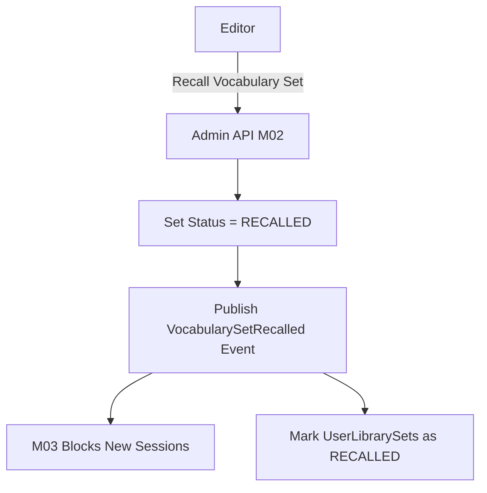

# Xử lý bộ bị thu hồi hoặc đổi quyền M02

| Thuộc tính | Giá trị |
|---|---|
| Contract ID | `M02-RECALLED-SET-HANDLING-1.0` |
| Task | M02-T041 |
| Đầu vào | M02-VOCAB-SET-MANAGEMENT-1.0 (M02-T033), M02-LIBRARY-REMOVE-SET-1.0 (M02-T040), M03-SESSION-LIFECYCLE-1.0 (M03-T003) |
| Phạm vi | Quy trình xử lý khi bộ từ vựng chuyển sang trạng thái `RECALLED` hoặc bị đổi quyền riêng tư (`IsPublic = false`), chặn tạo phiên mới và bảo vệ dữ liệu lịch sử |
| Tự kiểm | B-G01 |
| Phiên bản | 1.0 — 2026-08-22 |

## 1. Mục tiêu và invariant

Tài liệu này quy định ứng xử của hệ thống khi một bộ từ vựng bị ban biên tập thu hồi (`RECALLED`) hoặc thay đổi quyền truy cập trong M02.

- **Chặn Tuyệt đối Khởi tạo Phiên mới (`New Session Block Invariant`)**:
  - Ngay khi bộ từ chuyển trạng thái `RECALLED` hoặc `ARCHIVED`, API khởi tạo phiên học M03 từ bộ đó BẮT BUỘC bị chặn 100% (HTTP 403 `VOCABULARY_SET_RECALLED`).
- **Hiển thị Trạng thái Rõ ràng cho Người dùng (`Transparent Status Disclosure Invariant`)**:
  - Bộ từ bị thu hồi trong thư viện cá nhân người dùng được gắn nhãn `RECALLED_BY_PUBLISHER` kèm lý do (ví dụ: "Nội dung đang được bảo trì/sửa đổi chính tả"). CẤM ẩn mất âm thầm bộ từ khiến người dùng hoang mang.
- **Bảo toàn Lịch sử Học tập (`Historical Progress Preservation Invariant`)**: Tiến độ ghi nhớ SRS M04 của các từ vựng thuộc bộ bị thu hồi VẪN ĐƯỢC GIỮ NGUYÊN trong cơ sở dữ liệu.

## 2. Quy trình Thu hồi và Đổi quyền (Recall & Privilege Change Workflow)

## 3. Regression Gates và Test Cases

### 3.1. Regression Gates
- `RS-G01`: 100% request tạo phiên học M03 từ bộ từ `RECALLED` bị từ chối với lỗi HTTP 403.
- `RS-G02`: Bảng thư viện người học hiển thị đúng trạng thái `RECALLED_BY_PUBLISHER` thay vì biến mất không lý do.

### 3.2. Test Cases tự kiểm
| Case ID | Tình huống | Kết quả bắt buộc |
|---|---|---|
| `RS41-01` | Admin thu hồi bộ từ A2 do lỗi bản quyền | Tất cả request POST tạo phiên học mới cho A2 trả về HTTP 403 `VOCABULARY_SET_RECALLED`. |
| `RS41-02` | Người dùng mở trang Thư viện cá nhân chứa bộ từ A2 đã bị thu hồi | Hiển thị bộ A2 gắn badge màu xám `"Tạm ngừng cung cấp"`, nút "Bắt đầu học" bị disable. |
| `RS41-03` | Kiểm thử hoàn tất luồng M02-RECALLED-SET-HANDLING-1.0 | Đạt 100% tiêu chí nghiệm thu |

## 4. Đối chiếu Hiện trạng và Finding

| Finding ID | Quan sát | Sai lệch | Task tiếp nhận |
|---|---|---|---|
| `M02-RS-F01` | Phát sự kiện `VocabularySetRecalledIntegrationEvent` qua Redis Pub/Sub | Đảm bảo SLA đồng bộ $< 60\text{s}$ tới M03 và client UI | M02-T036 |

## 5. Tự kiểm M02-T041
- Đã hoàn thành đặc tả `M02-RECALLED-SET-HANDLING-1.0`.
- Chốt nguyên tắc chặn phiên mới 100% và minh bạch trạng thái thu hồi.
- Ghi nhận 2 Regression Gates (`RS-G01`–`RS-G02`) and 3 Test Cases (`RS41-01`–`RS41-03`).

## 6. Lịch sử
| Ngày | Phiên bản | Thay đổi | Người tự kiểm |
|---|---|---|---|
| 2026-08-22 | 1.0 | Tạo mới đặc tả xử lý bộ bị thu hồi hoặc đổi quyền M02-T041 | WSA-7K2 |
