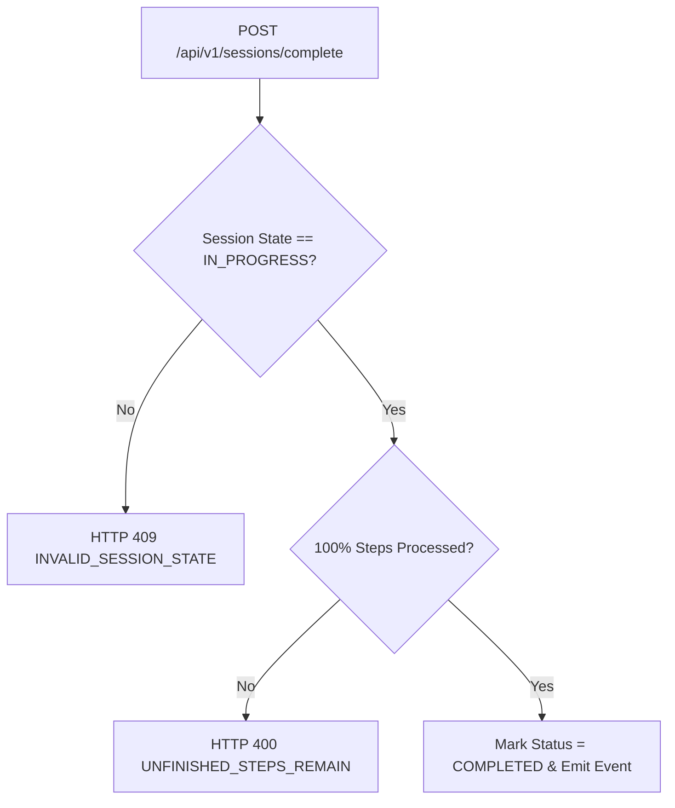

# Chuẩn hóa điều kiện hoàn thành phiên M03

| Thuộc tính | Giá trị |
|---|---|
| Contract ID | `M03-SESSION-COMPLETION-CONDITIONS-1.0` |
| Task | M03-T037 |
| Đầu vào | M03-SESSION-LIFECYCLE-1.0 (M03-T003), M03-SESSION-ITEM-LIMIT-1.0 (M03-T006) |
| Phạm vi | Điều kiện tiên quyết để đánh dấu 1 phiên học chuyển từ `IN_PROGRESS` sang `COMPLETED`, kiểm tra độ bao phủ 100% bước câu hỏi |
| Tự kiểm | B-G01 |
| Phiên bản | 1.0 — 2026-08-21 |

## 1. Mục tiêu và invariant

Tài liệu này quy định các tiêu chí bắt buộc để hệ thống công nhận 1 phiên học đã hoàn thành (`COMPLETED`).

- **Độ bao phủ 100% Câu hỏi Bắt buộc (`100% Mandatory Step Coverage Invariant`)**: Một phiên học CHỈ ĐƯỢC CHUYỂN SANG `COMPLETED` khi 100% các bước câu hỏi trong danh sách snapshot của phiên đã được trả lời (đúng hoặc vượt quá 3 lần thử lại). Nếu còn bất kỳ bước nào chưa thực hiện, request hoàn thành phiên sẽ bị chặn.
- **Tính Không Hoàn thành cho Phiên Bỏ dở/Hết hạn (`Abandoned Session Non-Completion Invariant`)**: Phiên học bị bỏ dở (`ABANDONED`) hoặc quá hạn 24h tuyệt đối CẤM chuyển sang trạng thái `COMPLETED` và CẤM phát thưởng kinh tế M06.

## 2. Quy trình Kiểm tra Điều kiện Hoàn thành (Completion Validation Flow)

## 3. Regression Gates và Test Cases

### 3.1. Regression Gates
- `SC-G01`: 100% request hoàn thành phiên khi chưa làm xong hết câu hỏi bị từ chối với lỗi HTTP 400 `UNFINISHED_STEPS_REMAIN`.
- `SC-G02`: Phiên đã ở trạng thái `ABANDONED` từ chối gọi API hoàn thành.

### 3.2. Test Cases tự kiểm
| Case ID | Tình huống | Kết quả bắt buộc |
|---|---|---|
| `SC37-01` | Người học hoàn thành câu cuối cùng của phiên 10 từ | Chuyển trạng thái phiên sang `COMPLETED`, phát event tổng kết. |
| `SC37-02` | Gọi API hoàn thành khi mới làm xong 8/10 từ | System reject với lỗi `UNFINISHED_STEPS_REMAIN`. |
| `SC37-03` | Kiểm thử hoàn tất luồng M03-SESSION-COMPLETION-CONDITIONS-1.0 | Đạt 100% tiêu chí nghiệm thu |

## 4. Đối chiếu Hiện trạng và Finding

| Finding ID | Quan sát | Sai lệch | Task tiếp nhận |
|---|---|---|---|
| `M03-SC-F01` | Cần thuộc tính `CompletedAtUtc` trong entity `LearningSession` | Ghi mốc thời gian chốt phiên chính xác | M03-T038 |

## 5. Tự kiểm M03-T037
- Đã đặc tả chuẩn hóa điều kiện hoàn thành phiên M03-T037.
- Ghi nhận 2 Regression Gates (`SC-G01`–`SC-G02`) và 3 Test Cases (`SC37-01`–`SC37-03`).

## 6. Lịch sử
| Ngày | Phiên bản | Thay đổi | Người tự kiểm |
|---|---|---|---|
| 2026-08-21 | 1.0 | Tạo mới đặc tả chuẩn hóa điều kiện hoàn thành phiên M03-T037 | WSA-7K2 |
