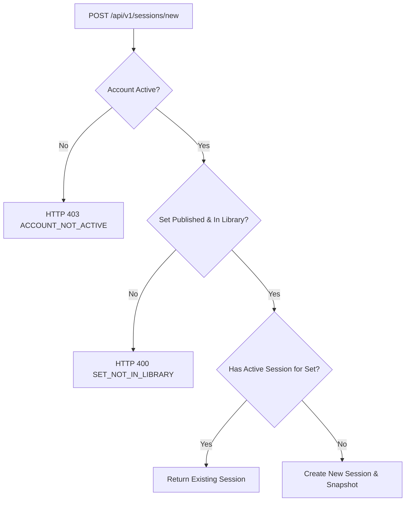

# Chuẩn hóa điều kiện tạo phiên học M03

| Thuộc tính | Giá trị |
|---|---|
| Contract ID | `M03-CREATE-SESSION-CONDITIONS-1.0` |
| Task | M03-T004 |
| Đầu vào | M01-T012 (Account Status), M02-SET-LIFECYCLE-1.0 (M02-T017), M02-LIBRARY-ADD-SET-1.0 (M02-T039), M03-SESSION-LIFECYCLE-1.0 (M03-T003) |
| Phạm vi | Ranh giới điều kiện tạo phiên học mới (`NewLearningSession`), kiểm tra điều kiện tài khoản, bộ từ trong thư viện và chống tạo phiên trùng |
| Tự kiểm | B-G01 |
| Phiên bản | 1.0 — 2026-08-21 |

## 1. Mục tiêu và invariant

Tài liệu này quy định 4 điều kiện tiên quyết cứng để khởi tạo thành công một phiên học mới.

- **Điều kiện Tài khoản Hợp lệ (`Eligible Account Invariant`)**: CHỈ cho phép người học có `AccountStatus == ACTIVE` khởi tạo phiên học. Tài khoản đang bị khóa (`LOCKED`), tạm ngưng (`SUSPENDED`) hoặc chờ xóa (`PENDING_DELETION`) bị từ chối tạo phiên.
- **Điều kiện Bộ từ Thư viện (`Library Set Eligibility Invariant`)**: Bộ từ dùng để tạo phiên BẮT BUỘC phải nằm trong Thư viện cá nhân của người học (`UserLibrarySet`), có trạng thái xuất bản `PUBLISHED` và không bị thu hồi (`IsQuarantined == false`).
- **Chống Tạo Phiên Trùng lặp (`Active Session Idempotency Invariant`)**: Mỗi người học chỉ được phép có tối đa 1 phiên học mới đang ở trạng thái `IN_PROGRESS` cho cùng một `VocabularySetId`. Yêu cầu tạo lặp sẽ trả về phiên đang chạy thay vì sinh phiên mới.

## 2. Quy trình Kiểm tra Điều kiện Tạo Phiên (Validation Flow)

## 3. Regression Gates và Test Cases

### 3.1. Regression Gates
- `CC-G01`: 100% tài khoản bị khóa `LOCKED` từ chối khởi tạo phiên học mới.
- `CC-G02`: Gọi API tạo phiên 2 lần liên tiếp cho cùng 1 bộ từ chỉ trả về 1 `SessionId` duy nhất.

### 3.2. Test Cases tự kiểm
| Case ID | Tình huống | Kết quả bắt buộc |
|---|---|---|
| `CC04-01` | Learner có tài khoản `ACTIVE` tạo phiên học cho bộ từ A1 trong thư viện | Khởi tạo phiên thành công, trả về `SessionId`. |
| `CC04-02` | Learner có tài khoản bị `LOCKED` tạo phiên học | System ném exception `ACCOUNT_NOT_ACTIVE`. |
| `CC04-03` | Tạo phiên cho bộ từ chưa được thêm vào thư viện | System ném exception `SET_NOT_IN_LIBRARY`. |
| `CC04-04` | Kiểm thử hoàn tất luồng M03-CREATE-SESSION-CONDITIONS-1.0 | Đạt 100% tiêu chí nghiệm thu |

## 4. Đối chiếu Hiện trạng và Finding

| Finding ID | Quan sát | Sai lệch | Task tiếp nhận |
|---|---|---|---|
| `M03-CC-F01` | Cần thêm middleware `AccountStatusCheckFilter` cho endpoint tạo phiên | Đảm bảo chặn tài khoản không hợp lệ | M03-T007 |

## 5. Tự kiểm M03-T004
- Đã đặc tả chuẩn hóa điều kiện tạo phiên học M03-T004.
- Ghi nhận 2 Regression Gates (`CC-G01`–`CC-G02`) và 4 Test Cases (`CC04-01`–`CC04-04`).

## 6. Lịch sử
| Ngày | Phiên bản | Thay đổi | Người tự kiểm |
|---|---|---|---|
| 2026-08-21 | 1.0 | Tạo mới đặc tả chuẩn hóa điều kiện tạo phiên học M03-T004 | WSA-7K2 |
