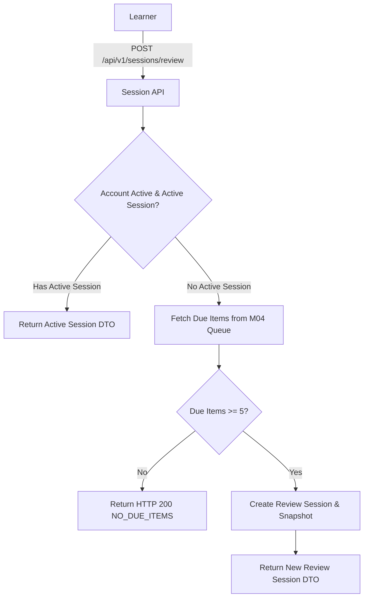

# Chuẩn hóa điều kiện tạo phiên ôn M03

| Thuộc tính | Giá trị |
|---|---|
| Contract ID | `M03-REVIEW-SESSION-CONDITIONS-1.0` |
| Task | M03-T005 |
| Đầu vào | M01-ACCOUNT-LOCK-UNLOCK-1.0 (M01-T031), M03-SESSION-LIFECYCLE-1.0 (M03-T003), M04-DUE-ITEM-SELECTION-CRITERIA-1.0 (M04-T020) |
| Phạm vi | Ranh giới điều kiện tạo phiên ôn tập (`ReviewSession`), kiểm tra số lượng mục từ đến hạn, chống tạo phiên lặp và ghi nhận nguồn hàng đợi M04 |
| Tự kiểm | B-G01 |
| Phiên bản | 1.0 — 2026-08-22 |

## 1. Mục tiêu và invariant

Tài liệu này quy định điều kiện bắt buộc để khởi tạo một Phiên ôn tập (`ReviewSession`) trong M03.

- **Số lượng Mục từ Đến hạn Tối thiểu (`Minimum Due Items Invariant`)**:
  - CHỈ cho phép khởi tạo `ReviewSession` khi hàng đợi M04 có ít nhất 5 mục từ đến hạn (`DueItemsCount >= 5`).
  - Trường hợp `DueItemsCount < 5`, API trả về phản hồi trung tính `NO_DUE_ITEMS_AVAILABLE` (HTTP 200 OK), không tạo phiên rỗng.
- **Tính Chống Tạo Phiên Ôn Trùng lặp (`Active Review Session Idempotency Invariant`)**:
  - Nếu người học đang có 1 `ReviewSession` ở trạng thái `IN_PROGRESS` hoặc `PAUSED`, hệ thống BẮT BUỘC trả về phiên đang dở đó thay vì khởi tạo phiên ôn mới.
- **Tài khoản Hoạt động (`Active Account Guard`)**: Tài khoản ở trạng thái `LOCKED` hoặc `INACTIVE` bị chặn 100% khi tạo phiên ôn (HTTP 403 `ACCOUNT_NOT_ACTIVE`).

## 2. Quy trình Khởi tạo Phiên Ôn (Review Session Creation Flow)

## 3. Regression Gates và Test Cases

### 3.1. Regression Gates
- `RC-G01`: 100% request tạo phiên ôn khi `DueItemsCount < 5` không tạo bản ghi phiên học mới trong DB.
- `RC-G02`: Gọi API tạo phiên ôn 2 lần liên tiếp khi phiên cũ chưa completed trả về đúng `SessionId` đang dở.
- `RC-G03`: Tài khoản bị khóa không thể tạo phiên ôn.

### 3.2. Test Cases tự kiểm
| Case ID | Tình huống | Kết quả bắt buộc |
|---|---|---|
| `RC05-01` | Người học có 12 từ đến hạn ôn trong M04 xin tạo phiên ôn | Khởi tạo `ReviewSession` thành công với 12 từ. |
| `RC05-02` | Người học chỉ có 2 từ đến hạn xin tạo phiên ôn | API trả về `NO_DUE_ITEMS_AVAILABLE`, không tạo phiên. |
| `RC05-03` | Người học đang có phiên ôn dở bấm tạo phiên ôn mới | Trả về `SessionId` của phiên dở hiện tại. |
| `RC05-04` | Kiểm thử hoàn tất luồng M03-REVIEW-SESSION-CONDITIONS-1.0 | Đạt 100% tiêu chí nghiệm thu |

## 4. Đối chiếu Hiện trạng và Finding

| Finding ID | Quan sát | Sai lệch | Task tiếp nhận |
|---|---|---|---|
| `M03-RC-F01` | Cần tạo DTO `ReviewSessionEligibilityDto` | Trả về trạng thái số từ đến hạn cho client UI | M03-T004 |

## 5. Tự kiểm M03-T005
- Đã hoàn thành đặc tả `M03-REVIEW-SESSION-CONDITIONS-1.0`.
- Chốt điều kiện tối thiểu 5 từ và idempotency phiên ôn dở.
- Ghi nhận 3 Regression Gates (`RC-G01`–`RC-G03`) và 4 Test Cases (`RC05-01`–`RC05-04`).

## 6. Lịch sử
| Ngày | Phiên bản | Thay đổi | Người tự kiểm |
|---|---|---|---|
| 2026-08-22 | 1.0 | Tạo mới đặc tả chuẩn hóa điều kiện tạo phiên ôn M03-T005 | WSA-7K2 |
