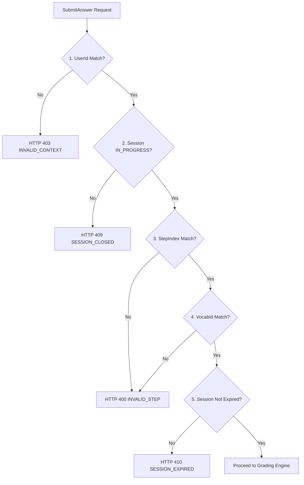

# Chuẩn hóa kiểm tra quyền và ngữ cảnh trả lời M03

| Thuộc tính | Giá trị |
|---|---|
| Contract ID | `M03-ANSWER-CONTEXT-AUTHORIZATION-1.0` |
| Task | M03-T027 |
| Đầu vào | M01-SESSION-1.0 (M01-T016), M03-SESSION-LIFECYCLE-1.0 (M03-T003), M03-SUBMIT-ANSWER-DATA-1.0 (M03-T024) |
| Phạm vi | Ranh giới xác thực 5 tầng khi người học gửi câu trả lời, bảo đảm đúng chủ phiên, đúng bước, đúng từ vựng và không làm rò rỉ dữ liệu người khác |
| Tự kiểm | B-G01 |
| Phiên bản | 1.0 — 2026-08-22 |

## 1. Mục tiêu và invariant

Tài liệu này đặc tả cơ chế kiểm tra quyền và ngữ cảnh hợp lệ (`Answer Context Authorization`) khi xử lý API `SubmitAnswer` trong M03.

- **Xác thực Ngữ cảnh 5 Tầng (`5-Tier Context Verification Invariant`)**:
  - Khi tiếp nhận request gửi đáp án, backend BẮT BUỘC kiểm tra đủ 5 điều kiện cứng:
    1. *Token người dùng hợp lệ*: `Claims.UserId == Session.UserId`.
    2. *Phiên học đang hoạt động*: `Session.Status == IN_PROGRESS`.
    3. *Đúng bước hiện tại*: `SubmitRequest.StepIndex == Session.CurrentStepIndex`.
    4. *Đúng định danh từ vựng*: `SubmitRequest.VocabularyId` trùng với từ trong bước đó.
    5. *Chưa bị quá hạn 24h*: `Session.CreatedAtUtc >= Now - 24h`.
  - Nếu vi phạm bất kỳ điều kiện nào, request BẮT BUỘC bị chối bỏ mà KHÔNG làm thay đổi dữ liệu phiên học.
- **Không Rò rỉ Dữ liệu Người khác (`Zero Data Leakage Invariant`)**:
  - Phản hồi lỗi khi sai quyền chỉ trả về mã lỗi tổng quát (HTTP 403 `INVALID_ANSWER_CONTEXT`), tuyệt đối CẤM trả về thông tin chi tiết về phiên hoặc câu trả lời của người học khác.

## 2. Quy trình Kiểm tra Ngữ cảnh 5 Tầng (Authorization Pipeline)

## 3. Regression Gates và Test Cases

### 3.1. Regression Gates
- `ACA-G01`: 100% request gửi đáp án sai `UserId` bị chối bỏ với lỗi HTTP 403.
- `ACA-G02`: Request gửi đáp án sai `StepIndex` (ví dụ gửi đáp án bước 5 trong khi đang ở bước 3) bị từ chối với lỗi HTTP 400.
- `ACA-G03`: Lỗi xác thực không làm biến đổi trạng thái hoặc lịch sử phiên trong CSDL.

### 3.2. Test Cases tự kiểm
| Case ID | Tình huống | Kết quả bắt buộc |
|---|---|---|
| `ACA27-01` | Learner A gửi đáp án cho `SessionId` của Learner B | System ném lỗi HTTP 403 `INVALID_ANSWER_CONTEXT`, giữ nguyên phiên B. |
| `ACA27-02` | Learner A đang ở bước 2 nhưng gửi `StepIndex = 4` | System ném lỗi HTTP 400 `INVALID_STEP_INDEX`. |
| `ACA27-03` | Gửi đáp án cho phiên học đã `COMPLETED` | System ném lỗi HTTP 409 `SESSION_ALREADY_COMPLETED`. |
| `ACA27-04` | Kiểm thử hoàn tất luồng M03-ANSWER-CONTEXT-AUTHORIZATION-1.0 | Đạt 100% tiêu chí nghiệm thu |

## 4. Đối chiếu Hiện trạng và Finding

| Finding ID | Quan sát | Sai lệch | Task tiếp nhận |
|---|---|---|---|
| `M03-ACA-F01` | Tích hợp `AnswerContextAuthorizationFilter` trong ASP.NET Core pipeline | Đảm bảo tự động hóa việc kiểm tra ngữ cảnh trước khi vào Controller | M03-T024 |

## 5. Tự kiểm M03-T027
- Đã hoàn thành đặc tả `M03-ANSWER-CONTEXT-AUTHORIZATION-1.0`.
- Chốt pipeline kiểm tra ngữ cảnh 5 tầng và nguyên tắc không rò rỉ dữ liệu.
- Ghi nhận 3 Regression Gates (`ACA-G01`–`ACA-G03`) và 4 Test Cases (`ACA27-01`–`ACA27-04`).

## 6. Lịch sử
| Ngày | Phiên bản | Thay đổi | Người tự kiểm |
|---|---|---|---|
| 2026-08-22 | 1.0 | Tạo mới đặc tả chuẩn hóa kiểm tra quyền và ngữ cảnh trả lời M03-T027 | WSA-7K2 |
