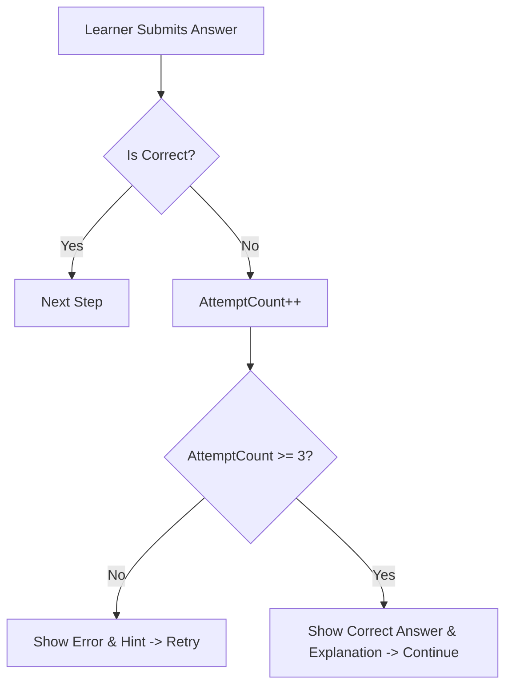

# Giới hạn vòng lặp khi trả lời sai M03

| Thuộc tính | Giá trị |
|---|---|
| Contract ID | `M03-WRONG-ANSWER-LOOP-LIMIT-1.0` |
| Task | M03-T018 |
| Đầu vào | M03-NEW-LEARNING-FLOW-1.0 (M03-T015), M03-REVIEW-FLOW-1.0 (M03-T016) |
| Phạm vi | Quy định số lần thử tối đa khi trả lời sai trong 1 bước phiên học, cơ chế hiển thị gợi ý hỗ trợ và chống lặp vô hạn gây nản lòng |
| Tự kiểm | B-G01 |
| Phiên bản | 1.0 — 2026-08-21 |

## 1. Mục tiêu và invariant

Tài liệu này quy định hạn mức số lần thử lại cho 1 câu hỏi khi người học liên tục trả lời sai trong phạm vi phiên học hiện tại.

- **Hạn mức Thử lại Tối đa (`Max Retries Limit Invariant`)**: Một câu hỏi chỉ cho phép thử lại tối đa $3$ lần trong cùng một lượt. Khi trả lời sai $3$ lần liên tiếp, hệ thống BẮT BUỘC hiển thị đáp án đúng kèm nút "Đã hiểu" và bỏ qua câu hỏi để tiếp tục phiên học.
- **Không Tự Đánh dấu Đúng (`No Auto-Correct Credit Invariant`)**: Việc hệ thống cho qua câu hỏi sau 3 lần sai KHÔNG ĐƯỢC tính là trả lời đúng. Điểm độ chính xác của từ đó trong phiên vẫn ghi nhận $IsCorrect = false$.

## 2. Quy trình Xử lý Trả lời Sai (Wrong Answer Loop Flow)

## 3. Regression Gates và Test Cases

### 3.1. Regression Gates
- `WL-G01`: Sau 3 lần trả lời sai liên tiếp cho 1 câu hỏi, hệ thống hiển thị đáp án đúng và cho phép tiếp tục phiên.
- `WL-G02`: CẤM tính điểm hoàn thành đúng cho các câu hỏi vượt quá 3 lần sai.

### 3.2. Test Cases tự kiểm
| Case ID | Tình huống | Kết quả bắt buộc |
|---|---|---|
| `WL18-01` | Người học nhập sai 3 lần liên tiếp cho 1 từ điền từ | Lần thứ 3 hiển thị đáp án đúng kèm nút "Tiếp tục", không bắt nhập lại lần thứ 4. |
| `WL18-02` | Kiểm tra kết quả ghi nhận sau 3 lần sai | Ghi nhận `IsCorrect = false`, `TotalAttempts = 3`. |
| `WL18-03` | Kiểm thử hoàn tất luồng M03-WRONG-ANSWER-LOOP-LIMIT-1.0 | Đạt 100% tiêu chí nghiệm thu |

## 4. Đối chiếu Hiện trạng và Finding

| Finding ID | Quan sát | Sai lệch | Task tiếp nhận |
|---|---|---|---|
| `M03-WL-F01` | Cần thuộc tính `MaxAttemptsPerStep = 3` trong cấu hình engine | Đảm bảo đồng bộ cho mọi loại câu hỏi | M03-T019 |

## 5. Tự kiểm M03-T018
- Đã đặc tả giới hạn vòng lặp khi trả lời sai M03-T018.
- Ghi nhận 2 Regression Gates (`WL-G01`–`WL-G02`) và 3 Test Cases (`WL18-01`–`WL18-03`).

## 6. Lịch sử
| Ngày | Phiên bản | Thay đổi | Người tự kiểm |
|---|---|---|---|
| 2026-08-21 | 1.0 | Tạo mới đặc tả giới hạn vòng lặp khi trả lời sai M03-T018 | WSA-7K2 |
