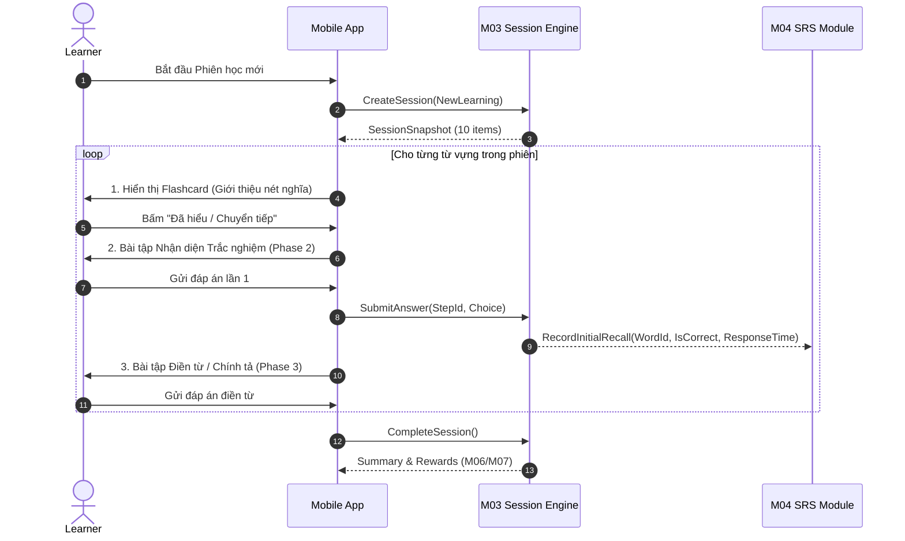

# Lập sơ đồ luồng học mới M03

| Thuộc tính | Giá trị |
|---|---|
| Contract ID | `M03-NEW-LEARNING-FLOW-1.0` |
| Task | M03-T015 |
| Đầu vào | M03-SESSION-POLICY-1.0 (M03-T002), M02-LESSON-CONTENT-1.0 (M02-T009-A) |
| Phạm vi | Sơ đồ tuần tự từng bước trong phiên học mới (`NewLearningSession`), điều kiện chuyển bước và tiêu chí hoàn thành phiên |
| Tự kiểm | B-G01 |
| Phiên bản | 1.0 — 2026-08-21 |

## 1. Mục tiêu và invariant

Tài liệu này sơ đồ hóa trình tự tương tác chuẩn của người học trong một phiên học mới (`NewLearningSession`).

- **Tuần tự 3 Giai đoạn Bắt buộc (`3-Phase Sequence Invariant`)**:
  - *Giai đoạn 1 (Giới thiệu Nét nghĩa)*: Hiển thị thẻ Flashcard (Từ, Phát âm âm thanh, Nét nghĩa tiếng Việt, Câu ví dụ).
  - *Giai đoạn 2 (Luyện tập Nhận diện)*: Bài tập Trắc nghiệm lựa chọn (Multiple Choice Quiz) hoặc Nối từ-nghĩa.
  - *Giai đoạn 3 (Luyện tập Chủ động)*: Bài tập Điền từ hoàn chỉnh (Fill-in-the-blank / Spelling).
- **Tính Bắt buộc của Lần Gợi nhớ Đầu (`Initial Recall Evidence Invariant`)**: Trong Giai đoạn 2, câu trả lời ĐẦU TIÊN cho mỗi từ vựng sẽ được ghi lại làm `InitialRecallResult` phát sang M04.

## 2. Sơ đồ Luồng Học Mới (New Learning Session Sequence Diagram)

## 3. Regression Gates và Test Cases

### 3.1. Regression Gates
- `NF-G01`: 100% phiên học mới trải qua đủ 3 giai đoạn: Flashcard -> Nhận diện -> Chủ động.
- `NF-G02`: Chỉ câu trả lời ở Giai đoạn 2 (Nhận diện) được dùng làm bằng chứng `InitialRecallResult` gửi cho M04.

### 3.2. Test Cases tự kiểm
| Case ID | Tình huống | Kết quả bắt buộc |
|---|---|---|
| `NF15-01` | Người học đi qua luồng học mới 10 từ | Hoàn thành đủ 30 bước bài tập, chốt phiên thành công. |
| `NF15-02` | Người học trả lời sai ở Giai đoạn 2 nhưng làm đúng ở Giai đoạn 3 | M04 ghi nhận bằng chứng lần 1 là `IsCorrect = false`. |
| `NF15-03` | Kiểm thử hoàn tất luồng M03-NEW-LEARNING-FLOW-1.0 | Đạt 100% tiêu chí nghiệm thu |

## 4. Đối chiếu Hiện trạng và Finding

| Finding ID | Quan sát | Sai lệch | Task tiếp nhận |
|---|---|---|---|
| `M03-NF-F01` | DTO `SessionStepDto` cần thuộc tính `StepPhase` (INTRO, QUIZ, RECALL) | Đảm bảo UI hiển thị đúng loại màn hình | M03-T019 |

## 5. Tự kiểm M03-T015
- Đã lập sơ đồ luồng học mới M03-T015.
- Ghi nhận 2 Regression Gates (`NF-G01`–`NF-G02`) và 3 Test Cases (`NF15-01`–`NF15-03`).

## 6. Lịch sử
| Ngày | Phiên bản | Thay đổi | Người tự kiểm |
|---|---|---|---|
| 2026-08-21 | 1.0 | Tạo mới đặc tả lập sơ đồ luồng học mới M03-T015 | WSA-7K2 |
