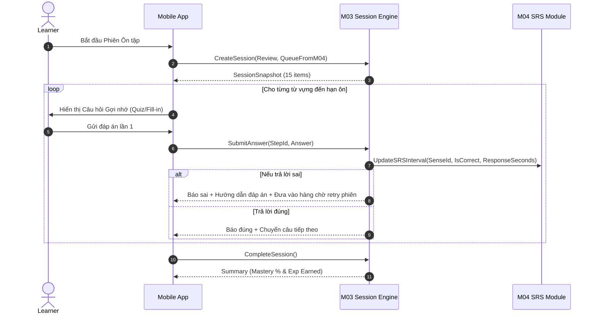

# Lập sơ đồ luồng ôn M03

| Thuộc tính | Giá trị |
|---|---|
| Contract ID | `M03-REVIEW-FLOW-1.0` |
| Task | M03-T016 |
| Đầu vào | M03-SESSION-POLICY-1.0 (M03-T002), M04-MEMORY-DICT-1.0 (M04-T001) |
| Phạm vi | Sơ đồ tuần tự các bước trong phiên ôn tập (`ReviewSession`), kiểm tra gợi nhớ trực tiếp và cập nhật lịch SRS |
| Tự kiểm | B-G01 |
| Phiên bản | 1.0 — 2026-08-21 |

## 1. Mục tiêu và invariant

Tài liệu này sơ đồ hóa trình tự tương tác trong một phiên ôn tập từ vựng (`ReviewSession`).

- **Cấm Ghi đè Kết quả Gợi nhớ Đầu (`Immutable Initial Recall Invariant`)**: Trong phiên ôn tập, kết quả câu trả lời ĐẦU TIÊN của mỗi từ vựng quyết định việc tăng/giảm $Interval$ SRS trong M04. Mọi lần làm lại hoặc thử lại sau khi làm sai trong cùng phiên KHÔNG ĐƯỢC ghi đè kết quả gợi nhớ đầu.
- **Tính Đi thẳng vào Bài tập (`Direct Quiz Sequence Invariant`)**: 100% các từ trong phiên ôn đi thẳng vào các câu hỏi trắc nghiệm/điền từ/nghe từ. CẤM hiển thị thông tin đáp án/flashcard trước khi người học gửi câu trả lời.

## 2. Sơ đồ Luồng Ôn tập (Review Session Sequence Diagram)

## 3. Regression Gates và Test Cases

### 3.1. Regression Gates
- `RF-G01`: 100% phiên ôn tập đi thẳng vào bài tập, cấm hiển thị flashcard đáp án trước khi người học trả lời.
- `RF-G02`: Kết quả gợi nhớ đầu tiên (`InitialRecallResult`) được chuyển ngay sang M04 để tính $Interval$ mới.

### 3.2. Test Cases tự kiểm
| Case ID | Tình huống | Kết quả bắt buộc |
|---|---|---|
| `RF16-01` | Ôn tập 15 từ đến hạn, trả lời đúng 12 từ ngay lần 1 | M04 nhận 12 kết quả `IsCorrect = true` để tăng $Interval$, 3 từ sai reset $Interval = 1$. |
| `RF16-02` | Trả lời sai lần 1, thử lại lần 2 đúng trong cùng phiên ôn | M04 vẫn ghi nhận điểm gợi nhớ là `IsCorrect = false`. |
| `RF16-03` | Kiểm thử hoàn tất luồng M03-REVIEW-FLOW-1.0 | Đạt 100% tiêu chí nghiệm thu |

## 4. Đối chiếu Hiện trạng và Finding

| Finding ID | Quan sát | Sai lệch | Task tiếp nhận |
|---|---|---|---|
| `M03-RF-F01` | Cần thuộc tính `IsInitialRecallCaptured` để đánh dấu đã lưu kết quả lần 1 | Đảm bảo không ghi đè dữ liệu SRS M04 | M03-T024 |

## 5. Tự kiểm M03-T016
- Đã lập sơ đồ luồng ôn M03-T016.
- Ghi nhận 2 Regression Gates (`RF-G01`–`RF-G02`) và 3 Test Cases (`RF16-01`–`RF16-03`).

## 6. Lịch sử
| Ngày | Phiên bản | Thay đổi | Người tự kiểm |
|---|---|---|---|
| 2026-08-21 | 1.0 | Tạo mới đặc tả lập sơ đồ luồng ôn M03-T016 | WSA-7K2 |
