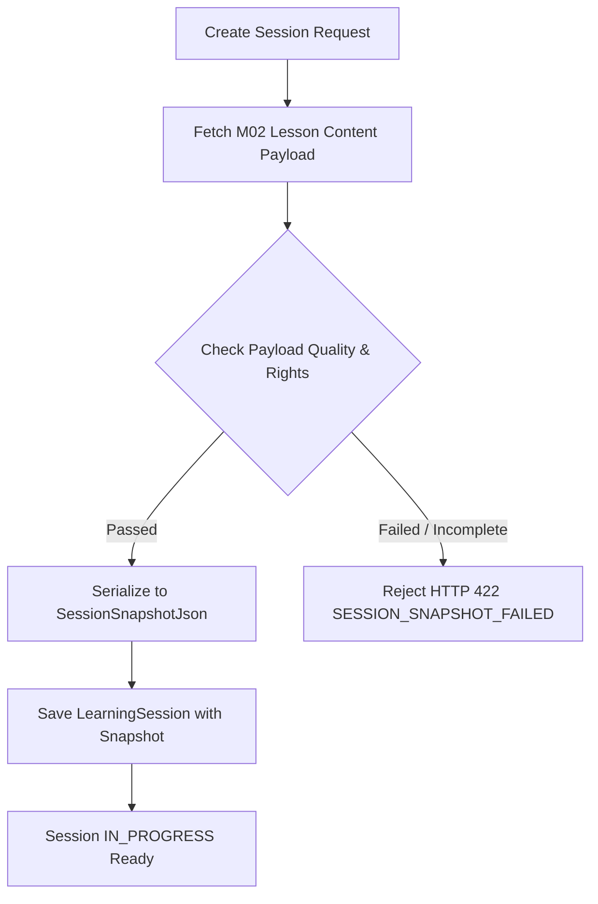

# Thiết kế ảnh chụp học liệu của phiên M03

| Thuộc tính | Giá trị |
|---|---|
| Contract ID | `M03-SESSION-CONTENT-SNAPSHOT-1.0` |
| Task | M03-T007 |
| Đầu vào | M02-HEADWORD-VERSIONING-1.0 (M02-T008-A), M02-LESSON-CONTENT-1.0 (M02-T009-A), M02-SET-VOCAB-OVERRIDE-1.0 (M02-T022), M03-SESSION-ITEM-LIMIT-1.0 (M03-T006) |
| Phạm vi | Đóng băng dữ liệu mục từ (`SessionSnapshotJson`), bảo đảm phiên đang chạy không bị đổi ngầm khi M02 cập nhật, kẹp revision digest và hủy bỏ phiên nếu snapshot lỗi |
| Tự kiểm | B-G01 |
| Phiên bản | 1.0 — 2026-08-22 |

## 1. Mục tiêu và invariant

Tài liệu này đặc tả cơ chế chụp ảnh dữ liệu học liệu (`SessionSnapshot`) khi tạo phiên học trong M03.

- **Đóng băng Học liệu Bất biến (`Immutable Content Snapshot Invariant`)**:
  - Tại thời điểm khởi tạo phiên học (trạng thái `CREATED`), toàn bộ mặt chữ (`Headword`), định nghĩa (`Meaning`), câu ví dụ (`ExampleSentence`), phát âm MP3 URL và `RevisionDigest` từ M02 được đóng băng 100% vào trường `SessionSnapshotJson`.
  - Mọi thao tác chỉnh sửa, xuất bản phiên bản mới hoặc cập nhật nội dung trong M02 sau thời điểm tạo phiên KHÔNG ĐƯỢC LÀM THAY ĐỔI nội dung đang học của phiên đó.
- **Fail-Closed khi Snapshot Lỗi (`Failed Snapshot Eviction Invariant`)**:
  - Nếu bất kỳ mục từ vựng nào trong tập từ được chọn bị lỗi snapshot (ví dụ: thiếu nét nghĩa chính `PrimarySense` hoặc thiếu `RevisionDigest`), hệ thống BẮT BUỘC hủy khởi tạo phiên học (HTTP 422 `SESSION_SNAPSHOT_CREATION_FAILED`), tuyệt đối CẤM tạo phiên ở trạng thái `IN_PROGRESS` với snapshot không toàn vẹn.

## 2. Cấu trúc Ảnh chụp Học liệu (SessionSnapshot Envelope)

```csharp
public class SessionSnapshotDto
{
    public Guid SessionId { get; set; }
    public Guid VocabularySetId { get; set; }
    public string SetRevisionDigest { get; set; }
    public List<SnapshotVocabularyItemDto> Items { get; set; } = new();
    public DateTime SnapshottedAtUtc { get; set; }
}

public class SnapshotVocabularyItemDto
{
    public Guid VocabularyId { get; set; }
    public Guid VocabularySenseId { get; set; }
    public string Headword { get; set; }
    public string SelectedMeaning { get; set; } // Lấy override nếu có, nếu không lấy PrimarySense
    public string SelectedExampleSentence { get; set; }
    public string? AudioUrl { get; set; }
    public string WordRevisionDigest { get; set; }
}
```

## 3. Quy trình Khởi tạo và Đóng băng Snapshot



## 4. Regression Gates và Test Cases

### 4.1. Regression Gates
- `SS-G01`: 100% phiên học sử dụng dữ liệu từ `SessionSnapshotJson` được lưu trữ cố định trong DB.
- `SS-G02`: Thay đổi nội dung từ vựng trên M02 trong khi phiên học đang chạy không làm biến đổi dữ liệu trả về cho client.
- `SS-G03`: Payload từ vựng lỗi hoặc thiếu nét nghĩa bắt buộc khiến API trả lỗi HTTP 422 `SESSION_SNAPSHOT_CREATION_FAILED`.

### 4.2. Test Cases tự kiểm
| Case ID | Tình huống | Kết quả bắt buộc |
|---|---|---|
| `SS07-01` | Tạo phiên học mới cho bộ từ A1 | `SessionSnapshotJson` được sinh với đầy đủ `RevisionDigest` và câu ví dụ. |
| `SS07-02` | Biên tập viên M02 cập nhật nghĩa từ vựng trong khi người học đang trả lời câu hỏi | Client tiếp nhận đúng nghĩa trong snapshot ban đầu. |
| `SS07-03` | Thử tạo phiên với bộ từ có từ vựng thiếu nét nghĩa chính | System từ chối tạo phiên, ném lỗi `SESSION_SNAPSHOT_CREATION_FAILED`. |
| `SS07-04` | Kiểm thử hoàn tất luồng M03-SESSION-CONTENT-SNAPSHOT-1.0 | Đạt 100% tiêu chí nghiệm thu |

## 5. Đối chiếu Hiện trạng và Finding

| Finding ID | Quan sát | Sai lệch | Task tiếp nhận |
|---|---|---|---|
| `M03-SS-F01` | Cần bổ sung cột `SessionSnapshotJson` dạng `nvarchar(max)` / `JSON` trong table `LearningSessions` | Chưa có cột lưu trữ snapshot trong DB | M03-T004 |

## 6. Tự kiểm M03-T007
- Đã hoàn thành đặc tả `M03-SESSION-CONTENT-SNAPSHOT-1.0`.
- Chốt nguyên tắc snapshot bất biến và fail-closed khi payload lỗi.
- Ghi nhận 3 Regression Gates (`SS-G01`–`SS-G03`) và 4 Test Cases (`SS07-01`–`SS07-04`).

## 7. Lịch sử
| Ngày | Phiên bản | Thay đổi | Người tự kiểm |
|---|---|---|---|
| 2026-08-22 | 1.0 | Tạo mới đặc tả thiết kế ảnh chụp học liệu của phiên M03-T007 | WSA-7K2 |
