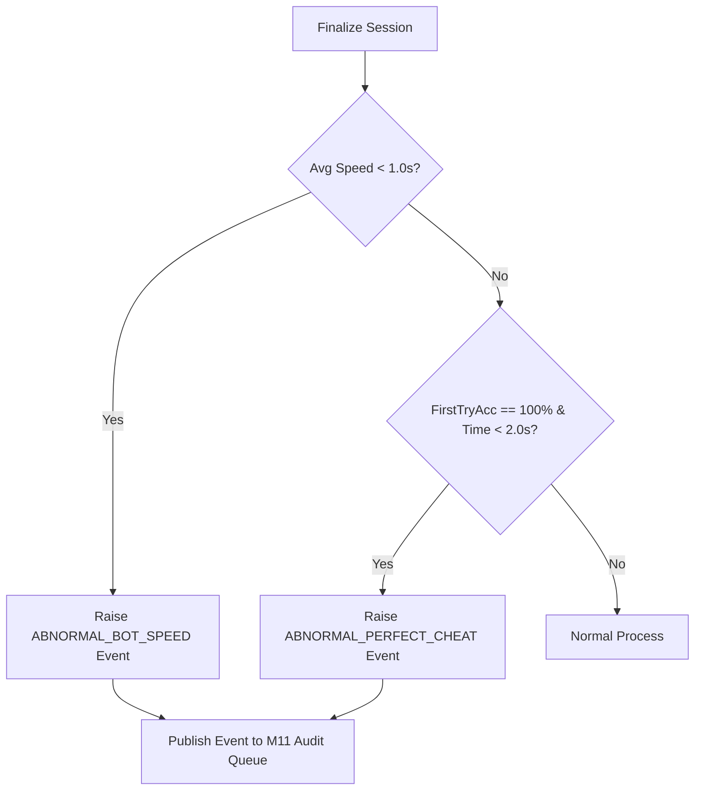

# Thiết kế cảnh báo phiên bất thường M03

| Thuộc tính | Giá trị |
|---|---|
| Contract ID | `M03-ABNORMAL-SESSION-ALERT-1.0` |
| Task | M03-T045 |
| Đầu vào | M03-LOCKED-STUCK-SESSION-RECOVERY-1.0 (M03-T014), M03-PUBLISH-ITEM-RESULTS-TO-M04-1.0 (M03-T036), M03-SESSION-QUALITY-METRICS-1.0 (M03-T043), M11-CONFIG-REG-1.0 (M11-T012) |
| Phạm vi | Hệ thống phát hiện và phát cảnh báo bất thường trong phiên học (`Abnormal Session Alert Engine`), bao gồm làm bài siêu nhanh (bot/cheat), phiên kẹt quá thời gian và chuỗi trả lời đúng $100\%$ bất thường |
| Tự kiểm | B-G01 |
| Phiên bản | 1.0 — 2026-08-22 |

## 1. Mục tiêu và invariant

Tài liệu này đặc tả quy trình phát hiện và ném cảnh báo đối với các phiên học có dấu hiệu bất thường (`Abnormal Session Alerts`) trong M03.

- **Không Tự ý Sửa/Hủy Kết quả Học tập (`Alert-Only Non-Interference Invariant`)**:
  - Khi phát hiện phiên học bất thường, hệ thống CHỈ PHÁT SỰ KIỆN CẢNH BÁO `AbnormalSessionDetectedIntegrationEvent` sang M11/Security.
  - Tuyệt đối CẤM tự ý sửa đổi điểm $q$, hủy phiên hay khóa tài khoản trực tiếp trong Domain M03 mà chưa có quyết định của M11/Admin.
- **Phân loại Ngưỡng Cảnh báo Chi tiết (`Distinct Alert Threshold Invariant`)**:
  - *Bot Speed Alert*: Tốc độ trung bình $< 1.0\text{s}$/từ cho toàn bộ phiên.
  - *Stuck Session Alert*: Phiên ở trạng thái `IN_PROGRESS` $> 12$ giờ mà không có tương tác.

## 2. Luồng Phát hiện và Ném Cảnh báo Phiên Bất thường (Alert Engine Flow)

## 3. Regression Gates và Test Cases

### 3.1. Regression Gates
- `AB-G01`: 100% phiên học có tốc độ $< 1.0\text{s}$/từ phát sự kiện cảnh báo `ABNORMAL_BOT_SPEED` sang M11.
- `AB-G02`: Việc phát cảnh báo bất thường không làm gián đoạn hay thất bại giao dịch hoàn thành phiên.

### 3.2. Test Cases tự kiểm
| Case ID | Tình huống | Kết quả bắt buộc |
|---|---|---|
| `AB45-01` | Script tự động làm xong phiên 10 từ trong 5 giây (TB 0.5s/từ) | Phiên vẫn chốt `COMPLETED`, gửi 1 event `ABNORMAL_BOT_SPEED` sang M11. |
| `AB45-02` | Người học để phiên treo không thao tác 14 tiếng | Cron Job quét phát hiện phiên kẹt $> 12$h, gửi event `ABNORMAL_STUCK_SESSION`. |
| `AB45-03` | Kiểm thử hoàn tất luồng M03-ABNORMAL-SESSION-ALERT-1.0 | Đạt 100% tiêu chí nghiệm thu |

## 4. Đối chiếu Hiện trạng và Finding

| Finding ID | Quan sát | Sai lệch | Task tiếp nhận |
|---|---|---|---|
| `M03-AB-F01` | Đăng ký handler lắng nghe `AbnormalSessionDetectedIntegrationEvent` tại M11 | Phục vụ dashboard giám sát gian lận | M11-T035 |

## 5. Tự kiểm M03-T045
- Đã hoàn thành đặc tả `M03-ABNORMAL-SESSION-ALERT-1.0`.
- Chốt nguyên tắc phát cảnh báo không can thiệp kết quả và ma trận ngưỡng phát hiện.
- Ghi nhận 2 Regression Gates (`AB-G01`–`AB-G02`) và 3 Test Cases (`AB45-01`–`AB45-03`).

## 6. Lịch sử
| Ngày | Phiên bản | Thay đổi | Người tự kiểm |
|---|---|---|---|
| 2026-08-22 | 1.0 | Tạo mới đặc tả thiết kế cảnh báo phiên bất thường M03-T045 | WSA-7K2 |
