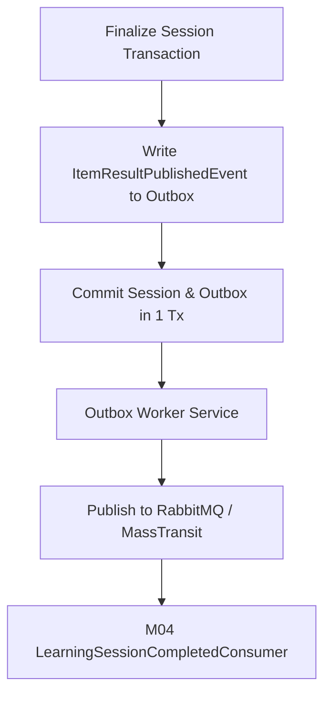

# Thiết kế phát hành kết quả từ sang M04 M03

| Thuộc tính | Giá trị |
|---|---|
| Contract ID | `M03-PUBLISH-ITEM-RESULTS-TO-M04-1.0` |
| Task | M03-T036 |
| Đầu vào | M03-ITEM-COMPLETION-RESULT-1.0 (M03-T035), M04-SESSION-RESULT-CONTRACT-1.0 (M04-T006) |
| Phạm vi | Cơ chế phát hành thông điệp kết quả mục từ từ M03 sang M04 qua Message Bus (`RabbitMQ / MassTransit`), bao gồm Outbox Pattern, mã Idempotency key và theo dõi lỗi phát lại |
| Tự kiểm | B-G01 |
| Phiên bản | 1.0 — 2026-08-22 |

## 1. Mục tiêu và invariant

Tài liệu này quy định kiến trúc và cơ chế phát hành thông điệp kết quả hoàn thành từ vựng từ M03 sang M04 (`Publish Item Results to M04`).

- **Đảm bảo Phát tin Cấp Reliability - Outbox Pattern (`Outbox Reliability Invariant`)**:
  - Mọi sự kiện phát hành kết quả từ BẮT BUỘC lưu vào bảng `OutboxMessages` trong cùng DB Transaction chốt phiên học.
  - Tiến trình Outbox Publisher đẩy thông điệp lên Message Bus theo cơ chế At-least-once. Tuyệt đối CẤM gửi trực tiếp qua HTTP REST làm mất tin khi M04 bị nén/sập.
- **Tính Duy nhất của Mã Thông điệp (`Unique Event Idempotency Key Invariant`)**:
  - Mỗi sự kiện `ItemResultPublishedEvent` gán duy nhất một `EventId = Guid.NewGuid()` và `DeduplicationKey = {SessionId}_{VocabularySenseId}`.

## 2. Luồng Phát hành Kết quả Từ qua Outbox Pattern (Outbox Publishing Workflow)

## 3. Regression Gates và Test Cases

### 3.1. Regression Gates
- `PR-G01`: 100% sự kiện kết quả mục từ được ghi vào `OutboxMessages` thành công trong cùng transaction chốt phiên.
- `PR-G02`: M04 nhận sự kiện lặp 2 lần không thực hiện tính lại SRS hai lần.

### 3.2. Test Cases tự kiểm
| Case ID | Tình huống | Kết quả bắt buộc |
|---|---|---|
| `PR36-01` | Chốt phiên học thành công với 10 từ vựng | Bảng `OutboxMessages` ghi 1 thông điệp tích hợp chứa danh sách 10 `CompletedItemResultDto`. |
| `PR36-02` | Mô phỏng sập mạng Message Bus ngay sau khi chốt phiên DB | Outbox Worker tự động thử lại phát tin khi bus kết nối lại, M04 nhận đủ 100% dữ liệu. |
| `PR36-03` | Kiểm thử hoàn tất luồng M03-PUBLISH-ITEM-RESULTS-TO-M04-1.0 | Đạt 100% tiêu chí nghiệm thu |

## 4. Đối chiếu Hiện trạng và Finding

| Finding ID | Quan sát | Sai lệch | Task tiếp nhận |
|---|---|---|---|
| `M03-PR-F01` | Cấu hình MassTransit Outbox trong `WordSoul.Infrastructure` | Tự động quét và phát lại outbox message | M03-T040 |

## 5. Tự kiểm M03-T036
- Đã hoàn thành đặc tả `M03-PUBLISH-ITEM-RESULTS-TO-M04-1.0`.
- Chốt Outbox Pattern và mã deduplication key cho sự kiện tích hợp M03$\to$M04.
- Ghi nhận 2 Regression Gates (`PR-G01`–`PR-G02`) and 3 Test Cases (`PR36-01`–`PR36-03`).

## 6. Lịch sử
| Ngày | Phiên bản | Thay đổi | Người tự kiểm |
|---|---|---|---|
| 2026-08-22 | 1.0 | Tạo mới đặc tả thiết kế phát hành kết quả từ sang M04 M03-T036 | WSA-7K2 |
