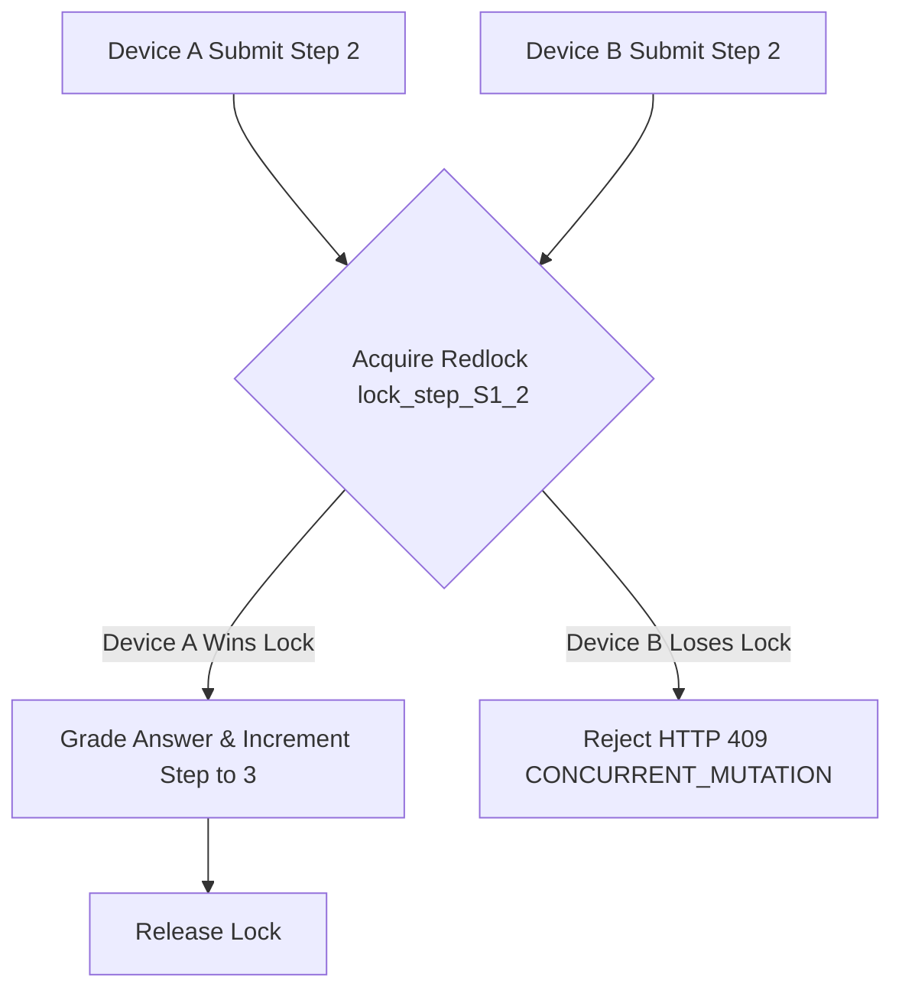

# Thiết kế xử lý trả lời đồng thời M03

| Thuộc tính | Giá trị |
|---|---|
| Contract ID | `M03-CONCURRENT-SUBMISSION-HANDLING-1.0` |
| Task | M03-T026 |
| Đầu vào | M03-RELOAD-STABILITY-1.0 (M03-T021), M03-SUBMIT-ANSWER-DATA-1.0 (M03-T024), M03-SUBMIT-IDEMPOTENCY-1.0 (M03-T025) |
| Phạm vi | Xử lý các yêu cầu gửi đáp án đồng thời từ hai thiết bị/tab khác nhau (`Concurrent Submissions`), khóa phân tán Redlock và ngăn ngừa nhảy bước trái phép |
| Tự kiểm | B-G01 |
| Phiên bản | 1.0 — 2026-08-22 |

## 1. Mục tiêu và invariant

Tài liệu này quy định cơ chế khóa và xử lý xung đột khi người học mở hai thiết bị/tab cùng lúc và gửi đáp án đồng thời trong M03.

- **Chỉ Một Chuyển bước Hợp lệ (`Single Step Transition Invariant`)**:
  - Khi hai request `SubmitAnswer` cùng `StepIndex` tới server đồng thời, khóa phân tán Redlock `lock_step_{sessionId}_{stepIndex}` CHỈ CHO PHÉP 1 request chiến thắng và thực hiện chuyển bước `CurrentStepIndex += 1`.
  - Request đến sau (thua đua khóa) BẮT BUỘC nhận trạng thái lỗi HTTP 409 `CONCURRENT_STEP_MUTATION` kèm theo thông tin bước hiện tại mới để client tự đồng bộ lại.
- **Không Mất hay Nhân bản Lịch sử (`No Double Execution Invariant`)**: Request thua đua khóa tuyệt đối CẤM ghi thêm bản ghi lịch sử trả lời thứ hai trong CSDL.

## 2. Quy trình Xử lý Khóa Phân tán Trả lời Đồng thời (Concurrent Submission Engine)

## 3. Regression Gates và Test Cases

### 3.1. Regression Gates
- `CS-G01`: 100% trường hợp gửi 2 request đáp án đồng thời chỉ làm tăng `CurrentStepIndex` lên đúng 1 đơn vị.
- `CS-G02`: Request thua khóa nhận được phản hồi HTTP 409 minh bạch mà không bị crash hay tạo bản ghi trùng.

### 3.2. Test Cases tự kiểm
| Case ID | Tình huống | Kết quả bắt buộc |
|---|---|---|
| `CS26-01` | Gửi 100 request `SubmitAnswer` đồng thời cho cùng 1 bước từ script jMeter | Chỉ có đúng 1 request được chấm và chuyển bước, 99 request còn lại nhận HTTP 409/400. |
| `CS26-02` | Mở ứng dụng trên cả điện thoại và máy tính, bấm gửi đáp án cùng một giây | Một thiết bị thành công chuyển bước, thiết bị còn lại thông báo "Phiên học đã được cập nhật từ thiết bị khác". |
| `CS26-03` | Kiểm thử hoàn tất luồng M03-CONCURRENT-SUBMISSION-HANDLING-1.0 | Đạt 100% tiêu chí nghiệm thu |

## 4. Đối chiếu Hiện trạng và Finding

| Finding ID | Quan sát | Sai lệch | Task tiếp nhận |
|---|---|---|---|
| `M03-CS-F01` | Triển khai Redlock qua `RedLock.net` library | Đảm bảo an toàn khóa trên cụm Redis | M03-T025 |

## 5. Tự kiểm M03-T026
- Đã hoàn thành đặc tả `M03-CONCURRENT-SUBMISSION-HANDLING-1.0`.
- Chốt cơ chế Redlock và phản hồi HTTP 409 đồng bộ trạng thái.
- Ghi nhận 2 Regression Gates (`CS-G01`–`CS-G02`) và 3 Test Cases (`CS26-01`–`CS26-03`).

## 6. Lịch sử
| Ngày | Phiên bản | Thay đổi | Người tự kiểm |
|---|---|---|---|
| 2026-08-22 | 1.0 | Tạo mới đặc tả thiết kế xử lý trả lời đồng thời M03-T026 | WSA-7K2 |
