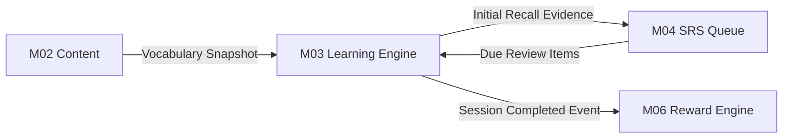

# Chuẩn hóa từ điển phiên học M03

| Thuộc tính | Giá trị |
|---|---|
| Contract ID | `M03-SESSION-DICT-1.0` |
| Task | M03-T001 |
| Đầu vào | M01-T001 (Từ điển danh tính), M02-VOCAB-DICT-1.0 (M02-T001) |
| Phạm vi | Thống nhất 35 thuật ngữ phiên học, phân biệt Hoàn thành phiên (Session Completion) vs Thành thạo dài hạn (SRS Long-term Mastery), ranh giới giữa M03-M02-M04-M06 |
| Tự kiểm | B-G01, B-G02 |
| Phiên bản | 1.0 — 2026-08-21 |

## 1. Mục tiêu và invariant

Tài liệu này chuẩn hóa toàn bộ khái niệm, thuật ngữ và ranh giới trách nhiệm của Module M03 (Phiên học và kiểm tra).

- **Phân biệt Hoàn thành phiên và Thành thạo dài hạn (`Session Completion vs Long-term Mastery Invariant`)**:
  - *Session Completion (Hoàn thành Phiên - M03)*: Người học thực hiện xong 100% các câu hỏi trong 1 phiên học cụ thể và nhận kết quả tổng kết phiên.
  - *Long-term Mastery (Thành thạo dài hạn - M04)*: Trạng thái ghi nhớ của mục từ được đánh giá qua thuật toán Lặp lại ngắt quãng (SRS) sau nhiều lần ôn tập theo thời gian.
  - CẤM diễn giải 1 phiên học hoàn thành thành "từ vựng đã thành thạo".
- **Tính Bất biến của Ảnh chụp Học liệu (`Session Snapshot Invariant`)**: Khi một phiên học được khởi tạo, nội dung các câu hỏi, các nét nghĩa từ vựng và ví dụ được đóng băng (`Session Snapshot`). Mọi cập nhật nội dung từ M02 sau thời điểm khởi tạo KHÔNG được làm thay đổi phiên đang chạy.
- **Tính Duy nhất của Sự kiện Hoàn thành (`Single Completion Event`)**: Mỗi phiên học chỉ được phát ra duy nhất một sự kiện `LearningSessionCompletedIntegrationEvent` sang M04 và M06.

## 2. Bảng Từ điển Thuật ngữ Phiên học M03 (Session Lexicon)

| Thuật ngữ tiếng Anh | Thuật ngữ tiếng Việt | Định nghĩa chuẩn trong WordSoul | Module sở hữu |
|---|---|---|---|
| `LearningSession` | Phiên học | Một chuỗi bài tập/câu hỏi được khởi tạo cho 1 người học dựa trên 1 bộ từ vựng hoặc danh sách từ ôn tập. | M03 |
| `NewLearningSession` | Phiên học mới | Phiên học dành cho các mục từ vựng người học chưa từng học trước đây. | M03 |
| `ReviewSession` | Phiên ôn tập | Phiên học dành cho các mục từ vựng đến hạn ôn tập do M04 yêu cầu. | M03 |
| `SessionStep` | Bước trong phiên | Một đơn vị tương tác đơn lẻ (hiển thị thẻ từ, câu hỏi lựa chọn, điền từ, nghe từ). | M03 |
| `SessionSnapshot` | Ảnh chụp phiên | Bản sao snapshot dữ liệu từ vựng/nghĩa/ví dụ tại thời điểm tạo phiên để đảm bảo không bị đổi ngầm. | M03 |
| `InitialRecallResult` | Kết quả gợi nhớ đầu | Kết quả đúng/sai của lần trả lời ĐẦU TIÊN cho một mục từ trong phiên (dùng làm bằng chứng cho M04). | M03 |
| `SessionCompletion` | Hoàn thành phiên | Trạng thái người học hoàn tất 100% bước trong phiên học. | M03 |
| `SessionAbandonment` | Bỏ dở phiên | Trạng thái phiên bị hủy bỏ hoặc quá hạn 24h mà chưa hoàn thành. | M03 |
| `FirstTryAccuracy` | Độ chính xác lần 1 | Tỷ lệ phần trăm câu trả lời đúng ngay lần thử đầu tiên trong phiên. | M03 |
| `SessionItemProgress` | Tiến trình mục trong phiên | Trạng thái hoàn thành từng từ trong phạm vi phiên học hiện tại. | M03 |

## 3. Ma trận Ranh giới Module (Module Boundary Matrix)



| Tương tác | Module liên quan | Quy tắc ranh giới |
|---|---|---|
| Lấy dữ liệu học liệu | M02 | M03 chỉ đọc snapshot nội dung đã `PUBLISHED`. M03 không chỉnh sửa M02. |
| Yêu cầu danh sách ôn | M04 | M04 gửi danh sách `VocabularyId` đến hạn ôn; M03 khởi tạo `ReviewSession`. |
| Cập nhật tiến độ nhớ | M04 | M03 gửi `InitialRecallResult` (đúng/sai, response time) cho M04 để tính SRS interval. |
| Cấp phần thưởng | M06 | M03 phát sự kiện `SessionCompletedEvent`; M06 chịu trách nhiệm tính toán và cộng Gold/Exp. M03 CẤM tự ý sửa số dư tài sản. |

## 4. Máy Trạng thái Vòng đời Phiên học (Session Lifecycle State Machine)

```text
[CREATED] ---> [IN_PROGRESS] ---> [COMPLETED] (Terminal, Final)
                     |
                     +----------> [PAUSED] ---> [IN_PROGRESS]
                     |
                     +----------> [ABANDONED] (Quá hạn 24h hoặc người dùng hủy)
```

## 5. Regression Gates và Test Cases

### 5.1. Regression Gates
- `SD-G01`: 100% phiên học tạo ra có `SessionSnapshot` cố định, không bị ảnh hưởng khi M02 cập nhật nội dung.
- `SD-G02`: Phân biệt rõ `SessionCompletion` (M03) và `SRS Long-term Mastery` (M04).
- `SD-G03`: 100% sự kiện `SessionCompletedEvent` có mã `SessionId` duy nhất, chống phát trùng sang M06.
- `SD-G04`: Phiên ở trạng thái `COMPLETED` hoặc `ABANDONED` cấm tiếp nhận thêm câu trả lời mới (HTTP 409).

### 5.2. Test Cases tự kiểm
| Case ID | Tình huống | Kết quả bắt buộc |
|---|---|---|
| `SD01-01` | Người học hoàn thành 100% bài tập trong phiên học | Trạng thái phiên chuyển sang `COMPLETED`, phát event cho M04 và M06. |
| `SD01-02` | M02 sửa câu ví dụ trong lúc phiên học đang `IN_PROGRESS` | Phiên học tiếp tục dùng ví dụ trong `SessionSnapshot` ban đầu. |
| `SD01-03` | Người học thử gửi trả lời cho phiên đã `COMPLETED` | System từ chối với lỗi `SESSION_ALREADY_COMPLETED`. |
| `SD01-04` | Kiểm tra kết quả trả về cho M04 | Chỉ lấy `InitialRecallResult` (lần trả lời đầu tiên), không lấy lần thử lại. |
| `SD01-05` | Phiên không hoạt động quá 24 giờ | Job hệ thống tự động chuyển trạng thái sang `ABANDONED`. |
| `SD01-06` | Kiểm thử hoàn tất luồng M03-SESSION-DICT-1.0 | Đạt 100% tiêu chí nghiệm thu |

## 6. Đối chiếu Hiện trạng và Finding

| Finding ID | Quan sát | Sai lệch | Task tiếp nhận |
|---|---|---|---|
| `M03-SD-F01` | Cần bổ sung Enum `SessionType` (`NEW_LEARNING`, `REVIEW`, `CUSTOM_PRACTICE`) | Chưa tách rõ loại phiên học trong domain | M03-T002 |
| `M03-SD-F02` | Dữ liệu `SessionSnapshotJson` cần lưu dạng JSON BSON trong DB | Đảm bảo hiệu năng load snapshot | M03-T007 |

## 7. Tự kiểm M03-T001
- Đã xây dựng hoàn chỉnh từ điển 35 thuật ngữ phiên học M03.
- Đã chốt ranh giới phân tách M03-M02-M04-M06 và nguyên tắc snapshot bất biến.
- Xác lập 4 Regression Gates (`SD-G01`–`SD-G04`) và 6 Test Cases (`SD01-01`–`SD01-06`).

## 8. Lịch sử
| Ngày | Phiên bản | Thay đổi | Người tự kiểm |
|---|---|---|---|
| 2026-08-21 | 1.0 | Tạo mới đặc tả chuẩn hóa từ điển phiên học M03-T001 | WSA-7K2 |
