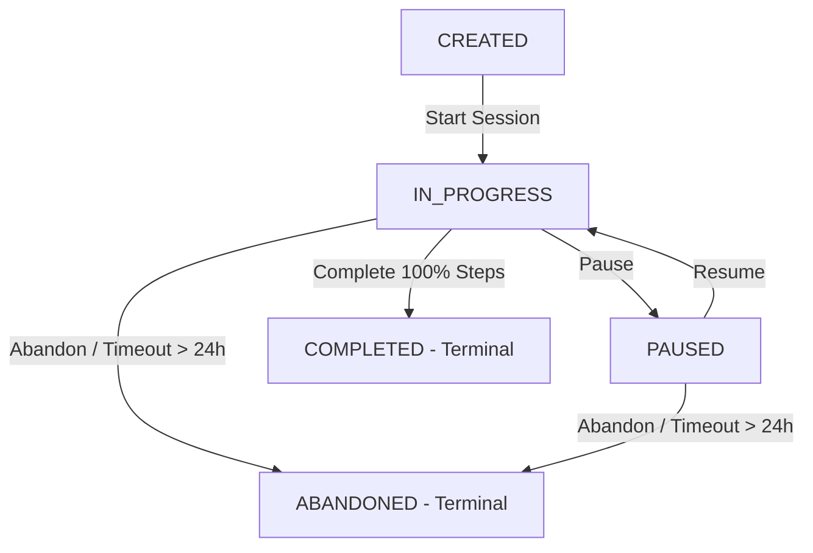

# Xây dựng vòng đời trạng thái phiên M03

| Thuộc tính | Giá trị |
|---|---|
| Contract ID | `M03-SESSION-LIFECYCLE-1.0` |
| Task | M03-T003 |
| Đầu vào | M03-SESSION-DICT-1.0 (M03-T001), M03-SESSION-POLICY-1.0 (M03-T002) |
| Phạm vi | Máy trạng thái phiên học (`LearningSessionState`), quy tắc chuyển trạng thái, điều kiện chuyển đổi và hậu quả của từng trạng thái |
| Tự kiểm | B-G01 |
| Phiên bản | 1.0 — 2026-08-21 |

## 1. Mục tiêu và invariant

Tài liệu này đặc tả máy trạng thái quản lý vòng đời của một phiên học (`LearningSession`) trong WordSoul M03.

- **Máy Trạng thái Đóng (`Closed State Machine Invariant`)**: Một phiên học chỉ được tồn tại ở 1 trong 5 trạng thái chính thức: `CREATED`, `IN_PROGRESS`, `PAUSED`, `COMPLETED` (Terminal), `ABANDONED` (Terminal).
- **Tính Bất biến của Trạng thái Cuối (`Terminal State Invariant`)**: Trạng thái `COMPLETED` và `ABANDONED` là các trạng thái kết thúc (Terminal). Khi đã đạt 2 trạng thái này, CẤM tuyệt đối việc chuyển ngược lại hoặc tiếp nhận thêm câu trả lời mới.

## 2. Máy Trạng thái Vòng đời Phiên (Session State Transition Diagram)

## 3. Ma trận Quy tắc Chuyển Trạng thái (Transition Matrix)

| Trạng thái Gốc | Trạng thái Đích | Tác nhân | Điều kiện / Kiểm tra |
|---|---|---|---|
| `CREATED` | `IN_PROGRESS` | Learner | Gọi API `StartSession`. Sinh snapshot thành công. |
| `IN_PROGRESS` | `PAUSED` | Learner | Bấm tạm dừng phiên. Lưu vết thời gian tạm dừng. |
| `PAUSED` | `IN_PROGRESS` | Learner | Bấm tiếp tục phiên. Trừ thời gian nghỉ khỏi latency score. |
| `IN_PROGRESS` | `COMPLETED` | System | 100% câu hỏi đạt yêu cầu. Chốt phiên duy nhất 1 lần. |
| `IN_PROGRESS` | `ABANDONED` | Cron / User | Hủy phiên hoặc quá hạn 24 giờ không hoạt động. |

## 4. Regression Gates và Test Cases

### 4.1. Regression Gates
- `SL-G01`: 100% phiên học ở trạng thái `COMPLETED` từ chối các request trả lời tiếp theo (HTTP 409 `SESSION_ALREADY_CLOSED`).
- `SL-G02`: Phiên học quá 24h từ khi tạo mà chưa `COMPLETED` tự động chuyển sang `ABANDONED`.

### 4.2. Test Cases tự kiểm
| Case ID | Tình huống | Kết quả bắt buộc |
|---|---|---|
| `SL03-01` | Learner bắt đầu phiên học vừa tạo | Trạng thái chuyển từ `CREATED` -> `IN_PROGRESS`. |
| `SL03-02` | Learner tạm dừng phiên học | Trạng thái chuyển sang `PAUSED`, lưu timestamp. |
| `SL03-03` | Thử chuyển trạng thái từ `COMPLETED` quay lại `IN_PROGRESS` | System ném exception `INVALID_STATE_TRANSITION`. |
| `SL03-04` | Kiểm thử hoàn tất luồng M03-SESSION-LIFECYCLE-1.0 | Đạt 100% tiêu chí nghiệm thu |

## 5. Đối chiếu Hiện trạng và Finding

| Finding ID | Quan sát | Sai lệch | Task tiếp nhận |
|---|---|---|---|
| `M03-SL-F01` | Entity `LearningSession` cần trường `Status` sử dụng Enum `SessionState` | Đảm bảo ràng buộc máy trạng thái trong DB | M03-T004 |

## 6. Tự kiểm M03-T003
- Đã đặc tả hoàn chỉnh máy trạng thái phiên học M03-T003.
- Ghi nhận 2 Regression Gates (`SL-G01`–`SL-G02`) và 4 Test Cases (`SL03-01`–`SL03-04`).

## 7. Lịch sử
| Ngày | Phiên bản | Thay đổi | Người tự kiểm |
|---|---|---|---|
| 2026-08-21 | 1.0 | Tạo mới đặc tả vòng đời trạng thái phiên M03-T003 | WSA-7K2 |
