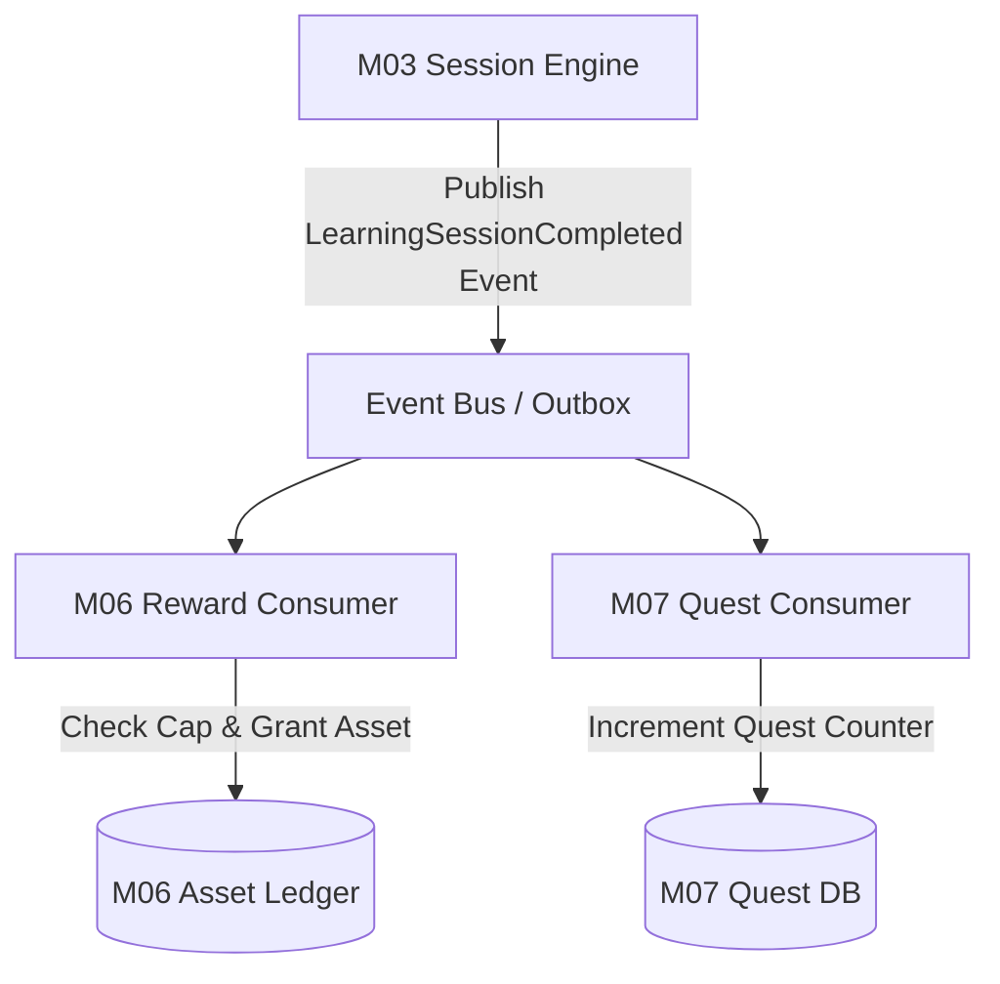

# Xác định ranh giới phần thưởng và nhiệm vụ M03

| Thuộc tính | Giá trị |
|---|---|
| Contract ID | `M03-REWARD-QUEST-BOUNDARY-1.0` |
| Task | M03-T041 |
| Đầu vào | M03-SESSION-COMPLETED-EVENT-1.0 (M03-T040), M06-ASSET-ITEM-DICT-1.0 (M06-T001), M07-QUEST-DICT-1.0 (M07-T001) |
| Phạm vi | Ranh giới trách nhiệm giữa M03 (Xác nhận hoàn thành), M06 (Sở hữu cấp tài sản) và M07 (Tính tiến độ nhiệm vụ) |
| Tự kiểm | B-G01, B-G03, B-G04 |
| Phiên bản | 1.0 — 2026-08-22 |

## 1. Mục tiêu và invariant

Tài liệu này quy định ranh giới tách biệt trách nhiệm giữa M03, M06 và M07 khi kết thúc một phiên học.

- **Ranh giới Trách nhiệm Độc lập (`Decoupled Module Responsibility Invariant`)**:
  - *M03 (Chỉ Xác nhận Hoàn thành)*: M03 chỉ xác nhận phiên học đã hoàn thành $100\%$ hợp lệ và phát sự kiện `LearningSessionCompletedIntegrationEvent`. M03 KHÔNG TỰ CẤP Gold/Exp và KHÔNG TỰ TÍNH tiến độ nhiệm vụ.
  - *M06 (Sở hữu Cấp Tài sản)*: M06 lắng nghe event từ M03, kiểm tra daily cap và thực hiện ghi sổ cái tài sản (`AssetLedgerEntry`).
  - *M07 (Sở hữu Tiến độ Nhiệm vụ)*: M07 lắng nghe event từ M03, đếm tăng `CurrentCount` nhiệm vụ ngày.
- **Tính Bất biến khi Module Khác Lỗi (`Resilience Invariant`)**: Nếu M06 hoặc M07 gặp sự cố xử lý, trạng thái `COMPLETED` của phiên học trong M03 VẪN ĐƯỢC GIỮ NGUYÊN 100%. Lỗi từ M06/M07 không làm rollback trạng thái hoàn thành học tập của người học.

## 2. Luồng Phát hiện và Tiếp nhận Sự kiện (Event Fan-out Architecture)

## 3. Regression Gates và Test Cases

### 3.1. Regression Gates
- `RQ-G01`: M03 không gọi API hay SQL trực tiếp vào DB của M06/M07 mà chỉ giao tiếp qua Outbox Integration Event.
- `RQ-G02`: Sự cố crash consumer M06/M07 không làm thất bại API chốt phiên của M03.

### 3.2. Test Cases tự kiểm
| Case ID | Tình huống | Kết quả bắt buộc |
|---|---|---|
| `RQ41-01` | Người học chốt phiên học thành công | M03 chuyển trạng thái `COMPLETED`, phát 1 event cho cả M06 và M07. |
| `RQ41-02` | M06 gặp sự cố database trong khi M03 đang chốt phiên | M03 vẫn chốt phiên `COMPLETED` thành công; event được lưu trong Outbox table để M06 retry sau. |
| `RQ41-03` | Kiểm thử hoàn tất luồng M03-REWARD-QUEST-BOUNDARY-1.0 | Đạt 100% tiêu chí nghiệm thu |

## 4. Đối chiếu Hiện trạng và Finding

| Finding ID | Quan sát | Sai lệch | Task tiếp nhận |
|---|---|---|---|
| `M03-RQ-F01` | Cần triển khai `Transactional Outbox Pattern` trong `WordSoul.Infrastructure` | Đảm bảo tính tin cậy tuyệt đối khi phát event | M03-T040 |

## 5. Tự kiểm M03-T041
- Đã hoàn thành đặc tả `M03-REWARD-QUEST-BOUNDARY-1.0`.
- Chốt ranh giới trách nhiệm M03-M06-M07 và 2 Regression Gates (`RQ-G01`–`RQ-G02`).

## 6. Lịch sử
| Ngày | Phiên bản | Thay đổi | Người tự kiểm |
|---|---|---|---|
| 2026-08-22 | 1.0 | Tạo mới đặc tả xác định ranh giới phần thưởng và nhiệm vụ M03-T041 | WSA-7K2 |
