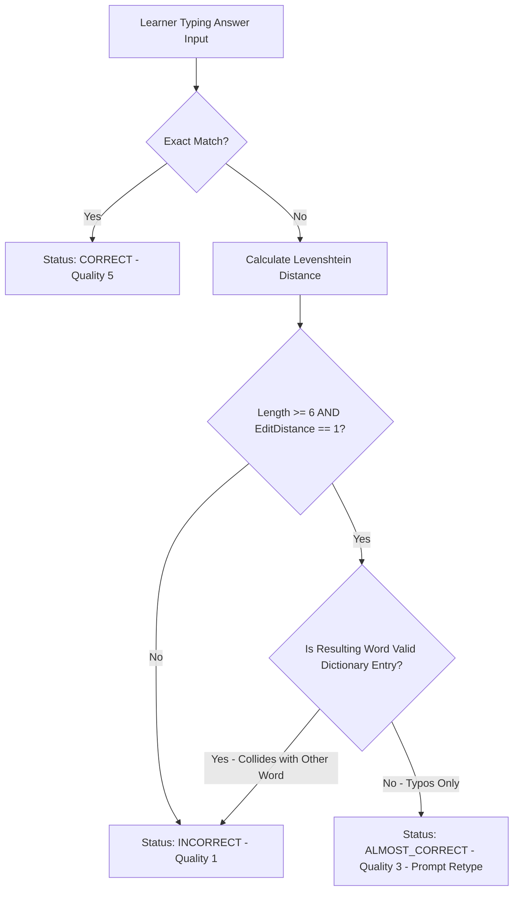

# Quyết định xử lý lỗi chính tả gần đúng M03

| Thuộc tính | Giá trị |
|---|---|
| Contract ID | `M03-FUZZY-SPELLING-ERROR-HANDLING-1.0` |
| Task | M03-T029 |
| Đầu vào | M03-REALTIME-FEEDBACK-1.0 (M03-T032), M11-CONFIG-REG-1.0 (M11-T012) |
| Phạm vi | Thuật toán đánh giá câu trả lời gõ từ (`Spelling Evaluation Engine`), khoảng cách Levenshtein (`Levenshtein Distance Threshold`) và xử lý lỗi gõ nhầm nhỏ |
| Tự kiểm | B-G02 |
| Phiên bản | 1.0 — 2026-08-22 |

## 1. Mục tiêu và invariant

Tài liệu này quy định quy tắc chấm điểm và xử lý lỗi chính tả gần đúng (`Fuzzy Spelling Evaluation Engine`) trong M03.

- **Ngưỡng Khoảng cách Levenshtein Chấp nhận được (`Levenshtein Threshold Rule`)**:
  - Với các từ có độ dài $\ge 6$ ký tự: Cho phép khoảng cách Levenshtein $EditDistance == 1$ (ví dụ: gõ sai 1 ký tự hoán vị hoặc gõ thừa/thiếu 1 chữ) được coi là `ALMOST_CORRECT`.
  - Từ $< 6$ ký tự: Yêu cầu chính xác $100\%$ ($EditDistance == 0$).
- **Không Tính Điểm Đúng Hoàn toàn cho Lỗi Gần đúng (`No Full Mastery Credit for Typos`)**:
  - Trả lời dạng `ALMOST_CORRECT` cho phép người học gõ lại mà KHÔNG bị tính là câu sai hoàn toàn, nhưng điểm SRS chất lượng chỉ được tính tối đa $QualityScore = 3$ (khá) thay vì $5$ (xuất sắc).
- **Cấm Chấp nhận Từ mang Nghĩa Khác (`Homophone Exclusion Invariant`)**: Nếu lỗi chính tả tạo thành một từ có nghĩa khác trong từ điển (ví dụ: "ship" vs "sheep"), BẮT BUỘC chấm là `INCORRECT`.

## 2. Quy trình Đánh giá Lỗi Chính tả (Spelling Evaluation Flow)

## 3. Regression Gates và Test Cases

### 3.1. Regression Gates
- `FS-G01`: 100% từ dài $\ge 6$ ký tự bị sai 1 lỗi chính tả gõ phím được chấm `ALMOST_CORRECT`.
- `FS-G02`: Lỗi chính tả va chạm với một từ từ điển khác (ví dụ "form" vs "from") bị chấm $100\%$ `INCORRECT`.

### 3.2. Test Cases tự kiểm
| Case ID | Tình huống | Kết quả bắt buộc |
|---|---|---|
| `FS29-01` | Learner gõ "beautiful" thành "beautifull" (dài 9 ký tự, thừa 1 chữ l) | Trả về `ALMOST_CORRECT`, gợi ý người học kiểm tra lại chữ 'l' cuối. |
| `FS29-02` | Learner gõ "cat" thành "cut" (từ ngắn 3 ký tự, đụng từ cut) | Trả về `INCORRECT`. |
| `FS29-03` | Kiểm thử hoàn tất luồng M03-FUZZY-SPELLING-ERROR-HANDLING-1.0 | Đạt 100% tiêu chí nghiệm thu |

## 4. Đối chiếu Hiện trạng và Finding

| Finding ID | Quan sát | Sai lệch | Task tiếp nhận |
|---|---|---|---|
| `M03-FS-F01` | Sử dụng thư viện FastLevenshtein trong QuestionScoringService | Tối ưu thời gian chấm bài $< 2\text{ms}$ | M03-T032 |

## 5. Tự kiểm M03-T029
- Đã hoàn thành đặc tả `M03-FUZZY-SPELLING-ERROR-HANDLING-1.0`.
- Chốt ngưỡng EditDistance Levenshtein và quy tắc kẹp trần QualityScore = 3.
- Ghi nhận 2 Regression Gates (`FS-G01`–`FS-G02`) và 3 Test Cases (`FS29-01`–`FS29-03`).

## 6. Lịch sử
| Ngày | Phiên bản | Thay đổi | Người tự kiểm |
|---|---|---|---|
| 2026-08-22 | 1.0 | Tạo mới đặc tả quyết định xử lý lỗi chính tả gần đúng M03-T029 | WSA-7K2 |
