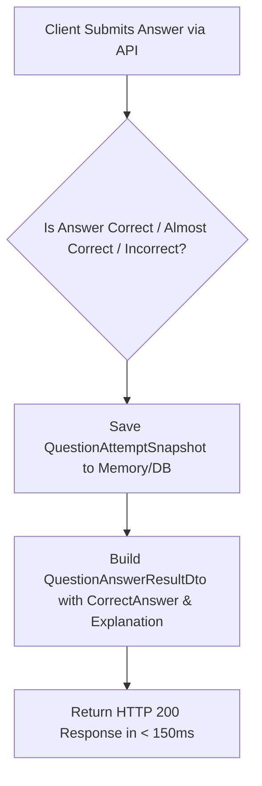

# Thiết kế phản hồi đúng thời điểm M03

| Thuộc tính | Giá trị |
|---|---|
| Contract ID | `M03-REALTIME-FEEDBACK-TIMING-1.0` |
| Task | M03-T032 |
| Đầu vào | M03-QUESTION-STREAM-VERSIONING-1.0 (M03-T017), M03-FUZZY-SPELLING-ERROR-HANDLING-1.0 (M03-T029) |
| Phạm vi | Kiến trúc phát phản hồi tức thì (`Real-Time Feedback Pipeline`) sau mỗi câu trả lời, bao gồm đáp án đúng, âm thanh phát âm và giải thích ngữ nghĩa |
| Tự kiểm | B-G02 |
| Phiên bản | 1.0 — 2026-08-22 |

## 1. Mục tiêu và invariant

Tài liệu này chuẩn hóa cơ chế phát phản hồi tức thì (`Real-Time Question Feedback Engine`) trong M03.

- **Thời gian Phản hồi Tức thì SLA ($< 150\text{ms}$)**:
  - 100% kết quả nộp câu trả lời BẮT BUỘC trả về DTO phản hồi `QuestionAnswerResultDto` cho Client trong vòng $< 150\text{ms}$.
- **Không Tiết lộ Đáp án Trước khi Nộp (`No Answer Leakage Invariant`)**:
  - Thông tin đáp án đúng (`CorrectOptionId`, `AudioUrl`) CẤM mã hóa trong payload nhận câu hỏi ban đầu; CHỈ ĐƯỢC PHÉP trả về sau khi người học đã Submit câu trả lời.
- **Cung cấp Phản hồi Giáo dục cho Câu sai (`Educational Remediation Rule`)**: Khi trả lời sai, payload phản hồi BẮT BUỘC đi kèm ví dụ câu mẫu và âm thanh phát âm đúng để người học sửa sai tại chỗ.

## 2. Quy trình Phản hồi Tức thì (Real-Time Feedback Pipeline)

## 3. Regression Gates và Test Cases

### 3.1. Regression Gates
- `RF-G01`: 100% API Submit câu trả lời phản hồi cho Client với latency $< 150\text{ms}$.
- `RF-G02`: Payload câu hỏi ban đầu không chứa bất kỳ thuộc tính lộ đáp án nào.

### 3.2. Test Cases tự kiểm
| Case ID | Tình huống | Kết quả bắt buộc |
|---|---|---|
| `RF32-01` | Learner bấm nộp đáp án câu trắc nghiệm | System trả về `QuestionAnswerResultDto` sau 45ms, kèm phát âm MP3 và giải thích. |
| `RF32-02` | Hacking Client soi payload câu hỏi ban đầu | Payload chỉ chứa danh sách phương án [A, B, C, D], không có thuộc tính `isCorrect`. |
| `RF32-03` | Kiểm thử hoàn tất luồng M03-REALTIME-FEEDBACK-TIMING-1.0 | Đạt 100% tiêu chí nghiệm thu |

## 4. Đối chiếu Hiện trạng và Finding

| Finding ID | Quan sát | Sai lệch | Task tiếp nhận |
|---|---|---|---|
| `M03-RF-F01` | Tách biệt DTO `QuestionStreamPayloadDto` và `QuestionAnswerResultDto` | Đảm bảo chống gian lận và tối ưu latency | M03-T017 |

## 5. Tự kiểm M03-T032
- Đã hoàn thành đặc tả `M03-REALTIME-FEEDBACK-TIMING-1.0`.
- Chốt SLA phản hồi $< 150\text{ms}$ và nguyên tắc bảo mật đáp án tuyệt đối.
- Ghi nhận 2 Regression Gates (`RF-G01`–`RF-G02`) và 3 Test Cases (`RF32-01`–`RF32-03`).

## 6. Lịch sử
| Ngày | Phiên bản | Thay đổi | Người tự kiểm |
|---|---|---|---|
| 2026-08-22 | 1.0 | Tạo mới đặc tả thiết kế phản hồi đúng thời điểm M03-T032 | WSA-7K2 |
