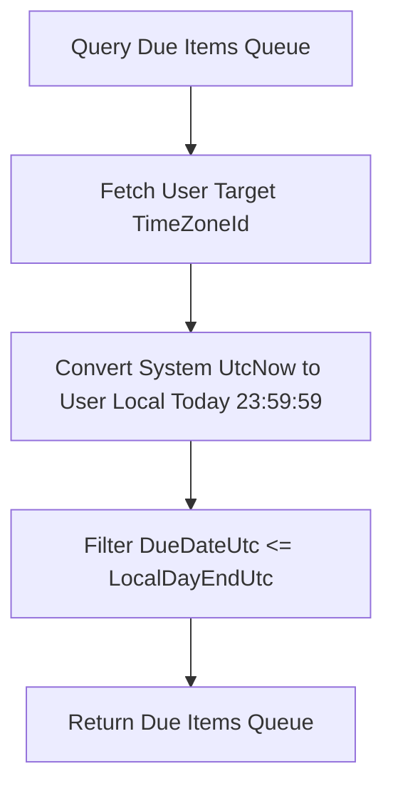

# Chuẩn hóa thời điểm ôn và múi giờ M04

| Thuộc tính | Giá trị |
|---|---|
| Contract ID | `M04-SCHEDULE-TIMEZONE-1.0` |
| Task | M04-T017 |
| Đầu vào | M01-TIMEZONE-1.0 (M01-T025), M04-SRS-INTERVAL-CALCULATION-1.0 (M04-T016) |
| Phạm vi | Lưu trữ mốc thời điểm ôn ở dạng chuẩn UTC (`DueDateUtc`), tính toán ngày nghiệp vụ theo múi giờ cá nhân (`UserTimeZoneId`) và xử lý chuyển đổi múi giờ/giờ mùa hè (DST) |
| Tự kiểm | B-G02 |
| Phiên bản | 1.0 — 2026-08-22 |

## 1. Mục tiêu và invariant

Tài liệu này quy định việc quản lý mốc thời gian ôn tập (`DueDate`) và xử lý múi giờ (`Timezone`) trong M04.

- **Lưu trữ Tuyệt đối theo UTC (`Absolute UTC Storage Invariant`)**:
  - 100% cột thời gian trong DB (`DueDateUtc`, `LastReviewedAtUtc`, `CreatedAtUtc`) BẮT BUỘC lưu dưới dạng `DateTime` UTC chuẩn (`Kind = Utc`).
  - Tuyệt đối CẤM lưu thời gian theo múi giờ địa phương vào cơ sở dữ liệu.
- **Xác định Từ đến hạn theo Ngày Nghiệp vụ Địa phương (`Local Business Day Due Rule`)**:
  - Mục từ vựng được tính là "Đến hạn ôn" (`IsDue == true`) khi mốc `DueDateUtc` quy đổi sang múi giờ người dùng (`UserTimeZoneId`) nhỏ hơn hoặc bằng 23:59:59 của Ngày Nghiệp vụ hiện tại.
  - Việc đổi múi giờ cá nhân (ví dụ đi du lịch từ `Asia/Ho_Chi_Minh` sang `America/New_York`) KHÔNG LÀM MẤT hay nhân bản từ vựng trong hàng đợi.

## 2. Quy trình Tính toán Ngày Đến hạn theo Múi giờ (Due Calculation Workflow)

## 3. Regression Gates và Test Cases

### 3.1. Regression Gates
- `TZ-G01`: 100% bản ghi `DueDateUtc` trong DB có định dạng UTC chuẩn (`Z` suffix trong JSON API).
- `TZ-G02`: Đổi múi giờ tài khoản không làm thay đổi giá trị gốc của `DueDateUtc` trong DB.

### 3.2. Test Cases tự kiểm
| Case ID | Tình huống | Kết quả bắt buộc |
|---|---|---|
| `TZ17-01` | Người dùng ở múi giờ `Asia/Ho_Chi_Minh` (UTC+7) học từ vựng mới lúc 10:00 AM UTC | `DueDateUtc` lưu `10:00 AM UTC` ngày hôm sau, quy đổi hiển thị local `5:00 PM`. |
| `TZ17-02` | Người dùng đổi múi giờ sang `Europe/London` (UTC+0) | Hàng đợi ôn tái tính toán theo ngày local London mà không làm hỏng dữ liệu DB. |
| `TZ17-03` | Kiểm thử hoàn tất luồng M04-SCHEDULE-TIMEZONE-1.0 | Đạt 100% tiêu chí nghiệm thu |

## 4. Đối chiếu Hiện trạng và Finding

| Finding ID | Quan sát | Sai lệch | Task tiếp nhận |
|---|---|---|---|
| `M04-TZ-F01` | Sử dụng NodaTime hoặc `TimeZoneInfo.ConvertTimeFromUtc` trong Query | Đảm bảo tính chính xác khi xử lý DST | M04-T020 |

## 5. Tự kiểm M04-T017
- Đã hoàn thành đặc tả `M04-SCHEDULE-TIMEZONE-1.0`.
- Chốt nguyên tắc lưu trữ UTC 100% và quy đổi ngày nghiệp vụ local.
- Ghi nhận 2 Regression Gates (`TZ-G01`–`TZ-G02`) và 3 Test Cases (`TZ17-01`–`TZ17-03`).

## 6. Lịch sử
| Ngày | Phiên bản | Thay đổi | Người tự kiểm |
|---|---|---|---|
| 2026-08-22 | 1.0 | Tạo mới đặc tả chuẩn hóa thời điểm ôn và múi giờ M04-T017 | WSA-7K2 |
