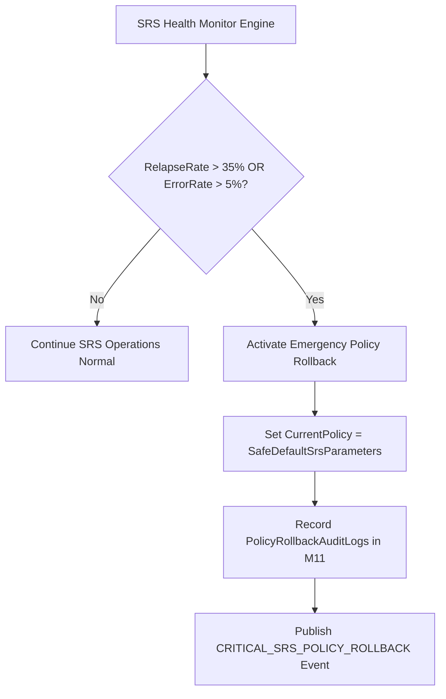

# Thiết kế cảnh báo và phục hồi chính sách M04

| Thuộc tính | Giá trị |
|---|---|
| Contract ID | `M04-POLICY-ALERT-ROLLBACK-ENGINE-1.0` |
| Task | M04-T044 |
| Đầu vào | M04-POLICY-FAILURE-RECOVERY-1.0 (M04-T019), M04-POLICY-VERSION-MIGRATION-STRATEGY-1.0 (M04-T042), M04-POLICY-QUALITY-METRICS-1.0 (M04-T043), M11-CONFIG-REG-1.0 (M11-T012) |
| Phạm vi | Cơ chế cảnh báo khẩn cấp và quay lại phiên bản chính sách an toàn (`Policy Alert & Emergency Rollback Engine`) khi chính sách SRS mới phát sinh sự cố |
| Tự kiểm | B-G02 |
| Phiên bản | 1.0 — 2026-08-22 |

## 1. Mục tiêu và invariant

Tài liệu này đặc tả quy trình ném cảnh báo khẩn cấp và quay lại phiên bản chính sách an toàn (`Policy Alert & Rollback Engine`) trong M04.

- **Tự động Quay lại Phiên bản An toàn (`Automatic Rollback to Safe Baseline Invariant`)**:
  - Khi chỉ số chất lượng chính sách tụt dốc nghiêm trọng (`RelearningRelapseRate > 35.0\%` hoặc tỷ lệ lỗi hệ thống SRS $> 5.0\%$):
    - Hệ thống TỰ ĐỘNG ngắt chính sách mới và khôi phục về `SafeDefaultSrsParameters` (Default $EF = 2.50, Interval_1 = 1d$).
    - Bắn cảnh báo `CRITICAL_SRS_POLICY_ROLLBACK` sang M11/Slack Ops.
- **Bảo toàn Lịch sử Đã phát sinh (`No History Purge on Rollback Rule`)**:
  - Thao tác Rollback KHÔNG ĐƯỢC PHÉP xóa các bản ghi lịch sử tiến độ `UserSenseProgressLogs` đã ghi nhận trong thời gian thử nghiệm chính sách lỗi.

## 2. Luồng Cảnh báo và Quay lại Chính sách Khẩn cấp (Rollback Engine Flow)

## 3. Regression Gates và Test Cases

### 3.1. Regression Gates
- `AR-G01`: 100% trường hợp `ErrorRate > 5%` kích hoạt tự động khôi phục về `SafeDefaultSrsParameters` trong vòng 10 giây.
- `AR-G02`: Thao tác Rollback giữ nguyên $100\%$ dữ liệu trong `UserSenseProgressLogs`.

### 3.2. Test Cases tự kiểm
| Case ID | Tình huống | Kết quả bắt buộc |
|---|---|---|
| `AR44-01` | Chính sách v2.1 bị lỗi công thức làm `RelapseRate` tăng vọt lên 40.0% | System tự động Rollback về `SafeDefaultSrsParameters`, bắn cảnh báo M11. |
| `AR44-02` | Admin bấm nút "Rollback Thủ công" từ Dashboard | System chuyển trạng thái về chính sách v2.0 an toàn trước đó, ghi 1 log kiểm toán. |
| `AR44-03` | Kiểm thử hoàn tất luồng M04-POLICY-ALERT-ROLLBACK-ENGINE-1.0 | Đạt 100% tiêu chí nghiệm thu |

## 4. Đối chiếu Hiện trạng và Finding

| Finding ID | Quan sát | Sai lệch | Task tiếp nhận |
|---|---|---|---|
| `M04-AR-F01` | Tích hợp cờ `EmergencyRollbackTriggered` trong M11 Config Registry | Cho phép ngắt chính sách SRS lỗi toàn hệ thống lập tức | M11-T012 |

## 5. Tự kiểm M04-T044
- Đã hoàn thành đặc tả `M04-POLICY-ALERT-ROLLBACK-ENGINE-1.0`.
- Chốt cơ chế tự động Rollback về SafeDefault khi lỗi $> 5\%$ và bảo toàn dữ liệu lịch sử.
- Ghi nhận 2 Regression Gates (`AR-G01`–`AR-G02`) và 3 Test Cases (`AR44-01`–`AR44-03`).

## 6. Lịch sử
| Ngày | Phiên bản | Thay đổi | Người tự kiểm |
|---|---|---|---|
| 2026-08-22 | 1.0 | Tạo mới đặc tả thiết kế cảnh báo và phục hồi chính sách M04-T044 | WSA-7K2 |
