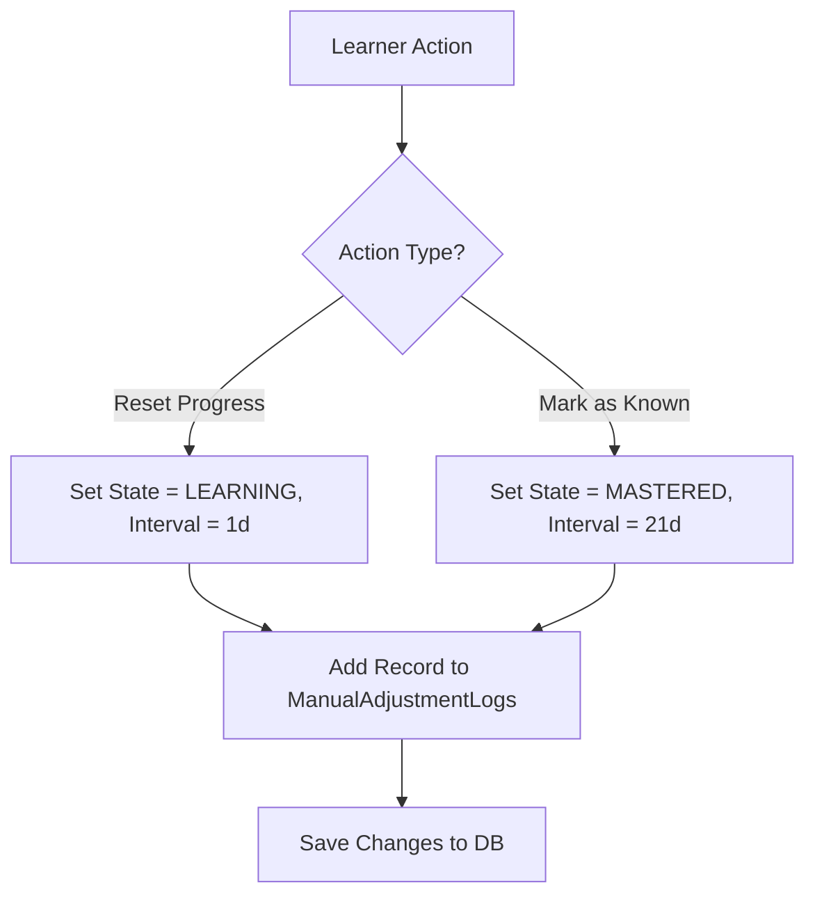

# Thiết kế đặt lại và đánh dấu đã biết M04

| Thuộc tính | Giá trị |
|---|---|
| Contract ID | `M04-RESET-MARK-KNOWN-1.0` |
| Task | M04-T005 |
| Đầu vào | M04-USER-SENSE-UNIT-1.0 (M04-T002), M04-INITIAL-PROGRESS-VALUES-1.0 (M04-T004) |
| Phạm vi | Hai thao tác can thiệp thủ công vào tiến độ ghi nhớ: Đặt lại tiến độ (`Reset Progress`) và Đánh dấu đã biết (`Mark as Known`), quy tắc ghi nhật ký điều chỉnh và bảo toàn lịch sử |
| Tự kiểm | B-G02 |
| Phiên bản | 1.0 — 2026-08-22 |

## 1. Mục tiêu và invariant

Tài liệu này đặc tả quy trình và tác động khi người học chủ động can thiệp Đặt lại (`Reset`) hoặc Đánh dấu đã biết (`Mark as Known`) đối với một nét nghĩa từ vựng trong M04.

- **Bảo lưu Nhật ký Kiểm toán Điều chỉnh (`Adjustment Audit Invariant`)**:
  - Mọi thao tác Reset hoặc Mark as Known CHỈ ĐƯỢC ĐỔI trạng thái hiện tại (`UserSenseProgress`), tuyệt đối CẤM xóa các bản ghi lịch sử ôn tập (`ProgressLogs`) đã sinh ra trước đó.
  - Hệ thống BẮT BUỘC ghi một bản ghi điều chỉnh `ManualAdjustmentLog` ghi nhận lý do và thời điểm thao tác.
- **Quy tắc Trạng thái sau Can thiệp (`Post-Action State Rules`)**:
  - *Reset Progress*: Chuyển `State = LEARNING`, `IntervalDays = 1`, `RepetitionCount = 0`, `DueDateUtc = Now`.
  - *Mark as Known*: Chuyển `State = MASTERED`, `IntervalDays = 21`, `RepetitionCount = 3`, `DueDateUtc = Now + 21 Days`.

## 2. Quy trình Xử lý Can thiệp Tiến độ Thủ công (Manual Progress Adjustment Flow)

## 3. Regression Gates và Test Cases

### 3.1. Regression Gates
- `RM-G01`: 100% thao tác Reset/Mark Known tạo ra bản ghi nhật ký kiểm toán trong `ManualAdjustmentLogs`.
- `RM-G02`: Lịch sử `ProgressLogs` nguyên bản không bị xóa sau thao tác Reset.

### 3.2. Test Cases tự kiểm
| Case ID | Tình huống | Kết quả bắt buộc |
|---|---|---|
| `RM05-01` | Người học bấm "Đặt lại tiến độ" cho từ A đang `MASTERED` | Trạng thái chuyển về `LEARNING`, $Interval = 1$ ngày, lịch sử cũ được giữ nguyên. |
| `RM05-02` | Người học bấm "Đánh dấu đã biết" cho từ B mới học | Trạng thái chuyển thành `MASTERED`, $Interval = 21$ ngày, đến hạn sau 21 ngày. |
| `RM05-03` | Kiểm thử hoàn tất luồng M04-RESET-MARK-KNOWN-1.0 | Đạt 100% tiêu chí nghiệm thu |

## 4. Đối chiếu Hiện trạng và Finding

| Finding ID | Quan sát | Sai lệch | Task tiếp nhận |
|---|---|---|---|
| `M04-RM-F01` | Tạo API endpoints `POST /api/v1/progress/{senseId}/reset` và `POST /api/v1/progress/{senseId}/mark-known` | Phục vụ UI can thiệp tiến độ cá nhân | M04-T005 |

## 5. Tự kiểm M04-T005
- Đã hoàn thành đặc tả `M04-RESET-MARK-KNOWN-1.0`.
- Chốt quy tắc trạng thái sau can thiệp và nhật ký kiểm toán bất biến.
- Ghi nhận 2 Regression Gates (`RM-G01`–`RM-G02`) và 3 Test Cases (`RM05-01`–`RM05-03`).

## 6. Lịch sử
| Ngày | Phiên bản | Thay đổi | Người tự kiểm |
|---|---|---|---|
| 2026-08-22 | 1.0 | Tạo mới đặc tả thiết kế đặt lại và đánh dấu đã biết M04-T005 | WSA-7K2 |
