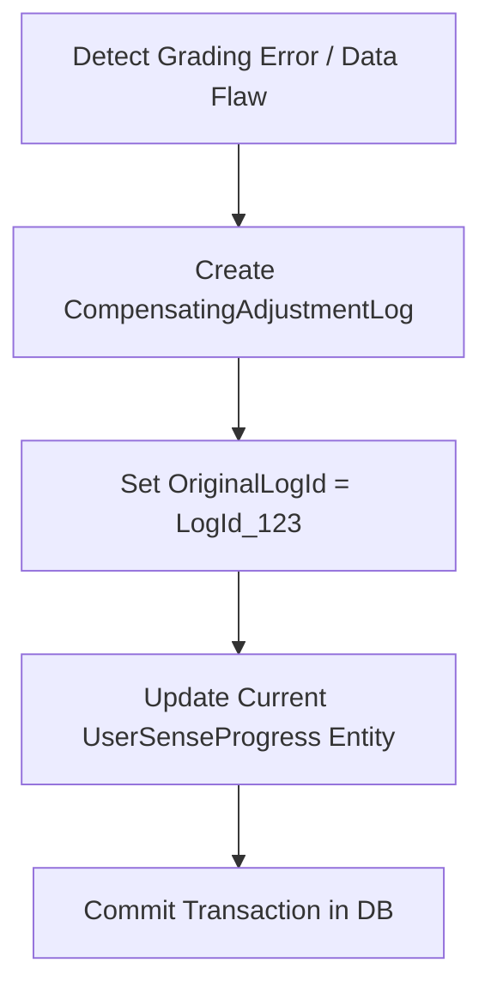

# Thiết kế lịch sử bất biến và điều chỉnh bù M04

| Thuộc tính | Giá trị |
|---|---|
| Contract ID | `M04-IMMUTABLE-HISTORY-COMPENSATING-ADJUSTMENT-1.0` |
| Task | M04-T025 |
| Đầu vào | M04-REVIEW-LOG-SCHEMA-1.0 (M04-T024), M11-CONFIG-REG-1.0 (M11-T012) |
| Phạm vi | Nguyên tắc thiết kế nhật ký lịch sử bất biến (`Immutable Audit History`) và cơ chế tạo bản ghi điều chỉnh bù (`Compensating Adjustment Entries`) khi sửa sai tiến độ |
| Tự kiểm | B-G02 |
| Phiên bản | 1.0 — 2026-08-22 |

## 1. Mục tiêu và invariant

Tài liệu này đặc tả quy trình thực hiện điều chỉnh bù (`Compensating Adjustment`) khi cần sửa sai tiến độ trong M04 mà vẫn đảm bảo tính bất biến của nhật ký lịch sử.

- **Tính Bất biến của Bản ghi Gốc (`No Original Record Mutation Invariant`)**:
  - Tuyệt đối CẤM chỉnh sửa (`UPDATE`) hoặc xóa (`DELETE`) các bản ghi lịch sử `UserSenseProgressLogs` đã tồn tại trong CSDL.
- **Cơ chế Bản ghi Bù (`Compensating Record Pattern`)**:
  - Khi Admin hoặc hệ thống cần điều chỉnh sửa sai chỉ số SRS (ví dụ: do lỗi chấm sai từ M03), hệ thống BẮT BUỘC sinh một bản ghi điều chỉnh bù mới `CompensatingAdjustmentLog` liên kết với `OriginalLogId`.
  - Bản ghi bù ghi nhận: `AdjustmentType = COMPENSATING`, `Reason`, `AdminUserId`, `DeltaIntervalDays`, `DeltaEaseFactor`.

## 2. Quy trình Thực hiện Điều chỉnh Bù (Compensating Adjustment Workflow)

## 3. Regression Gates và Test Cases

### 3.1. Regression Gates
- `IH-G01`: 100% các thao tác điều chỉnh tiến độ đều tạo thêm bản ghi điều chỉnh bù mà không làm thay đổi row gốc.
- `IH-G02`: Tái dựng trạng thái cuối từ chuỗi log (Log gốc + Log bù) cho kết quả chính xác 100%.

### 3.2. Test Cases tự kiểm
| Case ID | Tình huống | Kết quả bắt buộc |
|---|---|---|
| `IH25-01` | Admin thực hiện điều chỉnh bù tăng $Interval$ từ 1 lên 6 ngày do lỗi hệ thống | Hàng log gốc $Interval=1$ giữ nguyên; sinh log bù `DeltaInterval = +5` kèm lý do. |
| `IH25-02` | Replay lại chuỗi log từ đầu đến cuối cho nét nghĩa A | Trạng thái nạp lại khớp hoàn toàn với bản ghi `UserSenseProgress` hiện tại. |
| `IH25-03` | Kiểm thử hoàn tất luồng M04-IMMUTABLE-HISTORY-COMPENSATING-ADJUSTMENT-1.0 | Đạt 100% tiêu chí nghiệm thu |

## 4. Đối chiếu Hiện trạng và Finding

| Finding ID | Quan sát | Sai lệch | Task tiếp nhận |
|---|---|---|---|
| `M04-IH-F01` | Thêm thuộc tính `IsCompensated` trong `UserSenseProgressLog` | Đánh dấu bản ghi gốc đã được điều chỉnh bù | M04-T024 |

## 5. Tự kiểm M04-T025
- Đã hoàn thành đặc tả `M04-IMMUTABLE-HISTORY-COMPENSATING-ADJUSTMENT-1.0`.
- Chốt nguyên tắc Compensating Record Pattern bảo vệ tính bất biến của lịch sử.
- Ghi nhận 2 Regression Gates (`IH-G01`–`IH-G02`) và 3 Test Cases (`IH25-01`–`IH25-03`).

## 6. Lịch sử
| Ngày | Phiên bản | Thay đổi | Người tự kiểm |
|---|---|---|---|
| 2026-08-22 | 1.0 | Tạo mới đặc tả thiết kế lịch sử bất biến và điều chỉnh bù M04-T025 | WSA-7K2 |
