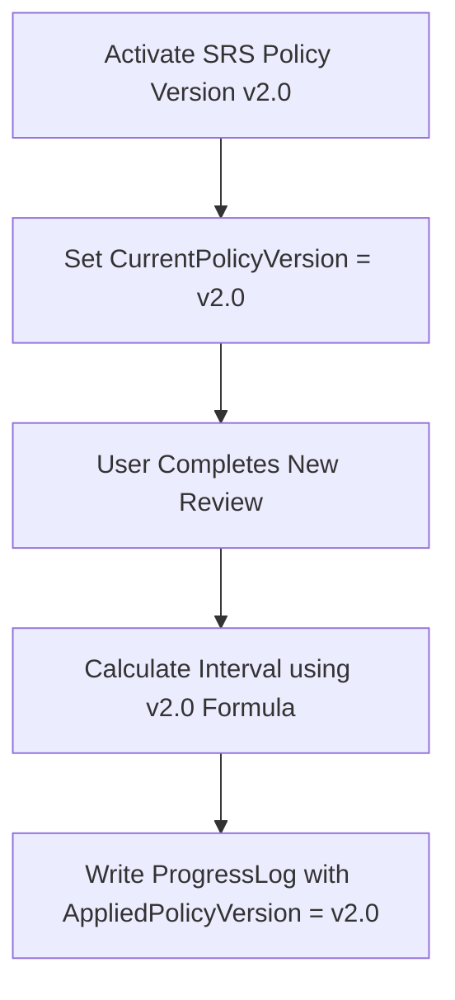

# Xác định chiến lược dữ liệu khi đổi phiên bản M04

| Thuộc tính | Giá trị |
|---|---|
| Contract ID | `M04-POLICY-VERSION-MIGRATION-STRATEGY-1.0` |
| Task | M04-T042 |
| Đầu vào | M04-REVIEW-LOG-SCHEMA-1.0 (M04-T024), M04-POLICY-SIMULATION-ENGINE-1.0 (M04-T041) |
| Phạm vi | Chiến lược dữ liệu khi nâng cấp hoặc thay đổi phiên bản thuật toán chính sách SRS (`SRS Policy Version Migration Strategy`), bảo lưu lịch sử hai phiên bản và cấm tính lại âm thầm |
| Tự kiểm | B-G02 |
| Phiên bản | 1.0 — 2026-08-22 |

## 1. Mục tiêu và invariant

Tài liệu này quy định chiến lược xử lý dữ liệu khi nâng cấp phiên bản thuật toán SRS (`Policy Version Migration Strategy`) trong M04.

- **Cấm Tính toán Hồi tố Âm thầm (`No Silent Retroactive Recalculation Invariant`)**:
  - Khi chính sách SRS mới (ví dụ v2.0) được kích hoạt:
    - Chỉ các lượt ôn mới phát sinh sau thời điểm nâng cấp mới áp dụng công thức v2.0.
    - Tuyệt đối CẤM tự ý tính toán lại $DueDateUtc$ hay $Interval$ của các lượt ôn cũ trong quá khứ dưới phiên bản v1.0.
- **Bảo lưu Đôi Phiên bản Lịch sử (`Dual-Version Audit Invariant`)**: Bản ghi tiến độ `UserSenseProgress` BẮT BUỘC lưu giữ thuộc tính `AppliedPolicyVersion` để phục vụ truy vết công thức đã chấm điểm.

## 2. Luồng Chuyển đổi Phiên bản Chính sách SRS (Version Migration Flow)

## 3. Regression Gates và Test Cases

### 3.1. Regression Gates
- `VM-G01`: 100% bản ghi lịch sử trước thời điểm nâng cấp giữ nguyên thuộc tính `AppliedPolicyVersion = v1.0`.
- `VM-G02`: Không có bất kỳ lệnh batch update nào làm thay đổi `DueDateUtc` của các mục từ chưa ôn.

### 3.2. Test Cases tự kiểm
| Case ID | Tình huống | Kết quả bắt buộc |
|---|---|---|
| `VM42-01` | Kích hoạt phiên bản chính sách v2.0 lúc 00:00 UTC | Dữ liệu tiến độ cũ giữ nguyên `v1.0`. Lượt ôn lúc 00:05 UTC gắn nhãn `v2.0`. |
| `VM42-02` | Admin truy vết lịch sử một từ vựng được học qua 2 thời kỳ v1.0 và v2.0 | API hiển thị rõ ràng phiên bản chính sách tương ứng từng điểm mốc ôn. |
| `VM42-03` | Kiểm thử hoàn tất luồng M04-POLICY-VERSION-MIGRATION-STRATEGY-1.0 | Đạt 100% tiêu chí nghiệm thu |

## 4. Đối chiếu Hiện trạng và Finding

| Finding ID | Quan sát | Sai lệch | Task tiếp nhận |
|---|---|---|---|
| `M04-VM-F01` | Thêm trường `AppliedPolicyVersion` vào `UserSenseProgressLog` Entity | Phục vụ truy vết phiên bản chính sách SRS | M04-T024 |

## 5. Tự kiểm M04-T042
- Đã hoàn thành đặc tả `M04-POLICY-VERSION-MIGRATION-STRATEGY-1.0`.
- Chốt nguyên tắc cấm tính toán hồi tố âm thầm và ghi nhận song song hai phiên bản chính sách.
- Ghi nhận 2 Regression Gates (`VM-G01`–`VM-G02`) và 3 Test Cases (`VM42-01`–`VM42-03`).

## 6. Lịch sử
| Ngày | Phiên bản | Thay đổi | Người tự kiểm |
|---|---|---|---|
| 2026-08-22 | 1.0 | Tạo mới đặc tả xác định chiến lược dữ liệu khi đổi phiên bản M04-T042 | WSA-7K2 |
