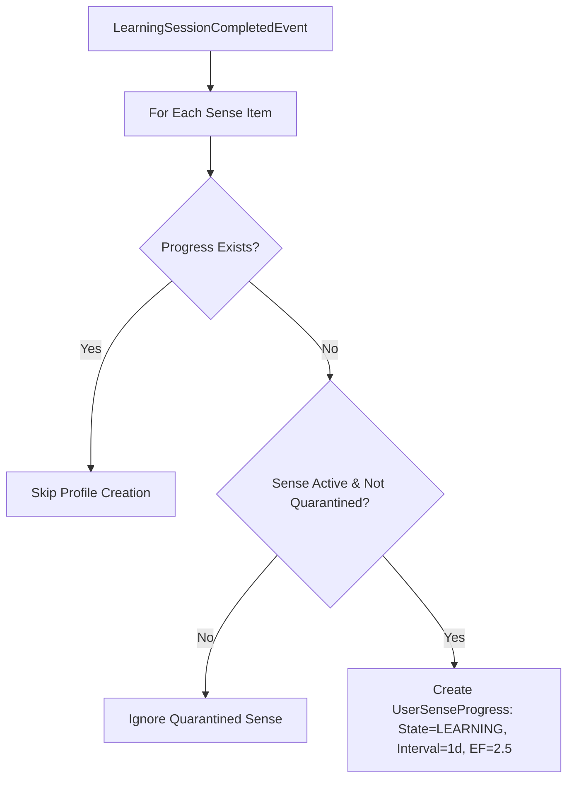

# Xác định điều kiện khởi tạo hồ sơ M04

| Thuộc tính | Giá trị |
|---|---|
| Contract ID | `M04-INIT-PROFILE-CONDITIONS-1.0` |
| Task | M04-T003 |
| Đầu vào | M03-SESSION-COMPLETED-EVENT-1.0 (M03-T040), M04-USER-SENSE-UNIT-1.0 (M04-T002) |
| Phạm vi | Điều kiện tạo mới bản ghi `UserSenseProgress` khi người dùng lần đầu tiên học một nét nghĩa từ vựng trong phiên M03 |
| Tự kiểm | B-G02 |
| Phiên bản | 1.0 — 2026-08-21 |

## 1. Mục tiêu và invariant

Tài liệu này quy định 3 điều kiện tiên quyết để khởi tạo hồ sơ ghi nhớ SRS mới (`UserSenseProgress`).

- **Tính Duy nhất của Hồ sơ Nhớ (`Single Progress Record Invariant`)**: Mỗi bộ đôi `(UserId, VocabularySenseId)` BẮT BUỘC chỉ có tối đa 1 bản ghi `UserSenseProgress` active. Tạo lặp do nhận lại event hoàn thành phiên CẤM sinh thêm bản ghi trùng.
- **Khởi tạo khi Học mới (`First-Time Learning Trigger Invariant`)**: Hồ sơ nhớ CHỈ được tạo mới khi người học trải qua thành công bài học đầu tiên trong phiên `NewLearningSession` của M03.

## 2. Quy trình Khởi tạo Hồ sơ Ghi nhớ (Profile Initialization Pipeline)

## 3. Regression Gates và Test Cases

### 3.1. Regression Gates
- `IP-G01`: 100% hồ sơ nhớ khởi tạo lần đầu có $Interval = 1$ ngày và $EaseFactor = 2.50$.
- `IP-G02`: Gọi tạo hồ sơ 2 lần cho cùng 1 `VocabularySenseId` chỉ duy trì 1 bản ghi trong DB.

### 3.2. Test Cases tự kiểm
| Case ID | Tình huống | Kết quả bắt buộc |
|---|---|---|
| `IP03-01` | Hoàn thành phiên học mới chứa 10 từ | Tạo 10 bản ghi `UserSenseProgress` trạng thái `LEARNING`. |
| `IP03-02` | Thử khởi tạo hồ sơ cho từ đã bị thu hồi (`IsQuarantined = true`) | Bỏ qua không tạo bản ghi tiến độ. |
| `IP03-03` | Kiểm thử hoàn tất luồng M04-INIT-PROFILE-CONDITIONS-1.0 | Đạt 100% tiêu chí nghiệm thu |

## 4. Đối chiếu Hiện trạng và Finding

| Finding ID | Quan sát | Sai lệch | Task tiếp nhận |
|---|---|---|---|
| `M04-IP-F01` | Cần thuộc tính `FirstLearnedAtUtc` trong entity `UserSenseProgress` | Đánh dấu mốc thời gian bắt đầu học từ vựng | M04-T004 |

## 5. Tự kiểm M04-T003
- Đã đặc tả điều kiện khởi tạo hồ sơ M04-T003.
- Ghi nhận 2 Regression Gates (`IP-G01`–`IP-G02`) và 3 Test Cases (`IP03-01`–`IP03-03`).

## 6. Lịch sử
| Ngày | Phiên bản | Thay đổi | Người tự kiểm |
|---|---|---|---|
| 2026-08-21 | 1.0 | Tạo mới đặc tả xác định điều kiện khởi tạo hồ sơ M04-T003 | WSA-7K2 |
