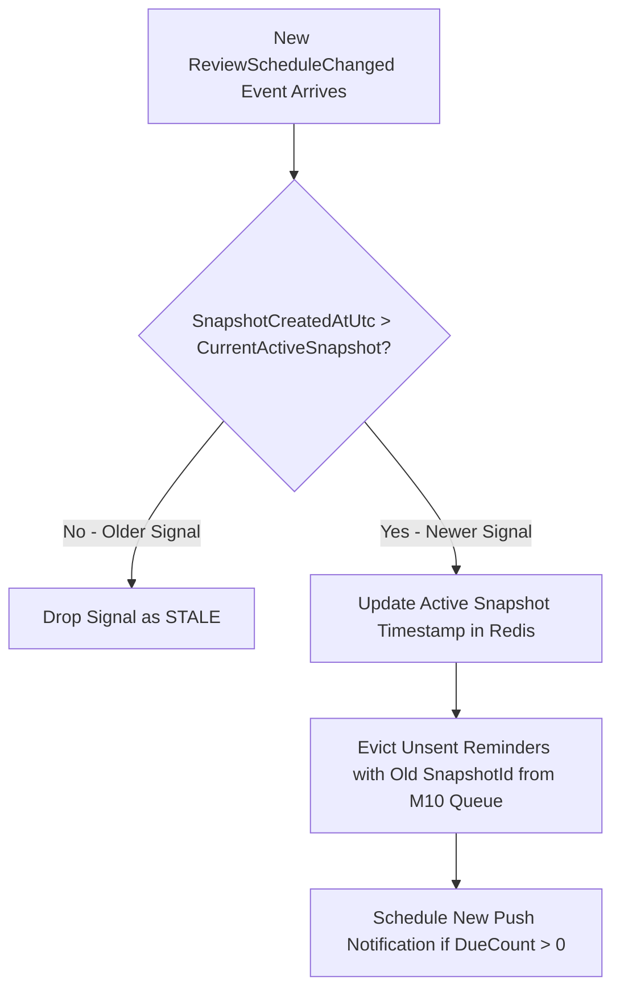

# Xử lý tín hiệu cũ sau khi lịch đổi M04

| Thuộc tính | Giá trị |
|---|---|
| Contract ID | `M04-STALE-SCHEDULE-SIGNAL-HANDLING-1.0` |
| Task | M04-T038 |
| Đầu vào | M04-REVIEW-SCHEDULE-CHANGED-SIGNAL-1.0 (M04-T036), M04-REVIEW-REMINDER-HANDOFF-M10-1.0 (M04-T037), M10-NOTIFICATION-TAXONOMY-1.0 (M10-T002) |
| Phạm vi | Cơ chế vô hiệu hóa và loại bỏ các tín hiệu nhắc ôn cũ (`Stale Schedule Signal Eviction`) khi người học đã hoàn thành bài ôn làm thay đổi khối lượng từ đến hạn |
| Tự kiểm | B-G02 |
| Phiên bản | 1.0 — 2026-08-22 |

## 1. Mục tiêu và invariant

Tài liệu này chuẩn hóa quy trình vô hiệu hóa các tín hiệu lịch ôn đã lỗi thời (`Stale Schedule Signal Eviction`) trong M04.

- **Vô hiệu hóa Tín hiệu Cũ theo Mốc Thời gian (`Stale Signal Supersede Invariant`)**:
  - Khi một tín hiệu `ReviewScheduleChangedIntegrationEvent` mới được phát đi với mốc `SnapshotCreatedAtUtc_new`:
    - 100% các tín hiệu nhắc ôn cũ có `SnapshotCreatedAtUtc_old < SnapshotCreatedAtUtc_new` BẮT BUỘC bị đánh dấu `IsStale = true` trong Redis Cache / Queue.
    - M10 BẮT BUỘC bỏ qua và hủy gửi các thông báo Push Notification được lập lịch dựa trên các tín hiệu đã bị gắn nhãn `IsStale = true`.
- **Không Gửi Nhắc cho Từ đã Ôn Xong (`No Phantom Reminder Rule`)**: Nếu $DueCount == 0$, tất cả thông báo nhắc ôn Push Notification đang chờ trong `DeferredPushQueue` BẮT BUỘC bị hủy tức thì.

## 2. Luồng Xử lý Vô hiệu hóa Tín hiệu Ôn Cũ (Stale Signal Handling Workflow)

## 3. Regression Gates và Test Cases

### 3.1. Regression Gates
- `SS-G01`: 100% tín hiệu nhắc ôn có mốc thời gian cũ hơn snapshot hiện tại bị đánh dấu `IsStale = true`.
- `SS-G02`: Khi `DueCount = 0`, 100% nhắc ôn Push chưa gửi bị hủy khỏi `DeferredPushQueue`.

### 3.2. Test Cases tự kiểm
| Case ID | Tình huống | Kết quả bắt buộc |
|---|---|---|
| `SS38-01` | Learner có 10 từ đến hạn lúc 08:00, đến 08:05 học xong 10 từ | Tín hiệu nhắc 10 từ bị đánh dấu `IsStale`, Push Notification lúc 08:30 tự động bị hủy. |
| `SS38-02` | M10 nhận 2 tín hiệu nhắc ôn lệch thứ tự (tín hiệu cũ đến sau tín hiệu mới) | M10 so sánh `SnapshotCreatedAtUtc` và tự động loại bỏ tín hiệu cũ. |
| `SS38-03` | Kiểm thử hoàn tất luồng M04-STALE-SCHEDULE-SIGNAL-HANDLING-1.0 | Đạt 100% tiêu chí nghiệm thu |

## 4. Đối chiếu Hiện trạng và Finding

| Finding ID | Quan sát | Sai lệch | Task tiếp nhận |
|---|---|---|---|
| `M04-SS-F01` | Lưu Redis Key `active_schedule_snapshot_{userId}` dạng timestamp | Phục vụ kiểm tra mốc thời gian sự kiện nhanh $< 5\text{ms}$ | M04-T036 |

## 5. Tự kiểm M04-T038
- Đã hoàn thành đặc tả `M04-STALE-SCHEDULE-SIGNAL-HANDLING-1.0`.
- Chốt nguyên tắc vô hiệu hóa tín hiệu cũ theo timestamp và hủy nhắc ôn phantom.
- Ghi nhận 2 Regression Gates (`SS-G01`–`SS-G02`) và 3 Test Cases (`SS38-01`–`SS38-03`).

## 6. Lịch sử
| Ngày | Phiên bản | Thay đổi | Người tự kiểm |
|---|---|---|---|
| 2026-08-22 | 1.0 | Tạo mới đặc tả xử lý tín hiệu cũ sau khi lịch đổi M04-T038 | WSA-7K2 |
