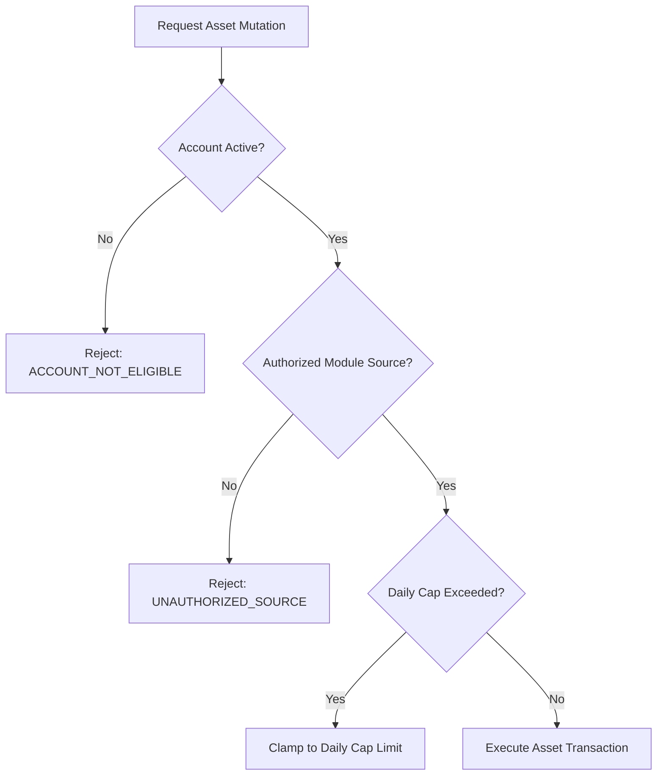

# Thiết kế kiểm tra tài khoản và điều kiện nguồn M06

| Thuộc tính | Giá trị |
|---|---|
| Contract ID | `M06-ACCOUNT-SOURCE-VALIDATION-1.0` |
| Task | M06-T013 |
| Đầu vào | M01-ACCOUNT-STATUS-1.0 (M01-T012), M06-REWARD-EVENT-CONTRACT-1.0 (M06-T011) |
| Phạm vi | Ràng buộc kiểm tra trạng thái tài khoản người dùng và điều kiện xác thực nguồn trước khi thực hiện cộng/trừ tài sản trong M06 |
| Tự kiểm | B-G03 |
| Phiên bản | 1.0 — 2026-08-21 |

## 1. Mục tiêu và invariant

Tài liệu này quy định các điều kiện tiên quyết để chấp nhận một lệnh biến động tài sản người dùng trong M06.

- **Ràng buộc Tài khoản Hoạt động (`Active Account Invariant`)**: CHỈ thực hiện cộng/trừ Gold, Gems, Exp cho người dùng có `AccountStatus == ACTIVE`. Tài khoản đang ở trạng thái `LOCKED`, `SUSPENDED` hoặc `PENDING_DELETION` BẮT BUỘC bị từ chối biến động tài sản với lỗi `ACCOUNT_NOT_ELIGIBLE_FOR_ASSET_MUTATION`.
- **Tính Minh bạch của Nhật ký Quyết định (`Audit Traceability Invariant`)**: Mọi lệnh từ chối cộng/trừ tài sản do tài khoản không hợp lệ BẮT BUỘC được lưu log vào `AssetRejectionAuditLogs` để quản trị viên đối soát.

## 2. Quy trình Kiểm tra Điều kiện Nguồn và Tài khoản (Validation Pipeline)

## 3. Regression Gates và Test Cases

### 3.1. Regression Gates
- `AV-G01`: 100% lệnh cộng thưởng cho tài khoản `LOCKED` bị từ chối với lỗi HTTP 403 `ACCOUNT_NOT_ELIGIBLE_FOR_ASSET_MUTATION`.
- `AV-G02`: Log từ chối được chèn thành công vào bảng `AssetRejectionAuditLogs`.

### 3.2. Test Cases tự kiểm
| Case ID | Tình huống | Kết quả bắt buộc |
|---|---|---|
| `AV13-01` | Cộng 50 Gold cho tài khoản `ACTIVE` hợp lệ | Thực thi giao dịch cộng tiền thành công. |
| `AV13-02` | M03 gửi sự kiện cộng thưởng cho tài khoản bị khóa `LOCKED` | Từ chối cộng tiền, tạo bản ghi audit log. |
| `AV13-03` | Kiểm thử hoàn tất luồng M06-ACCOUNT-SOURCE-VALIDATION-1.0 | Đạt 100% tiêu chí nghiệm thu |

## 4. Đối chiếu Hiện trạng và Finding

| Finding ID | Quan sát | Sai lệch | Task tiếp nhận |
|---|---|---|---|
| `M06-AV-F01` | Cần thuộc tính `IsFrozenForTransactions` trong User Asset Profile | Khóa khẩn cấp tài sản khi có gian lận | M06-T014 |

## 5. Tự kiểm M06-T013
- Đã đặc tả thiết kế kiểm tra tài khoản và điều kiện nguồn M06-T013.
- Ghi nhận 2 Regression Gates (`AV-G01`–`AV-G02`) và 3 Test Cases (`AV13-01`–`AV13-03`).

## 6. Lịch sử
| Ngày | Phiên bản | Thay đổi | Người tự kiểm |
|---|---|---|---|
| 2026-08-21 | 1.0 | Tạo mới đặc tả thiết kế kiểm tra tài khoản và điều kiện nguồn M06-T013 | WSA-7K2 |
