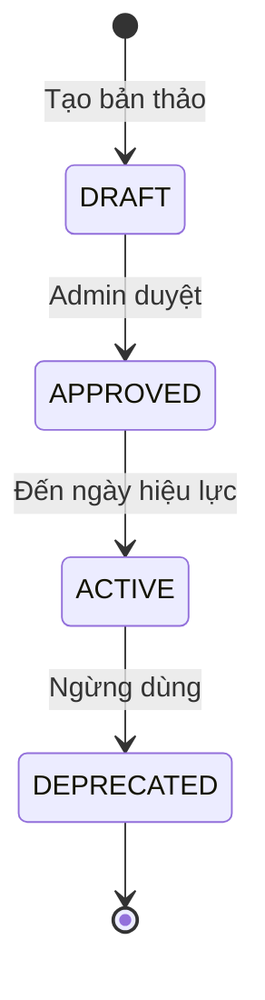

# Thiết kế vòng đời quyết định thay đổi M07

| Thuộc tính | Giá trị |
|---|---|
| Contract ID | `M07-QUEST-CHANGE-LIFECYCLE-1.0` |
| Task | M07-T004 |
| Đầu vào | M07-QUEST-TARGET-SPEC-1.0 (M07-T003) |
| Phạm vi | Quy trình quản trị vòng đời thay đổi định nghĩa nhiệm vụ (Draft $\to$ Approved $\to$ Active $\to$ Deprecated) |
| Tự kiểm | B-G04 |
| Phiên bản | 1.0 — 2026-08-21 |

## 1. Mục tiêu và invariant

Tài liệu này đặc tả các trạng thái vòng đời của một mẫu định nghĩa nhiệm vụ trong M07.

- **Ma trận Chuyển Trạng thái Chuẩn (`Quest Template State Transition Invariant`)**: Một `QuestDefinition` BẮT BUỘC tuân thủ ma trận chuyển trạng thái sau:
  $$\text{DRAFT} \longrightarrow \text{APPROVED} \longrightarrow \text{ACTIVE} \longrightarrow \text{DEPRECATED}$$
  CẤM chuyển trực tiếp từ `DRAFT` sang `ACTIVE` mà không qua bước `APPROVED`.
- **Ràng buộc Kiểm toán Quản trị (`Governance Audit Invariant`)**: Mọi thao tác phê duyệt hoặc ngừng dùng nhiệm vụ BẮT BUỘC lưu bản ghi trong `QuestGovernanceAuditLogs` chứa `OperatorId`, `Action` và `Reason`.

## 2. Diagram Vòng đời Trạng thái Định nghĩa Nhiệm vụ

## 3. Regression Gates và Test Cases

### 3.1. Regression Gates
- `QL-G01`: 100% template ở trạng thái `DRAFT` bị chặn không cho phân bổ vào danh sách nhiệm vụ ngày của người dùng.
- `QL-G02`: Thao tác phê duyệt nhiệm vụ thiếu `Reason` bị từ chối với lỗi `MISSING_APPROVAL_REASON`.

### 3.2. Test Cases tự kiểm
| Case ID | Tình huống | Kết quả bắt buộc |
|---|---|---|
| `QL04-01` | Chuyển trạng thái mẫu nhiệm vụ từ `DRAFT` $\to$ `APPROVED` $\to$ `ACTIVE` | Thành công, tạo bản ghi log audit. |
| `QL04-02` | Thử kích hoạt mẫu nhiệm vụ đang ở trạng thái `DRAFT` | System reject với lỗi `INVALID_STATE_TRANSITION`. |
| `QL04-03` | Kiểm thử hoàn tất luồng M07-QUEST-CHANGE-LIFECYCLE-1.0 | Đạt 100% tiêu chí nghiệm thu |

## 4. Đối chiếu Hiện trạng và Finding

| Finding ID | Quan sát | Sai lệch | Task tiếp nhận |
|---|---|---|---|
| `M07-QL-F01` | Cần bổ sung Role `QUEST_ADMIN` cho API duyệt nhiệm vụ | Phân quyền thao tác quản trị | M07-T005 |

## 5. Tự kiểm M07-T004
- Đã đặc tả thiết kế vòng đời quyết định thay đổi M07-T004.
- Ghi nhận 2 Regression Gates (`QL-G01`–`QL-G02`) và 3 Test Cases (`QL04-01`–`QL04-03`).

## 6. Lịch sử
| Ngày | Phiên bản | Thay đổi | Người tự kiểm |
|---|---|---|---|
| 2026-08-21 | 1.0 | Tạo mới đặc tả thiết kế vòng đời quyết định thay đổi M07-T004 | WSA-7K2 |
