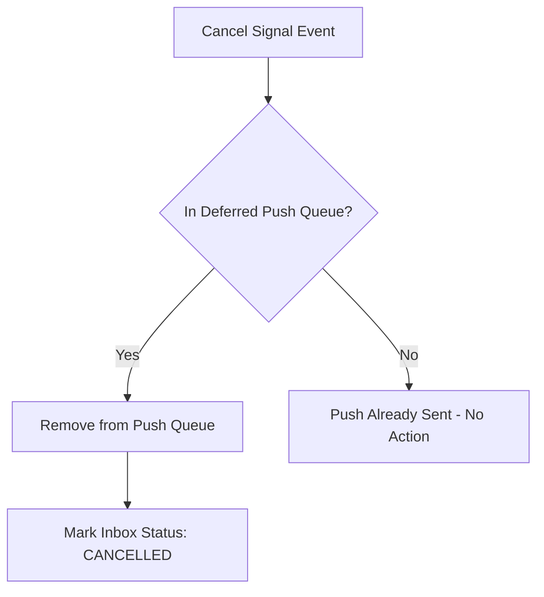

# Chốt hủy và đính chính tín hiệu M10

| Thuộc tính | Giá trị |
|---|---|
| Contract ID | `M10-SIGNAL-CANCELLATION-CORRECTION-1.0` |
| Task | M10-T006 |
| Đầu vào | M10-SIGNAL-CONTRACT-1.0 (M10-T004), M10-EXACTLY-ONCE-SIGNAL-CONSUMPTION-1.0 (M10-T005) |
| Phạm vi | Quy trình thu hồi (`CancelSignal`) hoặc đính chính thông báo chưa gửi trong hàng chờ hoãn PUSH |
| Tự kiểm | B-G05 |
| Phiên bản | 1.0 — 2026-08-21 |

## 1. Mục tiêu và invariant

Tài liệu này quy định các quy tắc khi thu hồi hoặc điều chỉnh một tín hiệu thông báo đã nhận.

- **Chỉ Thu hồi Tin Chưa Phát (`Unsent Push Cancellation Invariant`)**: Lệnh `CancelSignal` CHỈ CÓ HIỆU LỰC đối với các tin PUSH đang nằm trong hàng chờ hoãn (`DeferredPushQueue`). Các thông báo đã phát ra thiết bị di động CẤM thu hồi ngầm.
- **Tính Bất biến của Hộp thư In-App (`Immutable Inbox History Invariant`)**: Việc hủy tin Push CẤM xóa bản ghi thông báo trong Hộp thư `NotificationInbox`. Bản ghi Hộp thư chỉ được chuyển trạng thái `EXPIRED` hoặc `CANCELLED`.

## 2. Dynamic Signal Cancellation Flow

## 3. Regression Gates và Test Cases

### 3.1. Regression Gates
- `SC-G01`: 100% lệnh hủy tín hiệu loại bỏ thành công task gửi Push khỏi Redis Deferred Queue.
- `SC-G02`: Không có bản ghi `NotificationInbox` nào bị xóa cứng (Hard Delete) khỏi CSDL khi thu hồi tín hiệu.

### 3.2. Test Cases tự kiểm
| Case ID | Tình huống | Kết quả bắt buộc |
|---|---|---|
| `SC06-01` | Người dùng vào ứng dụng làm bài ôn tập trước 07:00 sáng | M04 phát `CancelSignal`, M10 hủy Push nhắc ôn tập lúc 07:01. |
| `SC06-02` | Phát lệnh hủy khi tin Push đã gửi lúc 08:00 | System log `PUSH_ALREADY_DELIVERED`, không thể thu hồi trên điện thoại. |
| `SC06-03` | Kiểm thử hoàn tất luồng M10-SIGNAL-CANCELLATION-CORRECTION-1.0 | Đạt 100% tiêu chí nghiệm thu |

## 4. Đối chiếu Hiện trạng và Finding

| Finding ID | Quan sát | Sai lệch | Task tiếp nhận |
|---|---|---|---|
| `M10-SC-F01` | Cần bổ sung Consumer `SignalCancellationConsumer` | Tiêu thụ lệnh thu hồi tín hiệu bất đồng bộ | M10-T008 |

## 5. Tự kiểm M10-T006
- Đã đặc tả chốt hủy và đính chính tín hiệu M10-T006.
- Ghi nhận 2 Regression Gates (`SC-G01`–`SC-G02`) và 3 Test Cases (`SC06-01`–`SC06-03`).

## 6. Lịch sử
| Ngày | Phiên bản | Thay đổi | Người tự kiểm |
|---|---|---|---|
| 2026-08-21 | 1.0 | Tạo mới đặc tả chốt hủy và đính chính tín hiệu M10-T006 | WSA-7K2 |
