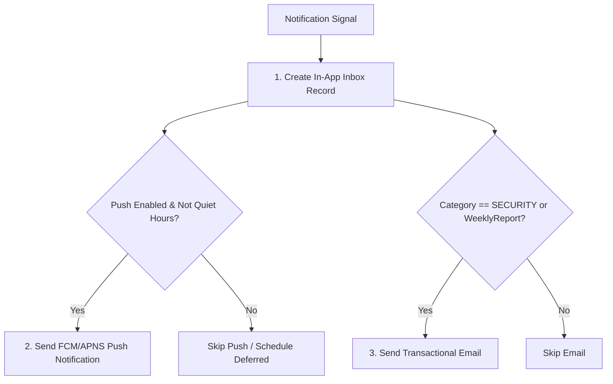

# Xây dựng ma trận chọn kênh M10

| Thuộc tính | Giá trị |
|---|---|
| Contract ID | `M10-CHANNEL-SELECTION-MATRIX-1.0` |
| Task | M10-T020 |
| Đầu vào | M10-NOTIFICATION-PREFERENCE-MATRIX-1.0 (M10-T007), M10-INBOX-MODEL-SPEC-1.0 (M10-T016) |
| Phạm vi | Thuật toán định tuyến lựa chọn kênh phát thông báo (`IN_APP`, `PUSH_NOTIFICATION`, `EMAIL`) dựa trên loại sự kiện và tùy chọn người dùng |
| Tự kiểm | B-G05 |
| Phiên bản | 1.0 — 2026-08-21 |

## 1. Mục tiêu và invariant

Tài liệu này đặc tả thuật toán quyết định kênh gửi thông báo cho từng tín hiệu.

- **Kênh In-App Luôn Bắt buộc (`In-App Always Mandatory Invariant`)**: 100% tín hiệu thông báo hợp lệ BẮT BUỘC được tạo bản ghi Hộp thư In-App (`NotificationInbox`), bất kể thiết lập kênh Push hay Email của người dùng.
- **Ràng buộc Phân tầng Kênh (`Channel Tier Routing Invariant`)**: Kênh `PUSH` là kênh ưu tiên thứ 2 cho `STUDY`/`REWARD`. Kênh `EMAIL` CHỈ ĐƯỢC KÍCH HOẠT cho các sự kiện `SECURITY` hoặc báo cáo học tập tuần khi người dùng đã xác nhận địa chỉ email.

## 2. Dynamic Channel Routing Decision Matrix

## 3. Regression Gates và Test Cases

### 3.1. Regression Gates
- `CS-G01`: 100% sự kiện thông báo tạo bản ghi trong `NotificationInbox`.
- `CS-G02`: Không có email tiếp thị/nhắc nhở học tập nào được gửi khi người dùng chưa Opt-In Email.

### 3.2. Test Cases tự kiểm
| Case ID | Tình huống | Kết quả bắt buộc |
|---|---|---|
| `CS20-01` | Nhận tín hiệu `DUE_REVIEWS_REMINDER`, người dùng Opt-In Push | Tạo Inbox item + Gửi Push notification. |
| `CS20-02` | Nhận tín hiệu `NEW_DEVICE_LOGIN` | Tạo Inbox item + Gửi Push + Gửi Email cảnh báo an ninh. |
| `CS20-03` | Kiểm thử hoàn tất luồng M10-CHANNEL-SELECTION-MATRIX-1.0 | Đạt 100% tiêu chí nghiệm thu |

## 4. Đối chiếu Hiện trạng và Finding

| Finding ID | Quan sát | Sai lệch | Task tiếp nhận |
|---|---|---|---|
| `M10-CS-F01` | Bổ sung Dispatcher `NotificationChannelDispatcher` | Định tuyến phát tín hiệu song song | M10-T025 |

## 5. Tự kiểm M10-T020
- Đã đặc tả xây dựng ma trận chọn kênh M10-T020.
- Ghi nhận 2 Regression Gates (`CS-G01`–`CS-G02`) và 3 Test Cases (`CS20-01`–`CS20-03`).

## 6. Lịch sử
| Ngày | Phiên bản | Thay đổi | Người tự kiểm |
|---|---|---|---|
| 2026-08-21 | 1.0 | Tạo mới đặc tả xây dựng ma trận chọn kênh M10-T020 | WSA-7K2 |
