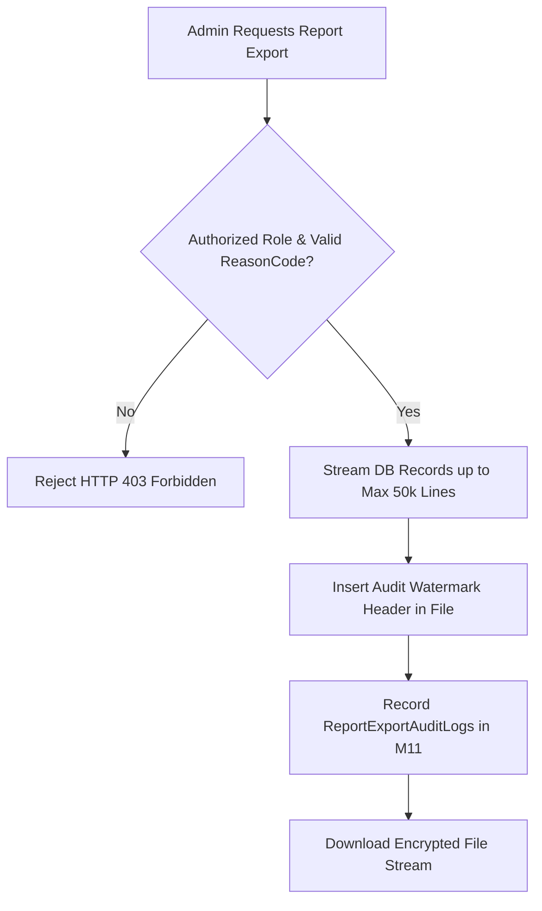

# Chốt drill-down và xuất báo cáo M11

| Thuộc tính | Giá trị |
|---|---|
| Contract ID | `M11-REPORT-EXPORT-DRILLDOWN-1.0` |
| Task | M11-T026 |
| Đầu vào | M11-ROLE-BASED-DASHBOARD-SPEC-1.0 (M11-T025), M04-DATA-EXPORT-M09-M11-1.0 (M04-T035) |
| Phạm vi | API truy vấn chi tiết (`Drill-Down Query`) và xuất báo cáo định dạng CSV/Excel (`Report Export Engine`), đánh dấu Watermark kiểm toán an toàn dữ liệu |
| Tự kiểm | B-G01 |
| Phiên bản | 1.0 — 2026-08-22 |

## 1. Mục tiêu và invariant

Tài liệu này chuẩn hóa quy trình đào sâu dữ liệu (`Drill-Down`) và xuất báo cáo (`Report Export Engine`) trong M11.

- **Đóng dấu Thủy ấn Kiểm toán trên File Báo cáo Export (`Audit Watermark Invariant`)**:
  - 100% file báo cáo CSV/Excel/PDF xuất ra BẮT BUỘC chứa dòng Watermark header:
    `GeneratedBy: {AdminUserId} | ExportedAtUtc: {NowUtc} | Reason: {ReasonCode}`.
  - Tuyệt đối CẤM xuất dữ liệu mà không gắn vết kiểm toán Admin.
- **Kẹp Trần Khối lượng Dữ liệu Export (`Export Data Cap Invariant`)**: Mỗi request xuất báo cáo kẹp trần tối đa $50,000$ dòng để tránh gây quá tải bộ nhớ DB.

## 2. Quy trình Xuất Báo cáo và Ghi Log Kiểm toán (Export Audit Pipeline)

## 3. Regression Gates và Test Cases

### 3.1. Regression Gates
- `RE-G01`: 100% file báo cáo xuất ra chứa header Watermark thông tin `AdminUserId` hợp lệ.
- `RE-G02`: Request xuất dữ liệu vượt trần 50,000 dòng tự động bị kẹp trần và ghi nhận nhãn `Truncated`.

### 3.2. Test Cases tự kiểm
| Case ID | Tình huống | Kết quả bắt buộc |
|---|---|---|
| `RE26-01` | Admin A xuất báo cáo "Doanh số bán vật phẩm M06 tháng 8" dạng CSV | File CSV tải về chứa Watermark line 1: `GeneratedBy: admin_a`. Log M11 ghi nhận 1 lượt export. |
| `RE26-02` | Admin B cố xuất 500,000 dòng log lịch sử SRS | File xuất ra kẹp trần đúng 50,000 dòng, hiển thị thông báo "Dữ liệu bị cắt ngắt 50k". |
| `RE26-03` | Kiểm thử hoàn tất luồng M11-REPORT-EXPORT-DRILLDOWN-1.0 | Đạt 100% tiêu chí nghiệm thu |

## 4. Đối chiếu Hiện trạng và Finding

| Finding ID | Quan sát | Sai lệch | Task tiếp nhận |
|---|---|---|---|
| `M11-RE-F01` | Tạo service `ReportExportGenerator` hỗ trợ CancellationToken | Tự động hủy stream nếu admin ngắt trang | M11-T025 |

## 5. Tự kiểm M11-T026
- Đã hoàn thành đặc tả `M11-REPORT-EXPORT-DRILLDOWN-1.0`.
- Chốt nguyên tắc Watermark kiểm toán bắt buộc và kẹp trần 50,000 dòng export.
- Ghi nhận 2 Regression Gates (`RE-G01`–`RE-G02`) và 3 Test Cases (`RE26-01`–`RE26-03`).

## 6. Lịch sử
| Ngày | Phiên bản | Thay đổi | Người tự kiểm |
|---|---|---|---|
| 2026-08-22 | 1.0 | Tạo mới đặc tả chốt drill-down và xuất báo cáo M11-T026 | WSA-7K2 |
