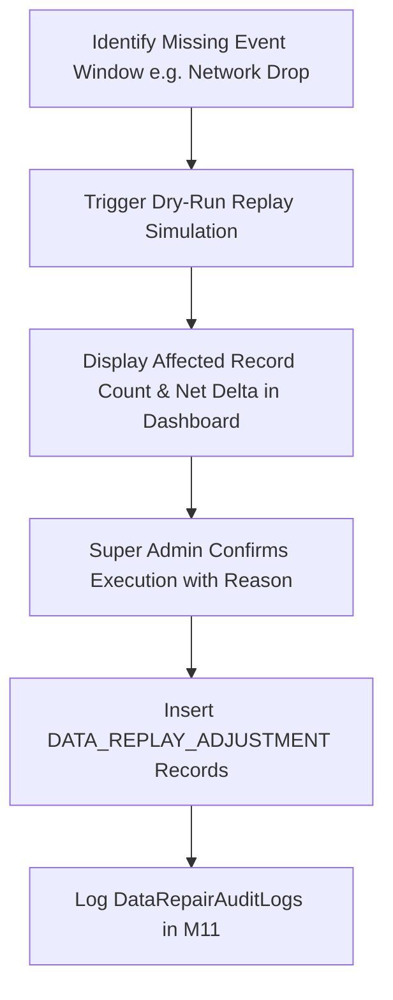

# Chuẩn hóa chạy bù và sửa dữ liệu M11

| Thuộc tính | Giá trị |
|---|---|
| Contract ID | `M11-DATA-REPLAY-REPAIR-CONTRACT-1.0` |
| Task | M11-T042 |
| Đầu vào | M11-CONFIG-REG-1.0 (M11-T012), M11-ASSET-ADJUSTMENT-REQUEST-1.0 (M11-T041) |
| Phạm vi | Quy trình phát lại sự kiện bị thiếu (`Event Replay Engine`) và khắc phục dữ liệu thống kê gián đoạn mà không làm sai lệch vết kiểm toán |
| Tự kiểm | B-G01 |
| Phiên bản | 1.0 — 2026-08-22 |

## 1. Mục tiêu và invariant

Tài liệu này chuẩn hóa quy trình phát lại sự kiện và sửa chữa dữ liệu gián đoạn (`Event Replay & Data Repair Protocol`) trong M11.

- **Bảo toàn Tính Bất biến của Log Kiểm toán Cũ (`Audit Log Immutability Invariant`)**:
  - Thao tác chạy bù dữ liệu CẤM ĐƯỢC PHÉP sửa đổi hoặc xóa các dòng log kiểm toán đã ghi nhận trước đó.
  - Việc khắc phục BẮT BUỘC chèn thêm các bản ghi bổ sung dạng `DATA_REPLAY_ADJUSTMENT` kèm `ReplayBatchId`.
- **Xem trước Kết quả Chạy bù (`Dry-Run Preview Requirement`)**: 100% lệnh Replay BẮT BUỘC trải qua bước chạy thử nghiệm `DryRun = true` hiển thị số lượng bản ghi bị tác động trước khi bấm "Xác nhận Phát lại".

## 2. Luồng Phát lại và Sửa chữa Dữ liệu (Event Replay Pipeline)

## 3. Regression Gates và Test Cases

### 3.1. Regression Gates
- `DR-G01`: 100% lệnh Replay chèn thêm dòng log bổ sung, giữ nguyên $100\%$ log kiểm toán cũ.
- `DR-G02`: Bất kỳ thao tác Replay nào thiếu bước xem trước `DryRun` bị từ chối với HTTP 400.

### 3.2. Test Cases tự kiểm
| Case ID | Tình huống | Kết quả bắt buộc |
|---|---|---|
| `DR42-01` | M11 bị mất 500 sự kiện từ M04 trong khoảng thời gian từ 02:00-03:00 | Admin kích hoạt DryRun, hệ thống hiển thị "Phát lại 500 sự kiện". |
| `DR42-02` | Admin xác nhận phát lại | M11 nạp 500 sự kiện vào Queue với `IsReplay = true`, chèn log `DATA_REPLAY_ADJUSTMENT`. Log cũ giữ nguyên. |
| `DR42-03` | Kiểm thử hoàn tất luồng M11-DATA-REPLAY-REPAIR-CONTRACT-1.0 | Đạt 100% tiêu chí nghiệm thu |

## 4. Đối chiếu Hiện trạng và Finding

| Finding ID | Quan sát | Sai lệch | Task tiếp nhận |
|---|---|---|---|
| `M11-DR-F01` | Tạo API `POST /api/v1/admin/data-repair/replay` | Phục vụ phát lại sự kiện sự cố | M11-T012 |

## 5. Tự kiểm M11-T042
- Đã hoàn thành đặc tả `M11-DATA-REPLAY-REPAIR-CONTRACT-1.0`.
- Chốt nguyên tắc bảo toàn log kiểm toán bất biến và bắt buộc DryRun preview.
- Ghi nhận 2 Regression Gates (`DR-G01`–`DR-G02`) và 3 Test Cases (`DR42-01`–`DR42-03`).

## 6. Lịch sử
| Ngày | Phiên bản | Thay đổi | Người tự kiểm |
|---|---|---|---|
| 2026-08-22 | 1.0 | Tạo mới đặc tả chuẩn hóa chạy bù và sửa dữ liệu M11-T042 | WSA-7K2 |
