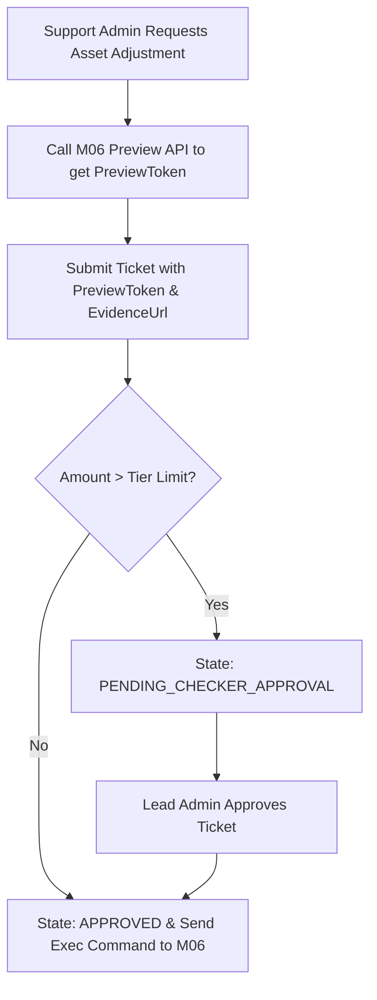

# Chuẩn hóa yêu cầu điều chỉnh tài sản M11

| Thuộc tính | Giá trị |
|---|---|
| Contract ID | `M11-ASSET-ADJUSTMENT-REQUEST-1.0` |
| Task | M11-T041 |
| Đầu vào | M06-ECONOMIC-MUTATION-AUTHORIZATION-1.0 (M06-T038), M06-PREVIEWABLE-ECONOMIC-ADJUSTMENT-1.0 (M06-T039), M11-CONFIG-REG-1.0 (M11-T012) |
| Phạm vi | Hợp đồng gửi và duyệt yêu cầu điều chỉnh số dư tài sản thủ công (`Manual Asset Adjustment Request Contract`) từ Admin Portal M11 tới M06 Engine |
| Tự kiểm | B-G01 |
| Phiên bản | 1.0 — 2026-08-22 |

## 1. Mục tiêu và invariant

Tài liệu này chuẩn hóa quy trình khởi tạo và duyệt yêu cầu điều chỉnh tài sản thủ công (`Manual Asset Adjustment Request Protocol`) trong M11.

- **Nguồn Sự thật Số dư Duy nhất thuộc M06 (`M06 Single Source of Truth Rule`)**:
  - M11 CHỈ LÀ GIAO DIỆN khởi tạo yêu cầu điều chỉnh và theo dõi phê duyệt. M11 CẤM can thiệp hoặc tính toán thay đổi số dư tài sản trực tiếp trong DB M11.
  - 100% giao dịch biến động BẮT BUỘC gửi lệnh sang M06 để ghi sổ cái append-only.
- **Ràng buộc Duy nhất Mã Yêu cầu Chống Đúp (`Idempotent Request Token Invariant`)**: Mỗi yêu cầu điều chỉnh BẮT BUỘC chứa `AdjustmentRequestId` duy nhất. Gửi lặp cùng `AdjustmentRequestId` không được phép tạo thêm lần ghi sổ nào trong M06.

## 2. Luồng Khởi tạo và Duyệt Lệnh Điều chỉnh Tài sản (Asset Adjustment Pipeline)

## 3. Regression Gates và Test Cases

### 3.1. Regression Gates
- `AA-G01`: 100% lệnh điều chỉnh từ M11 không trực tiếp sửa DB mà gửi Command hợp lệ sang M06.
- `AA-G02`: Request gửi lặp cùng `AdjustmentRequestId` trả về kết quả idempotency trong $100\%$ trường hợp.

### 3.2. Test Cases tự kiểm
| Case ID | Tình huống | Kết quả bắt buộc |
|---|---|---|
| `AA41-01` | Admin nộp lệnh cộng 200 Gold cho Learner A qua vé `ADJ_9912` | M11 gọi Preview M06, sinh `PreviewToken`, gửi lệnh sang M06 ghi sổ cái. |
| `AA41-02` | Admin gửi lại cùng request `ADJ_9912` do mạng chập chờn | M06 trả về kết quả giao dịch ban đầu, không cộng đôi 200 Gold. |
| `AA41-03` | Kiểm thử hoàn tất luồng M11-ASSET-ADJUSTMENT-REQUEST-1.0 | Đạt 100% tiêu chí nghiệm thu |

## 4. Đối chiếu Hiện trạng và Finding

| Finding ID | Quan sát | Sai lệch | Task tiếp nhận |
|---|---|---|---|
| `M11-AA-F01` | Tích hợp DTO `AssetAdjustmentRequestDto` giao tiếp giữa M11 và M06 | Phục vụ Maker-Checker flow an toàn | M06-T039 |

## 5. Tự kiểm M11-T041
- Đã hoàn thành đặc tả `M11-ASSET-ADJUSTMENT-REQUEST-1.0`.
- Chốt nguyên tắc M06 Single Source of Truth và Idempotent Request Token.
- Ghi nhận 2 Regression Gates (`AA-G01`–`AA-G02`) và 3 Test Cases (`AA41-01`–`AA41-03`).

## 6. Lịch sử
| Ngày | Phiên bản | Thay đổi | Người tự kiểm |
|---|---|---|---|
| 2026-08-22 | 1.0 | Tạo mới đặc tả chuẩn hóa yêu cầu điều chỉnh tài sản M11-T041 | WSA-7K2 |
