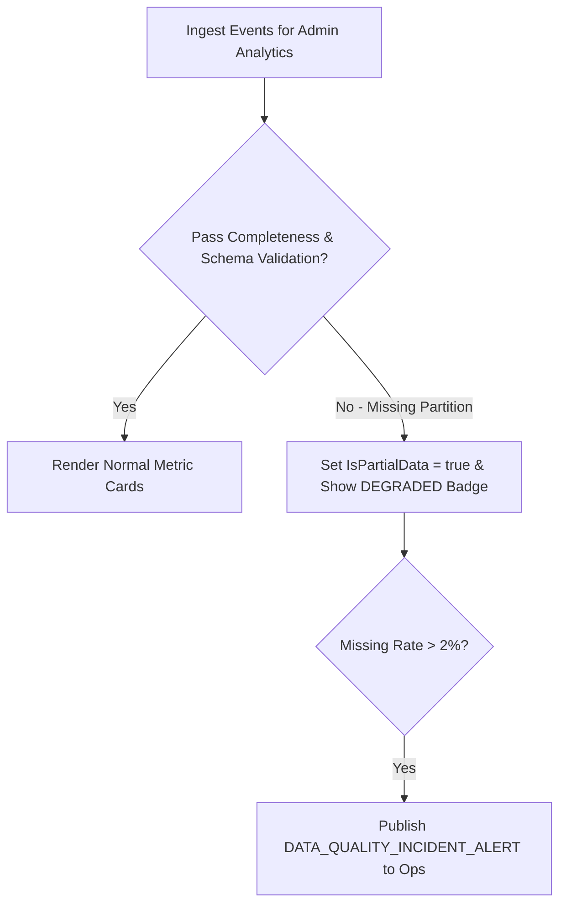

# Thiết kế kiểm tra chất lượng dữ liệu M11

| Thuộc tính | Giá trị |
|---|---|
| Contract ID | `M11-DATA-QUALITY-CONTROL-1.0` |
| Task | M11-T024 |
| Đầu vào | M11-REALTIME-FRESHNESS-1.0 (M11-T023), M04-DATA-EXPORT-M09-M11-1.0 (M04-T035) |
| Phạm vi | Bộ kiểm tra tính toàn vẹn và chất lượng dữ liệu giám sát (`Data Quality Validator Engine`), gắn cờ `IsPartialData = true` khi dữ liệu nguồn bị khuyết hoặc gián đoạn |
| Tự kiểm | B-G01 |
| Phiên bản | 1.0 — 2026-08-22 |

## 1. Mục tiêu và invariant

Tài liệu này chuẩn hóa quy trình kiểm tra chất lượng dữ liệu (`Data Quality Controls`) trên Admin Dashboard trong M11.

- **Gắn Cờ Cảnh báo khi Dữ liệu Thiếu/Nghi ngờ (`Data Integrity Flag Invariant`)**:
  - Khi dữ liệu nhận được từ M03/M04/M06 bị gián đoạn (ví dụ: mất kết nối Kafka/MassTransit làm thiếu dòng sự kiện):
    - Bảng điều khiển M11 BẮT BUỘC hiển thị badge `DEGRADED_DATA` kèm cờ `IsPartialData = true`.
    - Tuyệt đối CẤM hiển thị các chỉ số tổng hợp như "Chắc chắn 100%" khi chưa qua bộ kiểm tra chất lượng.
- **Tự động Phát Cảnh báo Sai lệch Dữ liệu (`Data Quality Incident Alert Rule`)**: Phát sự kiện `DATA_QUALITY_INCIDENT_ALERT` tới Slack Ops nếu tỷ lệ mất gói dữ liệu $> 2.0\%$.

## 2. Quy trình Kiểm tra Chất lượng Dữ liệu Báo cáo (Data Quality Pipeline)

## 3. Regression Gates và Test Cases

### 3.1. Regression Gates
- `DQ-G01`: 100% API báo cáo Admin trả về cờ `IsPartialData = true` khi phát hiện dữ liệu nguồn chưa đầy đủ.
- `DQ-G02`: Tỷ lệ gián đoạn $> 2.0\%$ bắn cảnh báo `DATA_QUALITY_INCIDENT_ALERT` trong 10 giây.

### 3.2. Test Cases tự kiểm
| Case ID | Tình huống | Kết quả bắt buộc |
|---|---|---|
| `DQ24-01` | Worker M11 mất kết nối với 1 node M04 trong 5 phút | Dashboard M11 hiển thị badge "Dữ liệu bị gián đoạn", `IsPartialData = true`. |
| `DQ24-02` | Kết nối khôi phục $100\%$, dữ liệu bù đồng bộ xong | Badge "Dữ liệu bị gián đoạn" tự động biến mất, `IsPartialData = false`. |
| `DQ24-03` | Kiểm thử hoàn tất luồng M11-DATA-QUALITY-CONTROL-1.0 | Đạt 100% tiêu chí nghiệm thu |

## 4. Đối chiếu Hiện trạng và Finding

| Finding ID | Quan sát | Sai lệch | Task tiếp nhận |
|---|---|---|---|
| `M11-DQ-F01` | Thêm thuộc tính `IsPartialData` trong `AnalyticsMetricEnvelopeDto` | Đảm bảo minh bạch dữ liệu vận hành | M11-T023 |

## 5. Tự kiểm M11-T024
- Đã hoàn thành đặc tả `M11-DATA-QUALITY-CONTROL-1.0`.
- Chốt cờ `IsPartialData` minh bạch và cảnh báo sự cố dữ liệu mất gói $> 2\%$.
- Ghi nhận 2 Regression Gates (`DQ-G01`–`DQ-G02`) và 3 Test Cases (`DQ24-01`–`DQ24-03`).

## 6. Lịch sử
| Ngày | Phiên bản | Thay đổi | Người tự kiểm |
|---|---|---|---|
| 2026-08-22 | 1.0 | Tạo mới đặc tả thiết kế kiểm tra chất lượng dữ liệu M11-T024 | WSA-7K2 |
