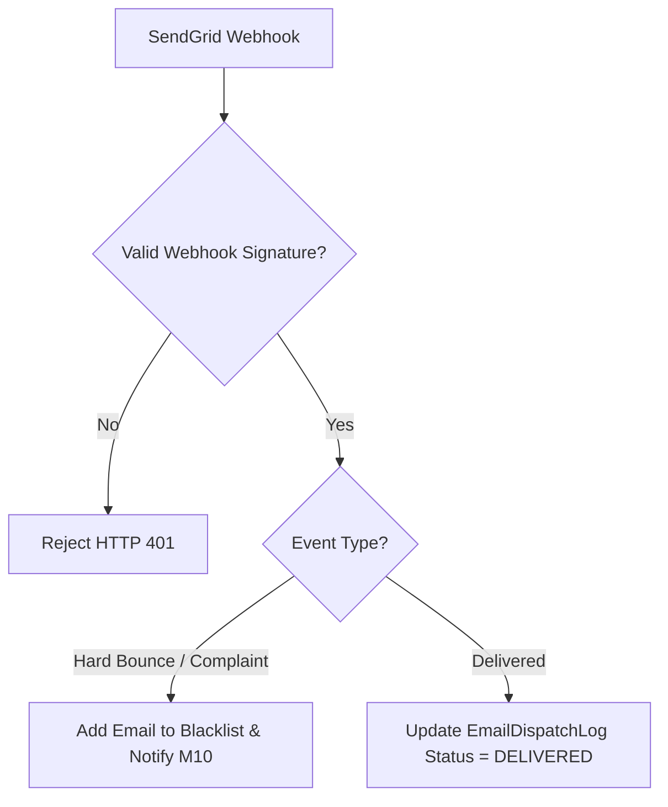

# Đặc tả hợp đồng email M12

| Thuộc tính | Giá trị |
|---|---|
| Contract ID | `M12-EMAIL-INTEGRATION-CONTRACT-1.0` |
| Task | M12-T026 |
| Đầu vào | M10-CHANNEL-SELECTION-MATRIX-1.0 (M10-T020), M10-EXPIRY-CHANNEL-FALLBACK-1.0 (M10-T024) |
| Phạm vi | Đặc tả hợp đồng giao tiếp giữa M10 và M12 Email Gateway (`SendGrid/SMTP Adapter`), phân biệt các trạng thái phản hồi `ACCEPTED`, `DELIVERED`, `BOUNCE`, `COMPLAINT` |
| Tự kiểm | B-G01 |
| Phiên bản | 1.0 — 2026-08-22 |

## 1. Mục tiêu và invariant

Tài liệu này chuẩn hóa hợp đồng tích hợp Email (`Email Gateway Contract`) trong M12.

- **Phân loại Rõ ràng Phản hồi Trạng thái Email (`Email Status Mapping Invariant`)**:
  - Hợp đồng BẮT BUỘC hỗ trợ các Webhook Event từ Provider (SendGrid/AWS SES):
    - `DELIVERED`: Email đã vào hộp thư người nhận.
    - `BOUNCE`: Email bị trả lại (Hard Bounce / Soft Bounce).
    - `COMPLAINT`: Người dùng bấm đánh dấu Spam.
  - Khi nhận `HARD_BOUNCE` hoặc `COMPLAINT`, M12 BẮT BUỘC gửi tín hiệu sang M10 để vô hiệu hóa địa chỉ Email đó trong danh sách gửi (`EmailBlacklist`).
- **An toàn Dữ liệu Riêng tư trong Log (`PII Masking Invariant`)**: 100% log nội dung Email BẮT BUỘC được ẩn danh hóa địa chỉ email và không lưu mật khẩu/OTP thô.

## 2. Luồng Xử lý Webhook Trạng thái Email (Email Status Webhook Pipeline)

## 3. Regression Gates và Test Cases

### 3.1. Regression Gates
- `EC-G01`: 100% sự kiện `HARD_BOUNCE` tự động thêm địa chỉ Email vào `EmailBlacklist`.
- `EC-G02`: Log hệ thống M12 không chứa địa chỉ Email dạng thô không được che đậy.

### 3.2. Test Cases tự kiểm
| Case ID | Tình huống | Kết quả bắt buộc |
|---|---|---|
| `EC26-01` | SendGrid trả về Webhook `event = hard_bounce` cho email invalid@test.com | M12 đưa `invalid@test.com` vào `EmailBlacklist`, phát tín hiệu sang M10. |
| `EC26-02` | M10 yêu cầu gửi Email cho địa chỉ nằm trong `EmailBlacklist` | M12 từ chối ngay lập tức với lỗi `EMAIL_BLACKLISTED`. |
| `EC26-03` | Kiểm thử hoàn tất luồng M12-EMAIL-INTEGRATION-CONTRACT-1.0 | Đạt 100% tiêu chí nghiệm thu |

## 4. Đối chiếu Hiện trạng và Finding

| Finding ID | Quan sát | Sai lệch | Task tiếp nhận |
|---|---|---|---|
| `M12-EC-F01` | Tạo service `SendGridEmailGatewayAdapter` trong Infrastructure M12 | Xử lý gửi mail và webhook callback | M12-T004 |

## 5. Tự kiểm M12-T026
- Đã hoàn thành đặc tả `M12-EMAIL-INTEGRATION-CONTRACT-1.0`.
- Chốt cơ chế EmailBlacklist khi Hard Bounce/Complaint và che giấu PII trong log.
- Ghi nhận 2 Regression Gates (`EC-G01`–`EC-G02`) và 3 Test Cases (`EC26-01`–`EC26-03`).

## 6. Lịch sử
| Ngày | Phiên bản | Thay đổi | Người tự kiểm |
|---|---|---|---|
| 2026-08-22 | 1.0 | Tạo mới đặc tả đặc tả hợp đồng email M12-T026 | WSA-7K2 |
