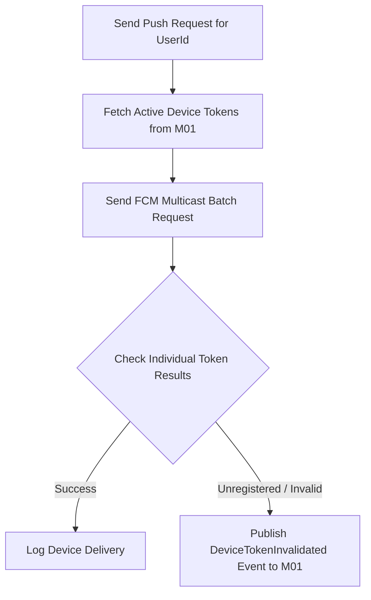

# Đặc tả hợp đồng push đa thiết bị M12

| Thuộc tính | Giá trị |
|---|---|
| Contract ID | `M12-MULTI-DEVICE-PUSH-CONTRACT-1.0` |
| Task | M12-T027 |
| Đầu vào | M10-DUPLICATE-DISPATCH-LOCK-1.0 (M10-T021), M10-EXPIRY-CHANNEL-FALLBACK-1.0 (M10-T024) |
| Phạm vi | Đặc tả hợp đồng giao tiếp phát Push Notification đa thiết bị qua Firebase FCM Gateway (`FCM Multicast Adapter`), xử lý vô hiệu hóa các Device Token không hợp lệ |
| Tự kiểm | B-G01 |
| Phiên bản | 1.0 — 2026-08-22 |

## 1. Mục tiêu và invariant

Tài liệu này chuẩn hóa hợp đồng phát Push Notification đa thiết bị (`Multi-Device Push Gateway Contract`) trong M12.

- **Vô hiệu hóa Token Thiết bị Lỗi (`Invalid Device Token Purge Invariant`)**:
  - Khi FCM trả về kết quả `UNREGISTERED` hoặc `INVALID_ARGUMENT` cho một `DeviceToken`:
    - M12 BẮT BUỘC gửi sự kiện `DeviceTokenInvalidatedIntegrationEvent` sang M01/M10 để hủy cờ Active của Token đó.
    - Tuyệt đối CẤM tiếp tục thử gửi Push sang Token đã bị vô hiệu hóa trong các lần phát sau.
- **Tính Duy nhất của Bản ghi Logic trên Đa Thiết bị (`Single Logical Notification Rule`)**:
  - Việc phát Push đồng thời tới 3 thiết bị di động của 1 người dùng KHÔNG ĐƯỢC PHÉP tạo ra 3 bản ghi thông báo trong bảng `NotificationInbox`.

## 2. Luồng Phát Push Đa Thiết bị và Xử lý Token (Multi-Device Push Pipeline)

## 3. Regression Gates và Test Cases

### 3.1. Regression Gates
- `MP-G01`: 100% Token bị FCM phản hồi `UNREGISTERED` tạo ra sự kiện vô hiệu hóa Token sang M01.
- `MP-G02`: Multicast Push gửi cho nhiều thiết bị chỉ sinh đúng 1 `NotificationInbox` record.

### 3.2. Test Cases tự kiểm
| Case ID | Tình huống | Kết quả bắt buộc |
|---|---|---|
| `MP27-01` | Learner có 2 thiết bị Active (iPhone + iPad), M10 gửi 1 Push nhắc ôn | FCM Multicast gửi tới cả 2 thiết bị, DB Inbox chỉ tạo 1 bản ghi duy nhất. |
| `MP27-02` | iPad bị xoá app làm FCM trả về `UNREGISTERED` | M12 phát `DeviceTokenInvalidatedIntegrationEvent`, iPad bị xóa khỏi danh sách Active Token. |
| `MP27-03` | Kiểm thử hoàn tất luồng M12-MULTI-DEVICE-PUSH-CONTRACT-1.0 | Đạt 100% tiêu chí nghiệm thu |

## 4. Đối chiếu Hiện trạng và Finding

| Finding ID | Quan sát | Sai lệch | Task tiếp nhận |
|---|---|---|---|
| `M12-MP-F01` | Tích hợp FCM Multicast Batching Service | Tối ưu hiệu năng phát Push dồn dập | M12-T004 |

## 5. Tự kiểm M12-T027
- Đã hoàn thành đặc tả `M12-MULTI-DEVICE-PUSH-CONTRACT-1.0`.
- Chốt cơ chế tự động dọn dẹp Invalid Device Token và bảo toàn single inbox record.
- Ghi nhận 2 Regression Gates (`MP-G01`–`MP-G02`) và 3 Test Cases (`MP27-01`–`MP27-03`).

## 6. Lịch sử
| Ngày | Phiên bản | Thay đổi | Người tự kiểm |
|---|---|---|---|
| 2026-08-22 | 1.0 | Tạo mới đặc tả đặc tả hợp đồng push đa thiết bị M12-T027 | WSA-7K2 |
