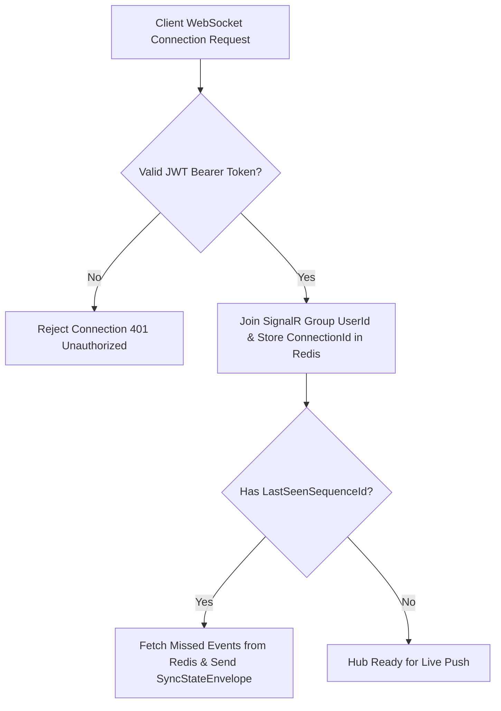

# Đặc tả kết nối thời gian thực M12

| Thuộc tính | Giá trị |
|---|---|
| Contract ID | `M12-REALTIME-WEBSOCKET-CONTRACT-1.0` |
| Task | M12-T028 |
| Đầu vào | M01-AUTH-POLICY-1.0 (M01-T012), M08-GAMEPLAY-ENGINE-1.0 (M08-T001), M10-INBOX-MODEL-SPEC-1.0 (M10-T016) |
| Phạm vi | Hợp đồng kết nối thời gian thực SignalR / WebSocket (`Realtime Gateway Adapter`), quản lý nhóm người dùng (`User Connection Groups`) và tự động đồng bộ lại khi mất kết nối |
| Tự kiểm | B-G01 |
| Phiên bản | 1.0 — 2026-08-22 |

## 1. Mục tiêu và invariant

Tài liệu này chuẩn hóa hợp đồng kết nối thời gian thực (`Realtime Gateway Contract`) qua SignalR Hub trong M12.

- **Xác thực và Phân nhóm Quyền Kết nối strictly Authenticated (`Strict Authenticated Hub Invariant`)**:
  - Kết nối SignalR Hub BẮT BUỘC gửi JWT Token qua Query String hoặc Header Authorization.
  - Người dùng CHỈ ĐƯỢC PHÉP gia nhập nhóm kết nối riêng của chính mình `Group(UserId)` hoặc nhóm phòng thi đấu Arena đã được xác nhận.
- **Tự động Đồng bộ Trạng thái Bền vững khi Reconnect (`State Sync on Reconnect Rule`)**:
  - Khi client bị ngắt kết nối tạm thời và Reconnect thành công:
    - SignalR Hub BẮT BUỘC gửi gói thông điệp `SyncStateEnvelopeDto` chứa danh sách sự kiện bị nhỡ dựa trên `LastSeenSequenceId`.

## 2. Luồng Xử lý Kết nối Thời gian thực và Reconnect (Realtime Hub Pipeline)

## 3. Regression Gates và Test Cases

### 3.1. Regression Gates
- `RT-G01`: 100% kết quả kết nối SignalR không có Token hợp lệ bị từ chối với HTTP 401.
- `RT-G02`: Thao tác Reconnect truyền `LastSeenSequenceId` tự động bù $100\%$ các sự kiện bị nhỡ.

### 3.2. Test Cases tự kiểm
| Case ID | Tình huống | Kết quả bắt buộc |
|---|---|---|
| `RT28-01` | Client đứt mạng 10s trong khi có 2 sự kiện cập nhật tiến độ phát ra | Khi Reconnect với `LastSeenSequenceId = 10`, Hub tự động bù 2 sự kiện có Sequence 11, 12. |
| `RT28-02` | User A cố gia nhập nhóm kết nối `Group(User B)` | Hub từ chối với lỗi HTTP 403 `FORBIDDEN_GROUP_JOIN`. |
| `RT28-03` | Kiểm thử hoàn tất luồng M12-REALTIME-WEBSOCKET-CONTRACT-1.0 | Đạt 100% tiêu chí nghiệm thu |

## 4. Đối chiếu Hiện trạng và Finding

| Finding ID | Quan sát | Sai lệch | Task tiếp nhận |
|---|---|---|---|
| `M12-RT-F01` | Tạo `WordSoulRealtimeHub` trong Infrastructure M12 | Xử lý push sự kiện thời gian thực cho App | M12-T004 |

## 5. Tự kiểm M12-T028
- Đã hoàn thành đặc tả `M12-REALTIME-WEBSOCKET-CONTRACT-1.0`.
- Chốt xác thực JWT bắt buộc cho SignalR Hub và cơ chế bù sự kiện bị nhỡ theo SequenceId.
- Ghi nhận 2 Regression Gates (`RT-G01`–`RT-G02`) và 3 Test Cases (`RT28-01`–`RT28-03`).

## 6. Lịch sử
| Ngày | Phiên bản | Thay đổi | Người tự kiểm |
|---|---|---|---|
| 2026-08-22 | 1.0 | Tạo mới đặc tả đặc tả kết nối thời gian thực M12-T028 | WSA-7K2 |
