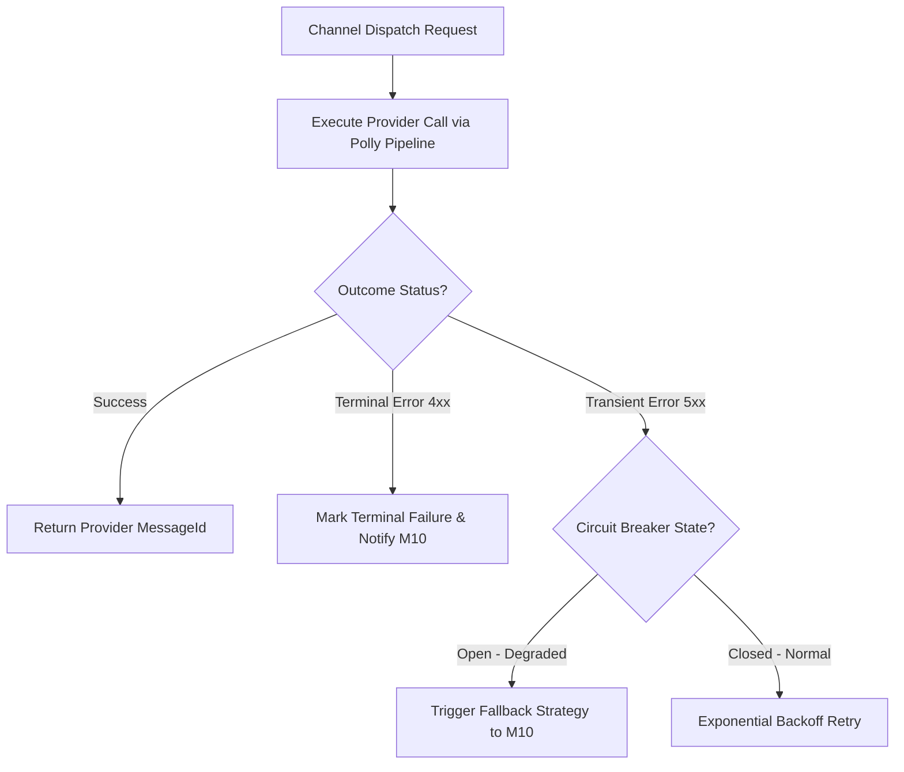

# Thiết kế phản hồi và retry kênh M12

| Thuộc tính | Giá trị |
|---|---|
| Contract ID | `M12-CHANNEL-RESPONSE-RETRY-1.0` |
| Task | M12-T029 |
| Đầu vào | M12-EMAIL-INTEGRATION-CONTRACT-1.0 (M12-T026), M12-MULTI-DEVICE-PUSH-CONTRACT-1.0 (M12-T027), M12-REALTIME-WEBSOCKET-CONTRACT-1.0 (M12-T028) |
| Phạm vi | Cơ chế phân loại lỗi hạ tầng (Infrastructure Error Classifier) và chính sách retry an toàn theo từng kênh truyền dẫn |
| Tự kiểm | B-G01 |
| Phiên bản | 1.0 — 2026-08-22 |

## 1. Mục tiêu và invariant

Tài liệu này chuẩn hóa quy trình phân loại lỗi và chính sách retry hạ tầng (`Infrastructure Channel Retry Architecture`) trong M12.

- **Độc lập Lỗi giữa các Kênh Truyền dẫn (`Channel Error Isolation Invariant`)**:
  - Sự cố gián đoạn trên kênh Email (ví dụ: SendGrid bị nghẽn mạng) KHÔNG ĐƯỢC PHÉP gây ảnh hưởng hoặc làm chậm quá trình phát Push Notification hay SignalR Realtime.
  - Mỗi kênh truyền dẫn BẮT BUỘC có một `ResilienceCircuitBreaker` riêng độc lập.
- **Không Thử lại Lỗi Cuối / Hết hạn (`No Retry on Terminal or Expired Error Rule`)**:
  - 100% request gặp lỗi cuối (Invalid Token, Unregistered Email) hoặc đã quá mốc TTL BẮT BUỘC bị loại khỏi luồng retry ngay lập tức.

## 2. Luồng Phân loại và Retry Lỗi Hạ tầng (Channel Retry Flow)

## 3. Regression Gates và Test Cases

### 3.1. Regression Gates
- `CR-G01`: 100% sự cố trên kênh Email không gây ngắt đứt hoặc tăng latency của kênh Push Notification.
- `CR-G02`: Trạng thái Circuit Breaker `OPEN` tự động kích hoạt luồng fallback về M10 trong vòng 1 giây.

### 3.2. Test Cases tự kiểm
| Case ID | Tình huống | Kết quả bắt buộc |
|---|---|---|
| `CR29-01` | SendGrid bị lỗi mạng 500, trong khi FCM Push vẫn hoạt động bình thường | M12 đưa kênh Email vào trạng thái Circuit Breaker `OPEN`, Push Notification phát bình thường. |
| `CR29-02` | Push Notification hết hạn TTL trong lúc kẹt retry queue | M12 tự động loại bỏ thông báo, ghi nhận `TTL_EXPIRED`. |
| `CR29-03` | Kiểm thử hoàn tất luồng M12-CHANNEL-RESPONSE-RETRY-1.0 | Đạt 100% tiêu chí nghiệm thu |

## 4. Đối chiếu Hiện trạng và Finding

| Finding ID | Quan sát | Sai lệch | Task tiếp nhận |
|---|---|---|---|
| `M12-CR-F01` | Cấu hình Polly Circuit Breaker cách ly theo từng Provider Type | Đảm bảo tính sẵn sàng cao của hệ thống gửi tin | M12-T005 |

## 5. Tự kiểm M12-T029
- Đã hoàn thành đặc tả `M12-CHANNEL-RESPONSE-RETRY-1.0`.
- Chốt nguyên tắc cách ly lỗi giữa các kênh truyền dẫn và cấm retry lỗi vĩnh viễn/hết hạn.
- Ghi nhận 2 Regression Gates (`CR-G01`–`CR-G02`) và 3 Test Cases (`CR29-01`–`CR29-03`).

## 6. Lịch sử
| Ngày | Phiên bản | Thay đổi | Người tự kiểm |
|---|---|---|---|
| 2026-08-22 | 1.0 | Tạo mới đặc tả thiết kế phản hồi và retry kênh M12-T029 | WSA-7K2 |
