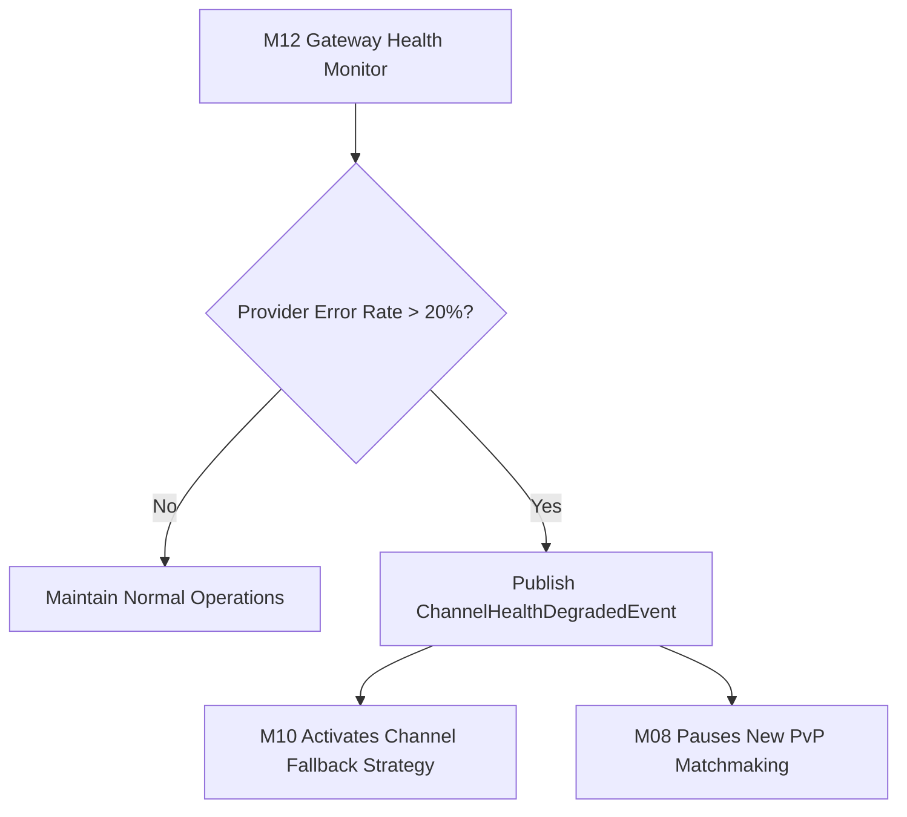

# Thiết kế suy giảm kênh gửi/realtime M12

| Thuộc tính | Giá trị |
|---|---|
| Contract ID | `M12-CHANNEL-DEGRADATION-POLICY-1.0` |
| Task | M12-T030 |
| Đầu vào | M12-CHANNEL-RESPONSE-RETRY-1.0 (M12-T029), M10-EXPIRY-CHANNEL-FALLBACK-1.0 (M10-T024), M08-GAMEPLAY-ENGINE-1.0 (M08-T001) |
| Phạm vi | Quy trình hạ cấp dịch vụ có kiểm soát (`Graceful Service Degradation`) khi kênh thời gian thực hoặc Push Notification gặp sự cố quá tải |
| Tự kiểm | B-G01 |
| Phiên bản | 1.0 — 2026-08-22 |

## 1. Mục tiêu và invariant

Tài liệu này chuẩn hóa quy trình suy giảm dịch vụ có kiểm soát (`Graceful Service Degradation`) trong M12.

- **Nguyên tắc Quyết định Fallback thuộc M10 (`M10 Fallback Decision Invariant`)**:
  - M12 CHỈ ĐƯỢC PHÉP báo cáo trạng thái suy giảm hạ tầng (`ChannelHealthDegradedEvent`). Quyết định chuyển hướng fallback sang kênh khác BẮT BUỘC do M10 kiểm soát.
- **Bảo vệ Tính Toàn vẹn Trạng thái Thi đấu M08 (`M08 Arena Match Guard Rule`)**:
  - Nếu kênh SignalR Realtime bị suy giảm chập chờn, M08 BẮT BUỘC từ chối bắt đầu các trận thi đấu PvP mới (`PvP Matchmaking Paused`) để tránh gây mất đồng bộ trận đấu.

## 2. Quy trình Suy giảm Dịch vụ Hạ tầng (Graceful Degradation Flow)

## 3. Regression Gates và Test Cases

### 3.1. Regression Gates
- `CD-G01`: 100% sự kiện suy giảm hạ tầng bắn `ChannelHealthDegradedEvent` trong vòng 5 giây.
- `CD-G02`: M08 tạm dừng ghép trận PvP mới $100\%$ khi kênh SignalR báo `DEGRADED`.

### 3.2. Test Cases tự kiểm
| Case ID | Tình huống | Kết quả bắt buộc |
|---|---|---|
| `CD30-01` | Kênh SignalR Realtime bị rớt kết nối 30% trong 2 phút | M12 phát `ChannelHealthDegradedEvent`, M08 tạm dừng nút "Tìm trận PvP". |
| `CD30-02` | Kênh SignalR khôi phục 100% kết nối khỏe mạnh | M12 phát `ChannelHealthRecoveredEvent`, M08 mở lại ghép trận PvP. |
| `CD30-03` | Kiểm thử hoàn tất luồng M12-CHANNEL-DEGRADATION-POLICY-1.0 | Đạt 100% tiêu chí nghiệm thu |

## 4. Đối chiếu Hiện trạng và Finding

| Finding ID | Quan sát | Sai lệch | Task tiếp nhận |
|---|---|---|---|
| `M12-CD-F01` | Tích hợp `GatewayHealthCheckWorker` quét sức khỏe kênh mỗi 10 giây | Phát hiện suy giảm kịp thời | M12-T003 |

## 5. Tự kiểm M12-T030
- Đã hoàn thành đặc tả `M12-CHANNEL-DEGRADATION-POLICY-1.0`.
- Chốt nguyên tắc M10 kiểm soát fallback và tạm dừng PvP M08 khi SignalR suy giảm.
- Ghi nhận 2 Regression Gates (`CD-G01`–`CD-G02`) và 3 Test Cases (`CD30-01`–`CD30-03`).

## 6. Lịch sử
| Ngày | Phiên bản | Thay đổi | Người tự kiểm |
|---|---|---|---|
| 2026-08-22 | 1.0 | Tạo mới đặc tả thiết kế suy giảm kênh gửi/realtime M12-T030 | WSA-7K2 |
