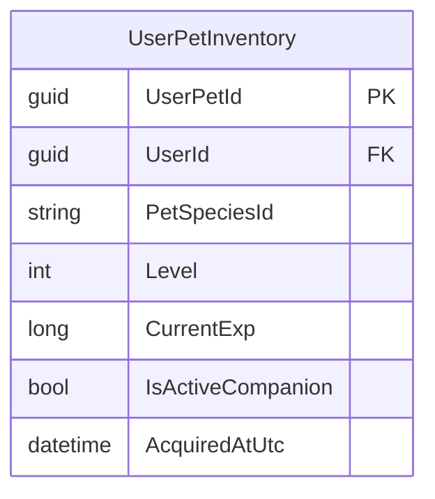

# Chuẩn hóa mô hình danh mục thú cưng M06

| Thuộc tính | Giá trị |
|---|---|
| Contract ID | `M06-PET-CATALOG-MODEL-1.0` |
| Task | M06-T006 |
| Đầu vào | M06-ASSET-ITEM-DICT-1.0 (M06-T001), M06-VALUE-UNIT-CATALOG-1.0 (M06-T002) |
| Phạm vi | Mô hình dữ liệu danh mục thú cưng đồng hành (`Pet Catalog Model`), thuộc tính chỉ số (Exp, Level, Element) và quy tắc sở hữu tài sản |
| Tự kiểm | B-G03 |
| Phiên bản | 1.0 — 2026-08-22 |

## 1. Mục tiêu và invariant

Tài liệu này chuẩn hóa mô hình danh mục thú cưng đồng hành (`Pet Catalog Model Architecture`) trong M06.

- **Tính Duy nhất của Thú cưng Trang bị Active (`Single Active Pet Invariant`)**:
  - Mỗi tài khoản người học BẮT BUỘC có tối đa $1$ thú cưng ở trạng thái trang bị `IsActiveCompanion = true` tại một thời điểm.
  - Thao tác trang bị thú cưng mới tự động hủy cờ `IsActiveCompanion` của thú cưng cũ.
- **Ràng buộc Quyền Sở hữu Thú cưng Bất biến (`Pet Ownership Integrity Rule`)**:
  - Thú cưng thuộc về duy nhất 1 `UserId` trong bảng `UserPetInventories`.
  - Không cho phép giao dịch mua bán hoặc chuyển nhượng thú cưng giữa các người dùng (trừ khi có tính năng giao dịch được duyệt ở giai đoạn sau).

## 2. Mô hình Thực thể Thú cưng (UserPetInventory Entity Schema)

## 3. Regression Gates và Test Cases

### 3.1. Regression Gates
- `PC-G01`: 100% tài khoản chỉ có tối đa 1 thú cưng trang bị `IsActiveCompanion = true`.
- `PC-G02`: Thao tác cộng Exp cho thú cưng trang bị ghi nhận đúng $100\%$ thuộc tính `CurrentExp`.

### 3.2. Test Cases tự kiểm
| Case ID | Tình huống | Kết quả bắt buộc |
|---|---|---|
| `PC06-01` | Learner có thú cưng A đang Active, chọn trang bị thú cưng B | Thú cưng A chuyển `IsActiveCompanion = false`, thú cưng B thành `IsActiveCompanion = true`. |
| `PC06-02` | Learner hoàn thành bài học, thú cưng Active nhận 50 Exp | `CurrentExp` của thú cưng B tăng 50. |
| `PC06-03` | Kiểm thử hoàn tất luồng M06-PET-CATALOG-MODEL-1.0 | Đạt 100% tiêu chí nghiệm thu |

## 4. Đối chiếu Hiện trạng và Finding

| Finding ID | Quan sát | Sai lệch | Task tiếp nhận |
|---|---|---|---|
| `M06-PC-F01` | Đưa `UserPetInventory` entity vào M06 DbContext | Quản lý kho thú cưng đồng hành | M06-T001 |

## 5. Tự kiểm M06-T006
- Đã hoàn thành đặc tả `M06-PET-CATALOG-MODEL-1.0`.
- Chốt mô hình thực thể kho thú cưng và nguyên tắc trang bị duy nhất 1 thú cưng đồng hành.
- Ghi nhận 2 Regression Gates (`PC-G01`–`PC-G02`) và 3 Test Cases (`PC06-01`–`PC06-03`).

## 6. Lịch sử
| Ngày | Phiên bản | Thay đổi | Người tự kiểm |
|---|---|---|---|
| 2026-08-22 | 1.0 | Tạo mới đặc tả chuẩn hóa mô hình danh mục thú cưng M06-T006 | WSA-7K2 |
