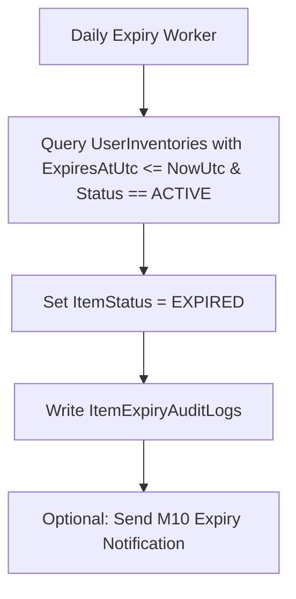

# Chuẩn hóa vật phẩm hết hạn/ngừng dùng M06

| Thuộc tính | Giá trị |
|---|---|
| Contract ID | `M06-EXPIRED-DEPRECATED-ITEM-1.0` |
| Task | M06-T037 |
| Đầu vào | M06-ITEM-CATALOG-MODEL-1.0 (M06-T007), M06-ITEM-INVENTORY-OWNERSHIP-1.0 (M06-T034) |
| Phạm vi | Quy trình xử lý vật phẩm hết hạn (`Expired Items`) hoặc bị dừng kinh doanh (`Deprecated Items`), bảo đảm không âm thầm xóa kho và thông báo lý do rõ ràng cho người dùng |
| Tự kiểm | B-G03 |
| Phiên bản | 1.0 — 2026-08-22 |

## 1. Mục tiêu và invariant

Tài liệu này quy định quy tắc quản lý vật phẩm hết hạn sử dụng hoặc bị ngừng kinh doanh (`Expired & Deprecated Items`) trong M06.

- **Cấm Sử dụng Vật phẩm Hết hạn (`Expired Item Block Invariant`)**:
  - Vật phẩm có `ExpiresAtUtc < NowUtc` hoặc nằm trong trạng thái `DEPRECATED` BẮT BUỘC bị chặn tuyệt đối khi người học gửi request sử dụng (`HTTP 400 ITEM_EXPIRED` hoặc `ITEM_DEPRECATED`).
- **Không Âm thầm Xóa Kho (`Transparent Deprecation Invariant`)**:
  - Việc vật phẩm hết hạn hoặc bị ngừng dùng KHÔNG ĐƯỢC PHÉP âm thầm xóa bản ghi khỏi bảng kho `UserInventories`.
  - Bắt buộc cập nhật thuộc tính `ItemStatus = EXPIRED` hoặc `DEPRECATED` kèm badge giải thích hiển thị minh bạch trên UI.

## 2. Quy trình Quét và Đánh dấu Vật phẩm Hết hạn (Expiry Eviction Worker Flow)

## 3. Regression Gates và Test Cases

### 3.1. Regression Gates
- `EI-G01`: 100% request sử dụng vật phẩm hết hạn bị từ chối với lỗi HTTP 400 `ITEM_EXPIRED`.
- `EI-G02`: Vật phẩm ngừng dùng hiển thị đầy đủ badge `DEPRECATED` và lý do trên màn hình Túi đồ.

### 3.2. Test Cases tự kiểm
| Case ID | Tình huống | Kết quả bắt buộc |
|---|---|---|
| `EI37-01` | Learner bấm sử dụng Thẻ Nhân 2 Exp đã hết hạn 1 giờ trước | System từ chối sử dụng, ném lỗi HTTP 400 `ITEM_EXPIRED`. |
| `EI37-02` | Worker chạy quét lúc 00:00 UTC phát hiện 50 vật phẩm hết hạn | Cập nhật 50 bản ghi sang `EXPIRED`, không xóa row khỏi DB. |
| `EI37-03` | Kiểm thử hoàn tất luồng M06-EXPIRED-DEPRECATED-ITEM-1.0 | Đạt 100% tiêu chí nghiệm thu |

## 4. Đối chiếu Hiện trạng và Finding

| Finding ID | Quan sát | Sai lệch | Task tiếp nhận |
|---|---|---|---|
| `M06-EI-F01` | Đăng ký background service `ItemExpiryWorker` trong M06 | Quét tự động vật phẩm hết hạn theo chu kỳ | M06-T034 |

## 5. Tự kiểm M06-T037
- Đã hoàn thành đặc tả `M06-EXPIRED-DEPRECATED-ITEM-1.0`.
- Chốt nguyên tắc cấm sử dụng vật phẩm hết hạn và bảo toàn lịch sử kho minh bạch.
- Ghi nhận 2 Regression Gates (`EI-G01`–`EI-G02`) và 3 Test Cases (`EI37-01`–`EI37-03`).

## 6. Lịch sử
| Ngày | Phiên bản | Thay đổi | Người tự kiểm |
|---|---|---|---|
| 2026-08-22 | 1.0 | Tạo mới đặc tả chuẩn hóa vật phẩm hết hạn/ngừng dùng M06-T037 | WSA-7K2 |
