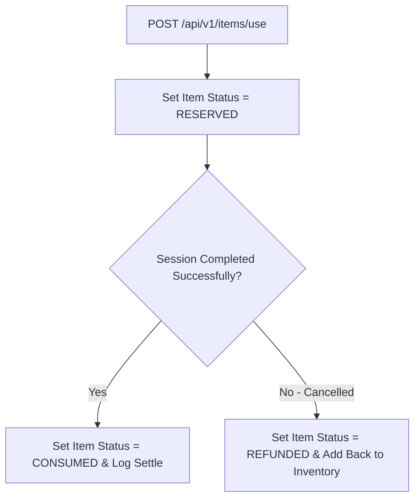

# Thiết kế chốt tiêu thụ và hoàn trả M06

| Thuộc tính | Giá trị |
|---|---|
| Contract ID | `M06-ITEM-CONSUMPTION-REFUND-1.0` |
| Task | M06-T036 |
| Đầu vào | M06-ITEM-USE-REQUEST-1.0 (M06-T035), M06-REWARD-IDEMPOTENCY-1.0 (M06-T012) |
| Phạm vi | Quy trình chốt tiêu thụ vật phẩm (`Settle Item Consumption`) và hoàn trả vật phẩm khi phiên dùng bị hủy (`Refund Item`), bảo đảm không khấu trừ hai lần |
| Tự kiểm | B-G03 |
| Phiên bản | 1.0 — 2026-08-22 |

## 1. Mục tiêu và invariant

Tài liệu này quy định quy trình hai bước chốt tiêu thụ (`Settlement`) và hoàn trả (`Refund`) vật phẩm trong kho M06.

- **Chống Khấu trừ và Hoàn trả Lặp (`Item Consumption Idempotency Invariant`)**:
  - Mỗi yêu cầu tiêu thụ hoặc hoàn trả BẮT BUỘC gắn mã `UsageRequestId`.
  - Gửi lại cùng mã `UsageRequestId` KHÔNG ĐƯỢC phép trừ vật phẩm lần thứ 2 hoặc hoàn trả vật phẩm lần thứ 2.
- **Hoàn trả Nguyên vẹn khi Phiên Lỗi (`Full Refund on Session Failure Rule`)**:
  - Nếu người học kích hoạt vật phẩm (ví dụ: Thẻ Gợi ý) nhưng phiên học bị lỗi/hủy bất khả kháng, hệ thống BẮT BUỘC tự động hoàn trả $100\%$ số lượng vật phẩm đã dùng vào kho `UserInventory`.

## 2. Quy trình Chốt Tiêu thụ và Hoàn trả Vật phẩm (Settlement & Refund Flow)

## 3. Regression Gates và Test Cases

### 3.1. Regression Gates
- `CR-G01`: 100% trường hợp phiên bị hủy bất khả kháng thực hiện hoàn trả số lượng vật phẩm về kho thành công.
- `CR-G02`: Gọi API settle/refund lặp lại 2 lần trả về cùng 1 trạng thái kết quả.

### 3.2. Test Cases tự kiểm
| Case ID | Tình huống | Kết quả bắt buộc |
|---|---|---|
| `CR36-01` | Learner dùng 1 Thẻ Gợi ý, phiên học chốt thành công | Trạng thái chuyển `CONSUMED`, kho ghi nhận đã trừ 1 thẻ. |
| `CR36-02` | Learner dùng 1 Thẻ Gợi ý, phiên sập do lỗi server M03 | Trigger hoàn trả tự động chuyển trạng thái `REFUNDED`, số dư thẻ trong kho phục hồi $100\%$. |
| `CR36-03` | Kiểm thử hoàn tất luồng M06-ITEM-CONSUMPTION-REFUND-1.0 | Đạt 100% tiêu chí nghiệm thu |

## 4. Đối chiếu Hiện trạng và Finding

| Finding ID | Quan sát | Sai lệch | Task tiếp nhận |
|---|---|---|---|
| `M06-CR-F01` | Lắng nghe event `LearningSessionAbortedEvent` từ M03 | Tự động kích hoạt luồng Refund vật phẩm | M06-T035 |

## 5. Tự kiểm M06-T036
- Đã hoàn thành đặc tả `M06-ITEM-CONSUMPTION-REFUND-1.0`.
- Chốt cơ chế hai bước Reserve-Settle/Refund và bảo toàn kho vật phẩm khi phiên lỗi.
- Ghi nhận 2 Regression Gates (`CR-G01`–`CR-G02`) và 3 Test Cases (`CR36-01`–`CR36-03`).

## 6. Lịch sử
| Ngày | Phiên bản | Thay đổi | Người tự kiểm |
|---|---|---|---|
| 2026-08-22 | 1.0 | Tạo mới đặc tả thiết kế chốt tiêu thụ và hoàn trả M06-T036 | WSA-7K2 |
