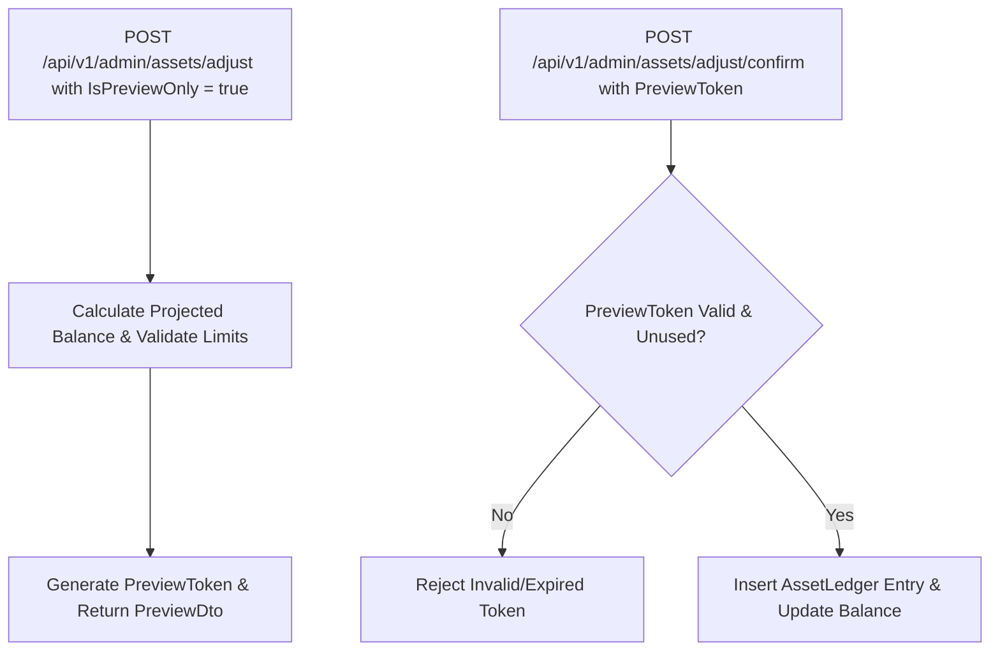

# Thiết kế luồng điều chỉnh có xem trước M06

| Thuộc tính | Giá trị |
|---|---|
| Contract ID | `M06-PREVIEWABLE-ECONOMIC-ADJUSTMENT-1.0` |
| Task | M06-T039 |
| Đầu vào | M06-ASSET-LEDGER-MODEL-1.0 (M06-T003), M06-ECONOMIC-MUTATION-AUTHORIZATION-1.0 (M06-T038) |
| Phạm vi | Luồng hai bước xem trước và xác nhận điều chỉnh số dư tài sản kinh tế thủ công (`Preview & Confirm Adjustment Workflow`), bảo đảm Admin kiểm tra số dư trước/sau thực tế trước khi chốt |
| Tự kiểm | B-G03 |
| Phiên bản | 1.0 — 2026-08-22 |

## 1. Mục tiêu và invariant

Tài liệu này quy định luồng làm việc 2 bước có xem trước (`Preview & Confirm Adjustment Workflow`) cho các thao tác điều chỉnh tài sản kinh tế thủ công trong M06.

- **Xem trước Bắt buộc trước khi Chốt (`Preview Before Commit Invariant`)**:
  - Endpoint điều chỉnh tài sản BẮT BUỘC hỗ trợ cờ `IsPreviewOnly = true`.
  - API trả về DTO xem trước bao gồm: `CurrentBalance`, `AdjustmentDelta`, `ProjectedBalance`, `MinMaxBoundaryCheckResult` và `PreviewToken` (có hiệu lực 5 phút).
  - CẤM ghi sổ cái khi request đang ở chế độ Xem trước (`IsPreviewOnly = true`).
- **Khóa Mã Xem trước Độc nhất (`Preview Token Binding Invariant`)**: Request xác nhận thực sự BẮT BUỘC truyền `PreviewToken` hợp lệ đã được tạo ở bước xem trước.

## 2. Luồng Thực hiện Điều chỉnh Xem trước và Xác nhận (Preview & Confirm Workflow)

## 3. Regression Gates và Test Cases

### 3.1. Regression Gates
- `PA-G01`: 100% request xem trước (`IsPreviewOnly = true`) không sinh bản ghi sổ cái trong `AssetLedger`.
- `PA-G02`: Request xác nhận không có `PreviewToken` hoặc dùng lại token cũ bị chặn với HTTP 400.

### 3.2. Test Cases tự kiểm
| Case ID | Tình huống | Kết quả bắt buộc |
|---|---|---|
| `PA39-01` | Admin gọi API xem trước cộng 500 Gold cho Learner A (số dư 200 Gold) | API trả về `ProjectedBalance = 700 Gold`, `PreviewToken = "tok_123"`. Số dư DB vẫn là 200 Gold. |
| `PA39-02` | Admin gửi request confirm với `PreviewToken = "tok_123"` trong 2 phút | Số dư cập nhật thành 700 Gold, chèn 1 dòng sổ cái liên kết `PreviewToken`. |
| `PA39-03` | Kiểm thử hoàn tất luồng M06-PREVIEWABLE-ECONOMIC-ADJUSTMENT-1.0 | Đạt 100% tiêu chí nghiệm thu |

## 4. Đối chiếu Hiện trạng và Finding

| Finding ID | Quan sát | Sai lệch | Task tiếp nhận |
|---|---|---|---|
| `M06-PA-F01` | Đưa Redis Key `preview_token_{token}` để lưu dự thảo điều chỉnh trong 5 phút | Đảm bảo tính nhất quán giữa bước xem trước và xác nhận | M06-T038 |

## 5. Tự kiểm M06-T039
- Đã hoàn thành đặc tả `M06-PREVIEWABLE-ECONOMIC-ADJUSTMENT-1.0`.
- Chốt luồng 2 bước Preview-Confirm và PreviewToken hiệu lực 5 phút.
- Ghi nhận 2 Regression Gates (`PA-G01`–`PA-G02`) và 3 Test Cases (`PA39-01`–`PA39-03`).

## 6. Lịch sử
| Ngày | Phiên bản | Thay đổi | Người tự kiểm |
|---|---|---|---|
| 2026-08-22 | 1.0 | Tạo mới đặc tả thiết kế luồng điều chỉnh có xem trước M06-T039 | WSA-7K2 |
