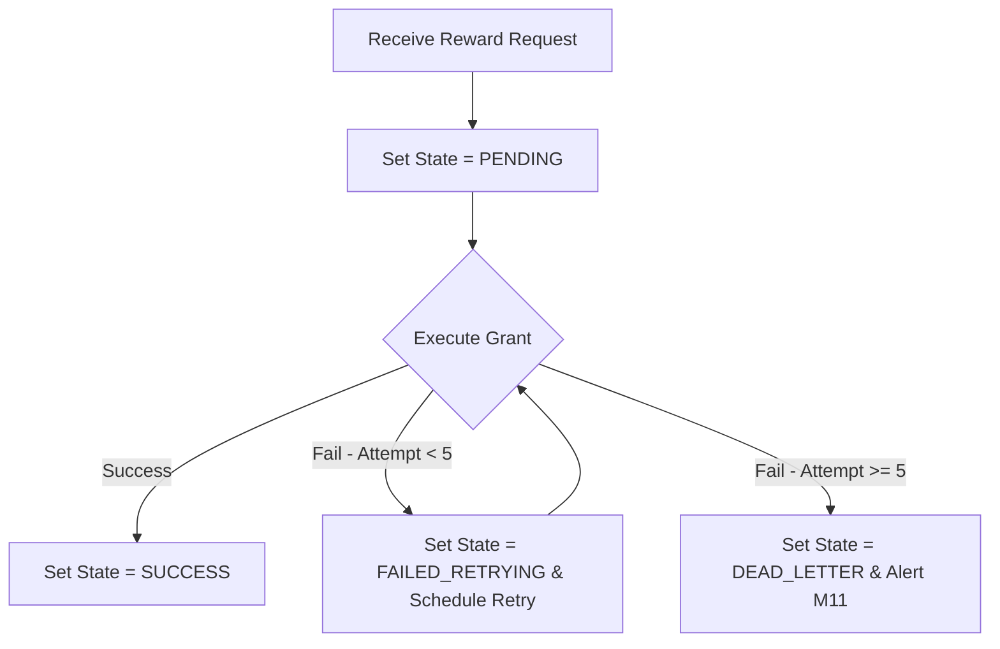

# Thiết kế trạng thái chờ và xử lý lại M06

| Thuộc tính | Giá trị |
|---|---|
| Contract ID | `M06-PENDING-REWARD-RETRY-ENGINE-1.0` |
| Task | M06-T016 |
| Đầu vào | M06-REWARD-IDEMPOTENCY-1.0 (M06-T012), M06-MULTI-COMPONENT-REWARD-1.0 (M06-T015), M11-CONFIG-REG-1.0 (M11-T012) |
| Phạm vi | Máy trạng thái giao dịch cấp thưởng chờ xử lý (`Pending Reward State Machine`), thuật toán tự động thử lại (`Exponential Backoff Retry Engine`) và xử lý tin đưa vào Dead Letter Queue (DLQ) |
| Tự kiểm | B-G03 |
| Phiên bản | 1.0 — 2026-08-22 |

## 1. Mục tiêu và invariant

Tài liệu này đặc tả cơ chế quản lý trạng thái chờ và xử lý lại (`Pending Reward & Retry Engine`) khi cấp thưởng tài sản trong M06 gặp sự cố gián đoạn hệ thống.

- **Vòng đời Trạng thái Cấp Thưởng Minh bạch (`Reward Grant State Invariant`)**:
  - Mỗi yêu cầu cấp thưởng lưu trạng thái: `PENDING` $\to$ `SUCCESS` hoặc `FAILED_RETRYING` $\to$ `DEAD_LETTER`.
- **Thử lại Tự động có Giới hạn (`Bounded Exponential Backoff Retry Invariant`)**:
  - Giao dịch ở trạng thái `FAILED_RETRYING` được hệ thống tự động thử lại tối đa 5 lần theo khoảng thời gian tăng dần ($10\text{s}, 30\text{s}, 2\text{m}, 10\text{m}, 30\text{m}$).
  - Sau 5 lần thất bại liên tiếp, giao dịch được chuyển sang `DEAD_LETTER` và phát cảnh báo sang M11 để hỗ trợ kỹ thuật xử lý thủ công.

## 2. Máy Trạng thái Cấp Thưởng và Thử lại (Reward Grant State Machine)

## 3. Regression Gates và Test Cases

### 3.1. Regression Gates
- `PR-G01`: 100% sự kiện cấp thưởng thất bại tạm thời được thử lại đúng 5 lần trước khi vào DLQ.
- `PR-G02`: Giao dịch chuyển sang `DEAD_LETTER` ném cảnh báo `REWARD_GRANT_DLQ_ALERT` sang M11.

### 3.2. Test Cases tự kiểm
| Case ID | Tình huống | Kết quả bắt buộc |
|---|---|---|
| `PR16-01` | DB bị ngắt kết nối tạm thời trong 15 giây khi cấp thưởng | Giao dịch thất bại lần 1 (`FAILED_RETRYING`), thử lại thành công ở lần 2 và chuyển sang `SUCCESS`. |
| `PR16-02` | Lỗi khóa tài khoản kéo dài quá 5 lần thử | Giao dịch chuyển `DEAD_LETTER`, dừng thử lại tự động và phát cảnh báo M11. |
| `PR16-03` | Kiểm thử hoàn tất luồng M06-PENDING-REWARD-RETRY-ENGINE-1.0 | Đạt 100% tiêu chí nghiệm thu |

## 4. Đối chiếu Hiện trạng và Finding

| Finding ID | Quan sát | Sai lệch | Task tiếp nhận |
|---|---|---|---|
| `M06-PR-F01` | Đăng ký background service `PendingRewardRetryWorker` trong M06 | Quét và thử lại các bản ghi PENDING quá hạn | M06-T015 |

## 5. Tự kiểm M06-T016
- Đã hoàn thành đặc tả `M06-PENDING-REWARD-RETRY-ENGINE-1.0`.
- Chốt máy trạng thái cấp thưởng 4 nấc và thuật toán retry 5 lần exponential backoff.
- Ghi nhận 2 Regression Gates (`PR-G01`–`PR-G02`) và 3 Test Cases (`PR16-01`–`PR16-03`).

## 6. Lịch sử
| Ngày | Phiên bản | Thay đổi | Người tự kiểm |
|---|---|---|---|
| 2026-08-22 | 1.0 | Tạo mới đặc tả thiết kế trạng thái chờ và xử lý lại M06-T016 | WSA-7K2 |
