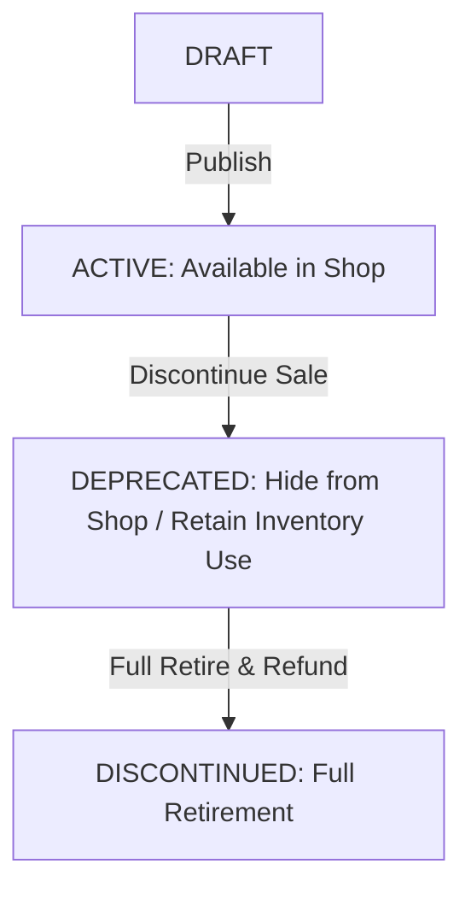

# Thiết kế vòng đời danh mục tài sản M06

| Thuộc tính | Giá trị |
|---|---|
| Contract ID | `M06-ASSET-CATALOG-LIFECYCLE-1.0` |
| Task | M06-T008 |
| Đầu vào | M06-PET-CATALOG-MODEL-1.0 (M06-T006), M06-EXPIRED-DEPRECATED-ITEM-1.0 (M06-T037) |
| Phạm vi | Quy trình ngắt dòng đời danh mục vật phẩm/tài sản (`Asset Deprecation Lifecycle`), chuyển đổi trạng thái từ `ACTIVE` sang `DEPRECATED` và `DISCONTINUED` |
| Tự kiểm | B-G03 |
| Phiên bản | 1.0 — 2026-08-22 |

## 1. Mục tiêu và invariant

Tài liệu này chuẩn hóa quy trình quản lý vòng đời danh mục vật phẩm (`Asset Catalog Lifecycle Engine`) trong M06.

- **Cấm Xóa Cứng Danh mục Vật phẩm đã Tham chiếu (`No Hard Delete Invariant`)**:
  - 100% các mặt hàng/vật phẩm kinh tế đã từng phát sinh giao dịch hoặc có trong kho người dùng CẤM XÓA CỨNG khỏi DB.
  - Thao tác ngừng bán BẮT BUỘC đổi trạng thái `IsAvailableForPurchase = false` và `Status = DEPRECATED`.
- **Bảo toàn Quyền Sử dụng Vật phẩm đã Mua (`Purchased Item Retention Rule`)**:
  - Vật phẩm chuyển sang trạng thái `DEPRECATED` (ngừng bán) VẪN CHO PHÉP người học đã mua trước đó tiếp tục sử dụng vật phẩm trong kho cho đến khi hết hạn sử dụng.

## 2. Máy Trạng thái Vòng đời Danh mục Vật phẩm (Asset Catalog State Machine)

## 3. Regression Gates và Test Cases

### 3.1. Regression Gates
- `AL-G01`: 100% vật phẩm `DEPRECATED` bị ẩn khỏi cửa hàng nhưng không bị xóa khỏi kho người dùng đã sở hữu.
- `AL-G02`: Request mua vật phẩm ở trạng thái `DEPRECATED` bị từ chối với HTTP 400 `ITEM_NOT_FOR_SALE`.

### 3.2. Test Cases tự kiểm
| Case ID | Tình huống | Kết quả bắt buộc |
|---|---|---|
| `AL08-01` | Admin ngừng bán vật phẩm "Thẻ x2 Exp 1 giờ" | Vật phẩm đổi `Status = DEPRECATED`, ẩn khỏi Shop. |
| `AL08-02` | Learner A đã mua thẻ x2 Exp trước đó, vào kho bấm sử dụng | Thẻ kích hoạt thành công, tăng x2 Exp bài học trong 1 giờ. |
| `AL08-03` | Kiểm thử hoàn tất luồng M06-ASSET-CATALOG-LIFECYCLE-1.0 | Đạt 100% tiêu chí nghiệm thu |

## 4. Đối chiếu Hiện trạng và Finding

| Finding ID | Quan sát | Sai lệch | Task tiếp nhận |
|---|---|---|---|
| `M06-AL-F01` | Thêm thuộc tính `CatalogStatus` trong `CatalogItemDefinition` Entity | Quản lý trạng thái vòng đời sản phẩm | M06-T001 |

## 5. Tự kiểm M06-T008
- Đã hoàn thành đặc tả `M06-ASSET-CATALOG-LIFECYCLE-1.0`.
- Chốt cấm xóa cứng vật phẩm đã bán và bảo tồn quyền sử dụng vật phẩm trong kho.
- Ghi nhận 2 Regression Gates (`AL-G01`–`AL-G02`) và 3 Test Cases (`AL08-01`–`AL08-03`).

## 6. Lịch sử
| Ngày | Phiên bản | Thay đổi | Người tự kiểm |
|---|---|---|---|
| 2026-08-22 | 1.0 | Tạo mới đặc tả thiết kế vòng đời danh mục tài sản M06-T008 | WSA-7K2 |
