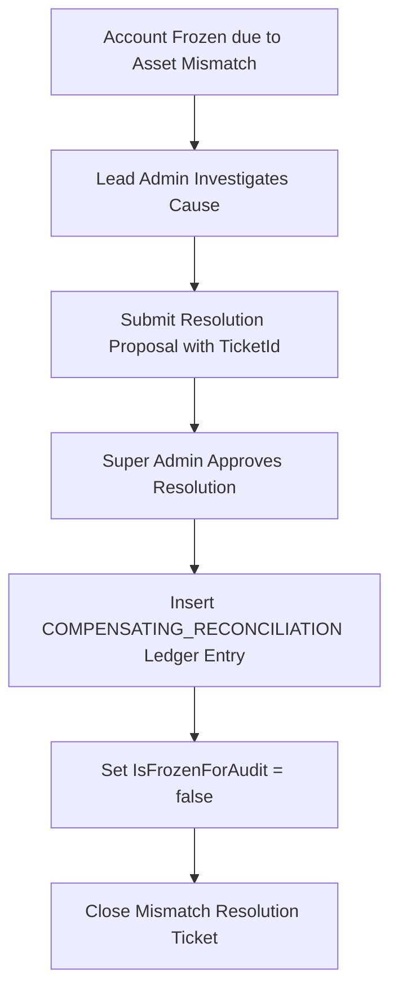

# Thiết kế xử lý chênh lệch kinh tế M06

| Thuộc tính | Giá trị |
|---|---|
| Contract ID | `M06-ECONOMIC-MISMATCH-RESOLUTION-1.0` |
| Task | M06-T041 |
| Đầu vào | M06-PERIODIC-ECONOMIC-RECONCILIATION-1.0 (M06-T040), M11-CONFIG-REG-1.0 (M11-T012) |
| Phạm vi | Quy trình mở khóa và giải quyết chênh lệch số dư tài sản (`Mismatch Resolution Workflow`), tạo giao dịch điều chỉnh bù bất biến để đóng hồ sơ đối soát |
| Tự kiểm | B-G03 |
| Phiên bản | 1.0 — 2026-08-22 |

## 1. Mục tiêu và invariant

Tài liệu này quy định quy trình giải quyết các sự cố chênh lệch tài sản kinh tế (`Mismatch Resolution Workflow`) trong M06.

- **Giải quyết Chênh lệch bằng Giao dịch Bù Bất biến (`Compensating Settlement Invariant`)**:
  - Việc xử lý chênh lệch số dư BẮT BUỘC thực hiện bằng cách chèn một dòng sổ cái bù `COMPENSATING_RECONCILIATION` kèm thuộc tính `TicketReferenceId`.
  - Tuyệt đối CẤM sửa trực tiếp số dư hay xóa các dòng sổ cái cũ để "làm đẹp" số liệu.
- **Mở khóa Tài khoản sau Phê duyệt (`Unfreeze Post-Approval Rule`)**: Cờ `IsFrozenForAudit` CHỈ ĐƯỢC CHUYỂN VỀ `false` sau khi giao dịch điều chỉnh bù được Lead Admin phê duyệt thành công.

## 2. Luồng Xử lý và Đóng Hồ sơ Chênh lệch (Resolution Workflow)

## 3. Regression Gates và Test Cases

### 3.1. Regression Gates
- `MR-G01`: 100% lệnh giải quyết chênh lệch tạo ra 1 bản ghi sổ cái loại `COMPENSATING_RECONCILIATION`.
- `MR-G02`: Cờ `IsFrozenForAudit` không được mở nếu chưa có chữ ký phê duyệt hợp lệ.

### 3.2. Test Cases tự kiểm
| Case ID | Tình huống | Kết quả bắt buộc |
|---|---|---|
| `MR41-01` | Lead Admin chốt xử lý chênh 500 Gold cho Learner A bằng vé `TICKET_888` | Chèn 1 dòng sổ cái bù 500 Gold, mở khóa tài khoản `IsFrozenForAudit = false`. |
| `MR41-02` | Support Admin bấm mở khóa tài khoản đang bị đóng băng đối soát mà không qua phê duyệt | System từ chối, ném lỗi HTTP 403 `UNAUTHORIZED_UNFREEZE`. |
| `MR41-03` | Kiểm thử hoàn tất luồng M06-ECONOMIC-MISMATCH-RESOLUTION-1.0 | Đạt 100% tiêu chí nghiệm thu |

## 4. Đối chiếu Hiện trạng và Finding

| Finding ID | Quan sát | Sai lệch | Task tiếp nhận |
|---|---|---|---|
| `M06-MR-F01` | Tạo enum `COMPENSATING_RECONCILIATION` trong `LedgerEntryType` | Phục vụ phân loại giao dịch bù đối soát | M06-T003 |

## 5. Tự kiểm M06-T041
- Đã hoàn thành đặc tả `M06-ECONOMIC-MISMATCH-RESOLUTION-1.0`.
- Chốt nguyên tắc điều chỉnh bù bất biến và mở khóa tài khoản sau khi phê duyệt.
- Ghi nhận 2 Regression Gates (`MR-G01`–`MR-G02`) và 3 Test Cases (`MR41-01`–`MR41-03`).

## 6. Lịch sử
| Ngày | Phiên bản | Thay đổi | Người tự kiểm |
|---|---|---|---|
| 2026-08-22 | 1.0 | Tạo mới đặc tả thiết kế xử lý chênh lệch kinh tế M06-T041 | WSA-7K2 |
