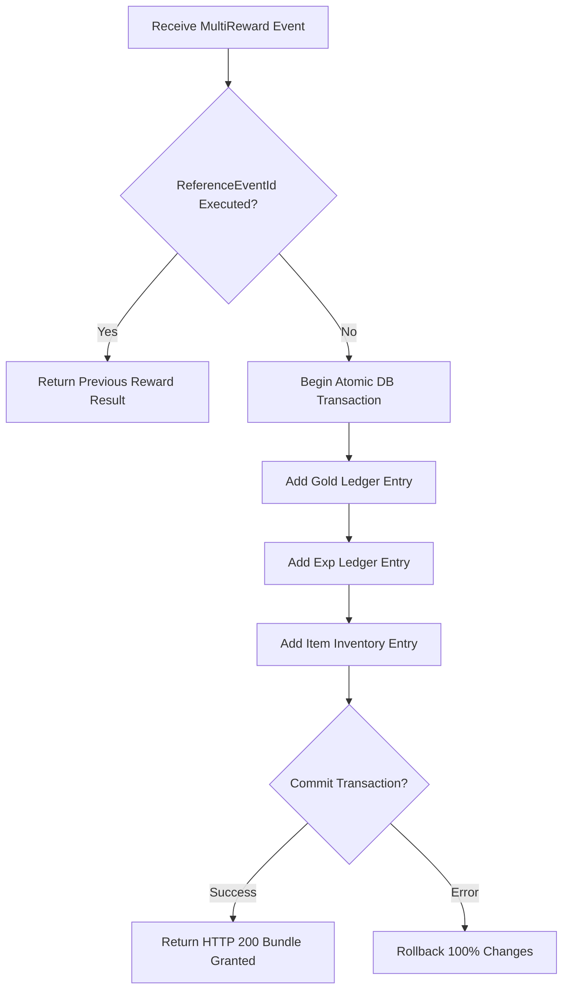

# Thiết kế xử lý thưởng nhiều thành phần M06

| Thuộc tính | Giá trị |
|---|---|
| Contract ID | `M06-MULTI-COMPONENT-REWARD-1.0` |
| Task | M06-T015 |
| Đầu vào | M06-ASSET-LEDGER-MODEL-1.0 (M06-T003), M06-REWARD-IDEMPOTENCY-1.0 (M06-T012), M06-VERSIONED-REWARD-CALCULATION-1.0 (M06-T014) |
| Phạm vi | Quy trình phát thưởng dạng gói chứa nhiều tài sản (`Multi-Asset Bundle` - ví dụ: 50 Gold + 10 Exp + 1 Thẻ Gợi ý) trong 1 Transaction nguyên tử |
| Tự kiểm | B-G03 |
| Phiên bản | 1.0 — 2026-08-22 |

## 1. Mục tiêu và invariant

Tài liệu này quy định quy trình cấp gói thưởng chứa nhiều loại tài sản (`Multi-Component Reward Bundle`) trong M06.

- **Cấp Thưởng Nguyên tử Tối thượng (`Atomic Bundle Grant Invariant`)**:
  - Gói thưởng chứa nhiều tài sản BẮT BUỘC được thực thi trong một Database Transaction duy nhất.
  - Hoặc TẤT CẢ các thành phần tài sản (Gold, Exp, Item) được cộng vào số dư thành công 100%, hoặc KHÔNG CÓ thành phần nào được cộng (All-or-Nothing Rollback).
  - Tuyệt đối CẤM xảy ra kịch bản cộng dở Gold nhưng thất bại khi cộng Item làm mâu thuẫn sổ cái.
- **Chống Cộng Lặp cho Mọi Thành phần (`Idempotency Key Scope`)**: Tất cả dòng sổ cái sinh ra từ cùng 1 gói thưởng đều liên kết chung một `ReferenceEventId`.

## 2. Quy trình Cấp Gói Thưởng Nguyên tử (Atomic Bundle Grant Flow)

## 3. Regression Gates và Test Cases

### 3.1. Regression Gates
- `MC-G01`: 100% sự cố xảy ra trong quá trình cấp gói thưởng (ví dụ: DB sập giữa chừng) đều làm rollback 100% toàn bộ gói.
- `MC-G02`: Nhấn nhận thưởng nhiều thành phần 2 lần chỉ sinh 1 tập sổ cái duy nhất.

### 3.2. Test Cases tự kiểm
| Case ID | Tình huống | Kết quả bắt buộc |
|---|---|---|
| `MC15-01` | Cấp gói thưởng gồm 100 Gold + 50 Exp + 1 Vật phẩm A | DB ghi nhận 2 bản ghi sổ cái (Gold, Exp) và 1 bản ghi UserInventory trong 1 transaction. |
| `MC15-02` | Cố tình tạo exception ở bước cộng Vật phẩm A | Transaction tự động rollback, số dư Gold và Exp không bị cộng dở. |
| `MC15-03` | Kiểm thử hoàn tất luồng M06-MULTI-COMPONENT-REWARD-1.0 | Đạt 100% tiêu chí nghiệm thu |

## 4. Đối chiếu Hiện trạng và Finding

| Finding ID | Quan sát | Sai lệch | Task tiếp nhận |
|---|---|---|---|
| `M06-MC-F01` | Sử dụng `IDbContextTransaction` trong `GrantRewardBundleHandler` | Đảm bảo tính nguyên tử khi cấp thưởng | M06-T014 |

## 5. Tự kiểm M06-T015
- Đã hoàn thành đặc tả `M06-MULTI-COMPONENT-REWARD-1.0`.
- Chốt nguyên tắc All-or-Nothing Rollback cho gói thưởng nhiều tài sản.
- Ghi nhận 2 Regression Gates (`MC-G01`–`MC-G02`) và 3 Test Cases (`MC15-01`–`MC15-03`).

## 6. Lịch sử
| Ngày | Phiên bản | Thay đổi | Người tự kiểm |
|---|---|---|---|
| 2026-08-22 | 1.0 | Tạo mới đặc tả thiết kế xử lý thưởng nhiều thành phần M06-T015 | WSA-7K2 |
