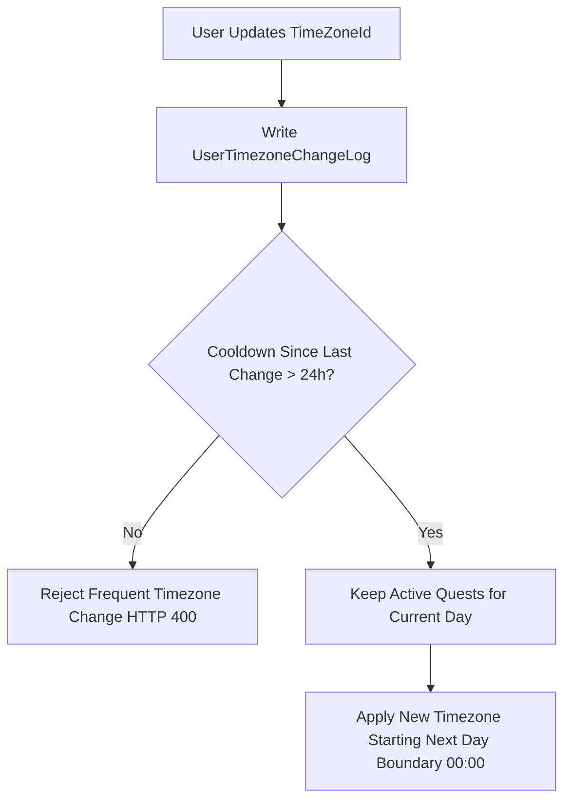

# Chốt chính sách đổi múi giờ M07

| Thuộc tính | Giá trị |
|---|---|
| Contract ID | `M07-TIMEZONE-CHANGE-POLICY-1.0` |
| Task | M07-T023 |
| Đầu vào | M07-TIMEZONE-DAY-BOUNDARY-1.0 (M07-T022), M01-USER-TIMEZONE-1.0 (M01-T025) |
| Phạm vi | Quy tắc xử lý khi người dùng thay đổi múi giờ cá nhân (`Timezone Transition Policy`), ngăn chặn hành vi lợi dụng đổi múi giờ để nhận 2 tập nhiệm vụ ngày trong cùng 24h thực tế |
| Tự kiểm | B-G04 |
| Phiên bản | 1.0 — 2026-08-22 |

## 1. Mục tiêu và invariant

Tài liệu này quy định chính sách xử lý khi người học thay đổi múi giờ cá nhân (`Timezone Transition Policy`) trong M07.

- **Chống Khai thác Đổi Múi giờ để Nhận Trùng Nhiệm vụ (`Timezone Exploitation Invariant`)**:
  - Khi người dùng đổi múi giờ `UserTimeZoneId` (ví dụ từ UTC+7 sang UTC-5):
    - Tập 3 nhiệm vụ ngày của ngày nghiệp vụ hiện tại `BusinessDayKey` BẮT BUỘC giữ nguyên.
    - Múi giờ mới CHỈ CÓ HIỆU LỰC từ chu kỳ reset tiếp theo ($00:00:00$ ngày nghiệp vụ tiếp theo của múi giờ mới).
    - CẤM phân bổ tập nhiệm vụ ngày thứ 2 trong cùng 24 giờ thực tế (`CooldownWindow = 20` giờ).
- **Ghi log Chuyển đổi Múi giờ Bất biến (`Timezone Change Audit Log`)**: 100% lần cập nhật múi giờ BẮT BUỘC ghi vết `UserTimezoneChangeLogs` kèm thời điểm và múi giờ cũ/mới.

## 2. Quy trình Xử lý Chuyển đổi Múi giờ (Timezone Transition Workflow)

## 3. Regression Gates và Test Cases

### 3.1. Regression Gates
- `TZ-G01`: 100% thao tác đổi múi giờ không làm thay đổi hay reset bộ 3 nhiệm vụ ngày đang chạy.
- `TZ-G02`: Thao tác đổi múi giờ lặp lại quá 1 lần trong 24 giờ bị từ chối với HTTP 400 `TIMEZONE_CHANGE_COOLDOWN`.

### 3.2. Test Cases tự kiểm
| Case ID | Tình huống | Kết quả bắt buộc |
|---|---|---|
| `TZ23-01` | Learner ở Việt Nam (UTC+7) chuyển múi giờ sang New York (UTC-5) lúc 14:00 | Bộ nhiệm vụ ngày hiện tại giữ nguyên, múi giờ UTC-5 chỉ áp dụng từ 00:00 ngày hôm sau theo giờ New York. |
| `TZ23-02` | Learner cố tình đổi múi giờ liên tục 3 lần trong 10 phút để reset nhiệm vụ | 2 lần đổi sau bị hệ thống chặn với HTTP 400 `TIMEZONE_CHANGE_COOLDOWN`. |
| `TZ23-03` | Kiểm thử hoàn tất luồng M07-TIMEZONE-CHANGE-POLICY-1.0 | Đạt 100% tiêu chí nghiệm thu |

## 4. Đối chiếu Hiện trạng và Finding

| Finding ID | Quan sát | Sai lệch | Task tiếp nhận |
|---|---|---|---|
| `M07-TZ-F01` | Lắng nghe event `UserTimezoneUpdatedIntegrationEvent` từ M01 | Tự động tính toán lại thời điểm reset ngày tiếp theo | M07-T022 |

## 5. Tự kiểm M07-T023
- Đã hoàn thành đặc tả `M07-TIMEZONE-CHANGE-POLICY-1.0`.
- Chốt nguyên tắc khóa bộ nhiệm vụ hiện tại và áp dụng múi giờ mới từ ngày hôm sau + cooldown 24h.
- Ghi nhận 2 Regression Gates (`TZ-G01`–`TZ-G02`) và 3 Test Cases (`TZ23-01`–`TZ23-03`).

## 6. Lịch sử
| Ngày | Phiên bản | Thay đổi | Người tự kiểm |
|---|---|---|---|
| 2026-08-22 | 1.0 | Tạo mới đặc tả chốt chính sách đổi múi giờ M07-T023 | WSA-7K2 |
