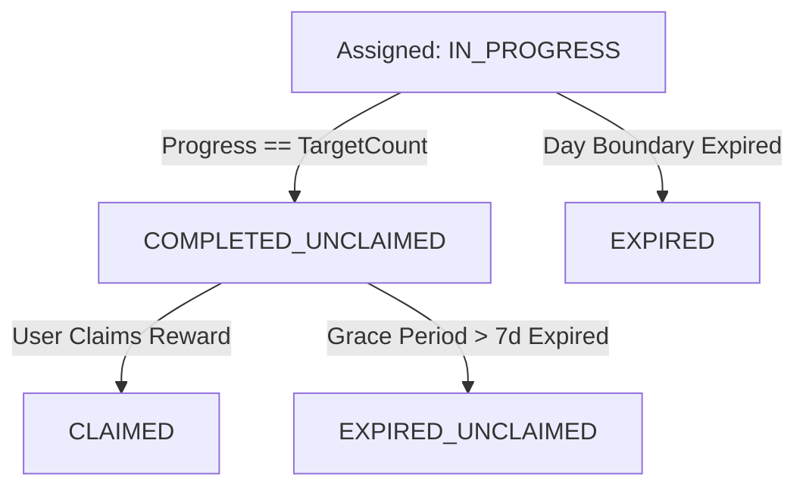

# Chốt chuyển trạng thái hoàn thành M07

| Thuộc tính | Giá trị |
|---|---|
| Contract ID | `M07-QUEST-COMPLETION-STATE-TRANSITION-1.0` |
| Task | M07-T026 |
| Đầu vào | M07-CONCURRENCY-ORDERING-1.0 (M07-T014), M07-ANTI-GRIND-CEILING-POLICY-1.0 (M07-T021), M07-QUEST-CYCLE-RESET-SPEC-1.0 (M07-T025) |
| Phạm vi | Máy trạng thái chuyển đổi tiến độ nhiệm vụ ngày (`Quest Completion State Machine`), quy tắc chuyển từ `IN_PROGRESS` sang `COMPLETED_UNCLAIMED` và `CLAIMED` |
| Tự kiểm | B-G04 |
| Phiên bản | 1.0 — 2026-08-22 |

## 1. Mục tiêu và invariant

Tài liệu này chuẩn hóa máy trạng thái (`Quest State Machine`) và quy tắc chuyển trạng thái hoàn thành nhiệm vụ trong M07.

- **Tính Duy nhất của Việc Hoàn thành (`Single Completion Invariant`)**:
  - Nhiệm vụ ngày CHỈ ĐƯỢC CHUYỂN TRẠNG THÁI sang `COMPLETED_UNCLAIMED` duy nhất 1 lần trong chu kỳ khi `CurrentProgressCount == TargetCount`.
  - Mọi sự kiện phát sinh sau đó trong cùng ngày KHÔNG ĐƯỢC PHÉP thay đổi trạng thái hoàn thành hay đếm vượt trần `TargetCount`.
- **Lưu giữ Bằng chứng Hoàn thành Bất biến (`Completion Audit Evidence Rule`)**:
  - Khi chuyển trạng thái `COMPLETED_UNCLAIMED`, hệ thống BẮT BUỘC lưu `CompletedAtUtc` và `TriggerEventId` cuối cùng làm bằng chứng đối soát.

## 2. Máy Trạng thái Vòng đời Nhiệm vụ (Quest State Machine Diagram)

## 3. Regression Gates và Test Cases

### 3.1. Regression Gates
- `ST-G01`: 100% nhiệm vụ khi `CurrentProgressCount == TargetCount` chuyển trạng thái sang `COMPLETED_UNCLAIMED` trong cùng DB transaction.
- `ST-G02`: Nhiệm vụ đã ở trạng thái `COMPLETED_UNCLAIMED` hoặc `CLAIMED` từ chối $100\%$ các sự kiện tăng tiến độ tiếp theo.

### 3.2. Test Cases tự kiểm
| Case ID | Tình huống | Kết quả bắt buộc |
|---|---|---|
| `ST26-01` | Learner hoàn thành 5/5 từ vựng của nhiệm vụ ngày | Trạng thái chuyển `COMPLETED_UNCLAIMED`, ghi nhận `CompletedAtUtc = NowUtc`. |
| `ST26-02` | Learner học thêm từ thứ 6 trong ngày | `CurrentProgressCount` giữ nguyên 5, trạng thái giữ nguyên `COMPLETED_UNCLAIMED`. |
| `ST26-03` | Kiểm thử hoàn tất luồng M07-QUEST-COMPLETION-STATE-TRANSITION-1.0 | Đạt 100% tiêu chí nghiệm thu |

## 4. Đối chiếu Hiện trạng và Finding

| Finding ID | Quan sát | Sai lệch | Task tiếp nhận |
|---|---|---|---|
| `M07-ST-F01` | Phát `QuestCompletedIntegrationEvent` khi chuyển trạng thái `COMPLETED_UNCLAIMED` | Phục vụ bắn Push Notification chúc mừng từ M10 | M10-T028 |

## 5. Tự kiểm M07-T026
- Đã hoàn thành đặc tả `M07-QUEST-COMPLETION-STATE-TRANSITION-1.0`.
- Chốt máy trạng thái nhiệm vụ 5 bước và nguyên tắc single completion invariant.
- Ghi nhận 2 Regression Gates (`ST-G01`–`ST-G02`) và 3 Test Cases (`ST26-01`–`ST26-03`).

## 6. Lịch sử
| Ngày | Phiên bản | Thay đổi | Người tự kiểm |
|---|---|---|---|
| 2026-08-22 | 1.0 | Tạo mới đặc tả chốt chuyển trạng thái hoàn thành M07-T026 | WSA-7K2 |
