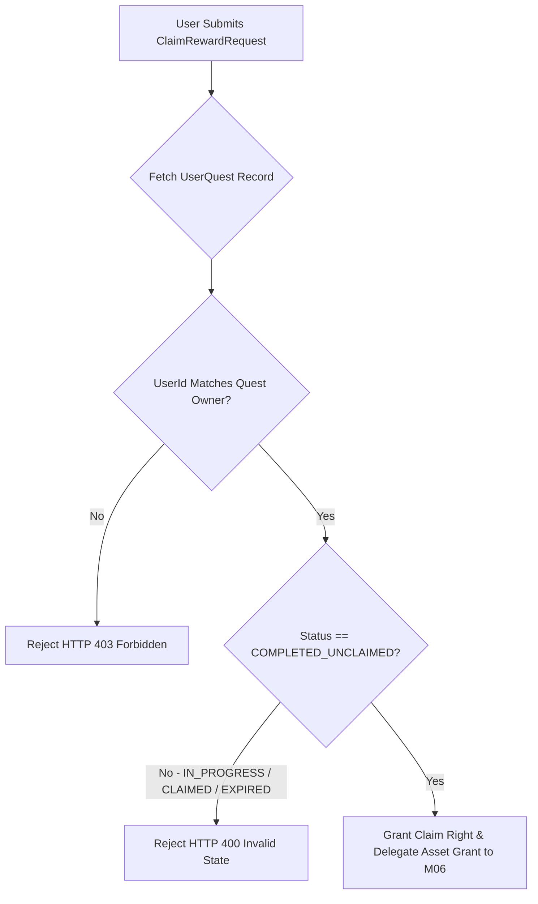

# Chốt điều kiện nhận thưởng M07

| Thuộc tính | Giá trị |
|---|---|
| Contract ID | `M07-QUEST-REWARD-CLAIM-CONDITIONS-1.0` |
| Task | M07-T030 |
| Đầu vào | M07-QUEST-COMPLETION-STATE-TRANSITION-1.0 (M07-T026), M07-QUEST-SINGLE-CLAIM-GUARANTEE-1.0 (M07-T033) |
| Phạm vi | Quy tắc kiểm tra điều kiện nhận thưởng nhiệm vụ ngày (`Reward Claim Validation Engine`), bảo đảm trạng thái `COMPLETED_UNCLAIMED` trước khi cấp quyền nhận |
| Tự kiểm | B-G04 |
| Phiên bản | 1.0 — 2026-08-22 |

## 1. Mục tiêu và invariant

Tài liệu này chuẩn hóa các điều kiện tiên quyết để bấm "Nhận thưởng" nhiệm vụ ngày (`Quest Reward Claim Preconditions`) trong M07.

- **Chỉ Nhận thưởng khi Trạng thái `COMPLETED_UNCLAIMED` (`Claim Eligibility Invariant`)**:
  - Yêu cầu nhận thưởng CHỈ ĐƯỢC CHẤP NHẬN khi nhiệm vụ đang ở trạng thái `COMPLETED_UNCLAIMED` và thuộc về đúng `UserId` gửi request.
  - Từ chối $100\%$ các yêu cầu nhận thưởng đối với nhiệm vụ chưa hoàn thành (`IN_PROGRESS`), đã nhận rồi (`CLAIMED`) hoặc đã hết hạn `EXPIRED`.
- **Tính Bất biến của Gói Thưởng tại Thời điểm Nhận (`Reward Snapshot Immutability Rule`)**:
  - Giá trị phần thưởng (Gold, Exp) BẮT BUỘC lấy theo bản chụp snapshot gói thưởng tại thời điểm phân bổ nhiệm vụ, không bị thay đổi nếu admin chỉnh sửa định nghĩa nhiệm vụ sau đó.

## 2. Luồng Kiểm tra Điều kiện Nhận Thưởng (Claim Validation Pipeline)

## 3. Regression Gates và Test Cases

### 3.1. Regression Gates
- `RC-G01`: 100% request nhận thưởng đối với nhiệm vụ `IN_PROGRESS` bị chặn với HTTP 400.
- `RC-G02`: Request nhận thưởng nhiệm vụ đã `CLAIMED` từ chối $100\%$ không cấp thêm phần thưởng.

### 3.2. Test Cases tự kiểm
| Case ID | Tình huống | Kết quả bắt buộc |
|---|---|---|
| `RC30-01` | Learner bấm "Nhận thưởng" khi nhiệm vụ mới đạt 3/5 tiến độ | System từ chối, trả lỗi HTTP 400 `QUEST_NOT_COMPLETED`. |
| `RC30-02` | Learner A cố bấm nhận thưởng cho `UserQuestId` của Learner B | System từ chối, trả lỗi HTTP 403 `FORBIDDEN_QUEST_ACCESS`. |
| `RC30-03` | Kiểm thử hoàn tất luồng M07-QUEST-REWARD-CLAIM-CONDITIONS-1.0 | Đạt 100% tiêu chí nghiệm thu |

## 4. Đối chiếu Hiện trạng và Finding

| Finding ID | Quan sát | Sai lệch | Task tiếp nhận |
|---|---|---|---|
| `M07-RC-F01` | Sử dụng DB Pessimistic Lock khi kiểm tra trạng thái `COMPLETED_UNCLAIMED` | Chống race-condition nhận thưởng song song | M07-T033 |

## 5. Tự kiểm M07-T030
- Đã hoàn thành đặc tả `M07-QUEST-REWARD-CLAIM-CONDITIONS-1.0`.
- Chốt điều kiện tiên quyết `COMPLETED_UNCLAIMED` và bảo toàn snapshot gói thưởng.
- Ghi nhận 2 Regression Gates (`RC-G01`–`RC-G02`) và 3 Test Cases (`RC30-01`–`RC30-03`).

## 6. Lịch sử
| Ngày | Phiên bản | Thay đổi | Người tự kiểm |
|---|---|---|---|
| 2026-08-22 | 1.0 | Tạo mới đặc tả chốt điều kiện nhận thưởng M07-T030 | WSA-7K2 |
