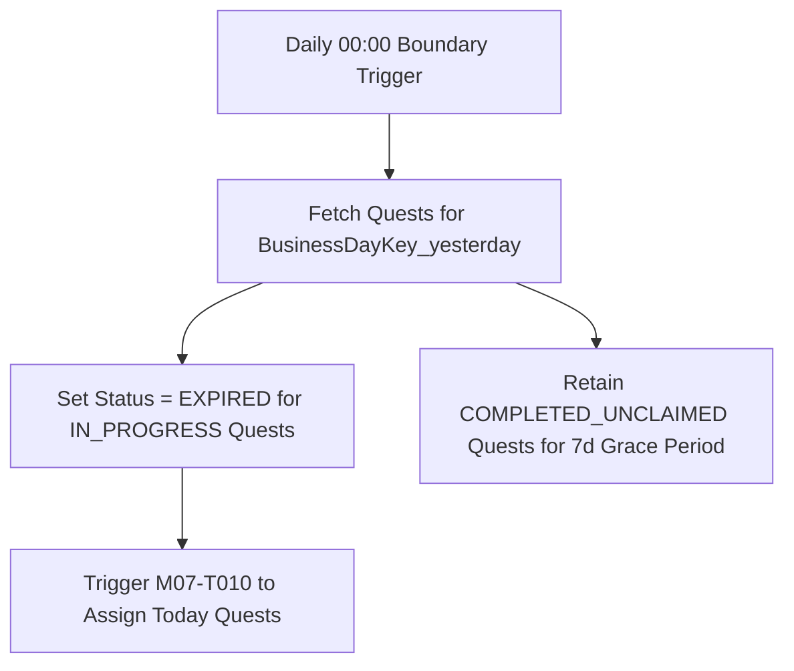

# Đặc tả kết thúc và tạo chu kỳ M07

| Thuộc tính | Giá trị |
|---|---|
| Contract ID | `M07-QUEST-CYCLE-RESET-SPEC-1.0` |
| Task | M07-T025 |
| Đầu vào | M07-QUEST-UNIQUE-ASSIGNMENT-1.0 (M07-T010), M07-LATE-ARRIVING-EVENT-HANDLING-1.0 (M07-T024) |
| Phạm vi | Tiến trình ngầm kết thúc chu kỳ nhiệm vụ ngày cũ (`Daily Quest Cycle Closure Worker`) và tự động chuyển trạng thái các nhiệm vụ chưa nhận thưởng |
| Tự kiểm | B-G04 |
| Phiên bản | 1.0 — 2026-08-22 |

## 1. Mục tiêu và invariant

Tài liệu này chuẩn hóa quy trình kết thúc chu kỳ và reset nhiệm vụ ngày (`Quest Cycle Reset & Closure Workflow`) trong M07.

- **Chuyển Trạng thái Nhiệm vụ Chưa nhận Thưởng (`Unclaimed Quest Expiry Rule`)**:
  - Khi hết ngày nghiệp vụ (sau ranh giới $00:00:00$ local):
    - Các nhiệm vụ đã đạt $100\%$ tiến độ nhưng người học CHƯA bấm nhận thưởng (`COMPLETED_UNCLAIMED`) BẮT BUỘC giữ nguyên quyền nhận thưởng trong vòng $7$ ngày tiếp theo (`GraceClaimPeriod = 7d`).
    - Các nhiệm vụ chưa hoàn thành (`IN_PROGRESS`) tự động chuyển trạng thái `EXPIRED`.
- **Không Chồng chéo Chu kỳ Nhiệm vụ (`No Cycle Overlap Invariant`)**: 100% nhiệm vụ của chu kỳ ngày cũ bị ngắt đếm tiến độ ngay khi chu kỳ ngày mới bắt đầu.

## 2. Quy trình Kết thúc và Khởi tạo Chu kỳ Nhiệm vụ Ngày (Cycle Transition Flow)

## 3. Regression Gates và Test Cases

### 3.1. Regression Gates
- `QC-G01`: 100% nhiệm vụ `IN_PROGRESS` của ngày hôm qua chuyển sang `EXPIRED` sau ranh giới reset.
- `QC-G02`: Nhiệm vụ `COMPLETED_UNCLAIMED` cho phép nhận thưởng trong thời hạn Grace Period 7 ngày.

### 3.2. Test Cases tự kiểm
| Case ID | Tình huống | Kết quả bắt buộc |
|---|---|---|
| `QC25-01` | Learner làm xong 100% nhiệm vụ A hôm qua nhưng quên bấm nút "Nhận thưởng", hôm nay mở app | Nhiệm vụ A hiển thị trong mục "Nhiệm vụ chờ nhận thưởng cũ", nút "Nhận thưởng" vẫn có hiệu lực. |
| `QC25-02` | Learner làm 50% nhiệm vụ B hôm qua, qua 00:00 UTC | Nhiệm vụ B chuyển `EXPIRED`, bộ 3 nhiệm vụ mới của hôm nay được phân bổ. |
| `QC25-03` | Kiểm thử hoàn tất luồng M07-QUEST-CYCLE-RESET-SPEC-1.0 | Đạt 100% tiêu chí nghiệm thu |

## 4. Đối chiếu Hiện trạng và Finding

| Finding ID | Quan sát | Sai lệch | Task tiếp nhận |
|---|---|---|---|
| `M07-QC-F01` | Đăng ký Cron Job `DailyQuestCycleClosureWorker` chạy 00:00:01 local time | Phục vụ chốt sổ chu kỳ nhiệm vụ ngày an toàn | M07-T010 |

## 5. Tự kiểm M07-T025
- Đã hoàn thành đặc tả `M07-QUEST-CYCLE-RESET-SPEC-1.0`.
- Chốt nguyên tắc chuyển `EXPIRED` cho `IN_PROGRESS` và bảo lưu 7 ngày cho `COMPLETED_UNCLAIMED`.
- Ghi nhận 2 Regression Gates (`QC-G01`–`QC-G02`) và 3 Test Cases (`QC25-01`–`QC25-03`).

## 6. Lịch sử
| Ngày | Phiên bản | Thay đổi | Người tự kiểm |
|---|---|---|---|
| 2026-08-22 | 1.0 | Tạo mới đặc tả đặc tả kết thúc và tạo chu kỳ M07-T025 | WSA-7K2 |
